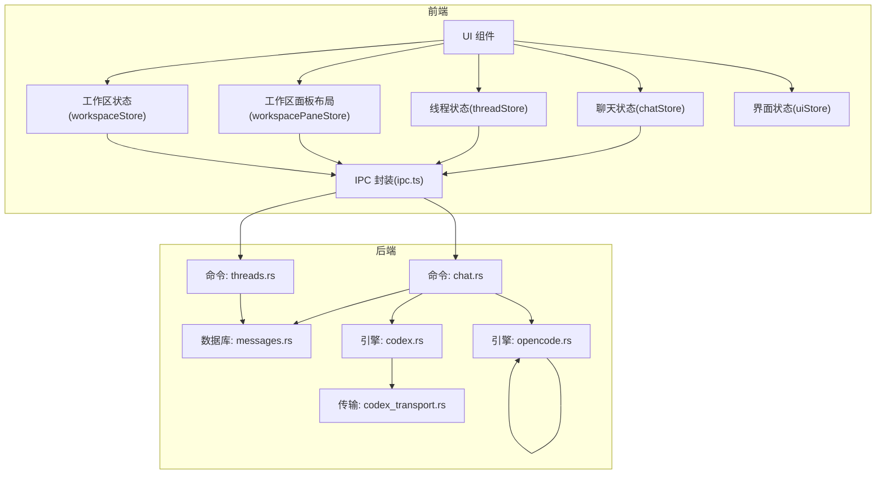
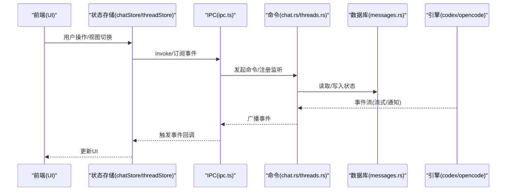
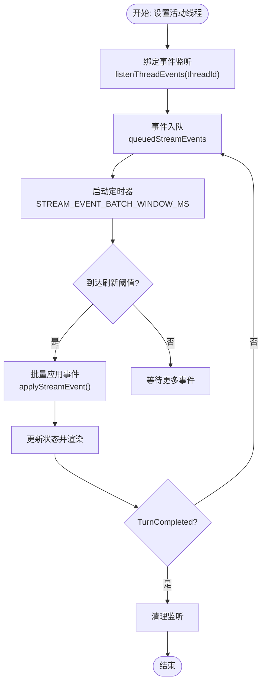
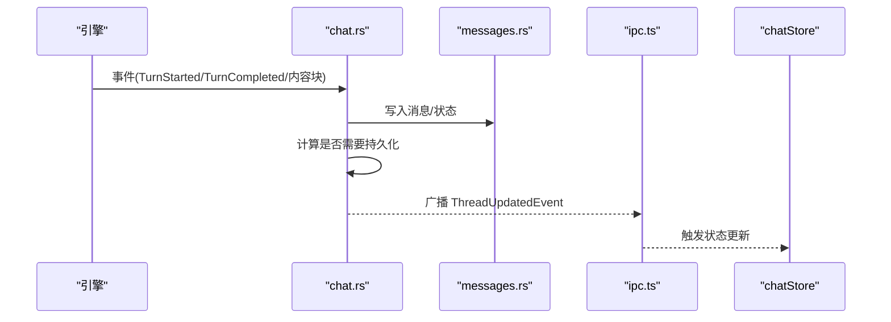
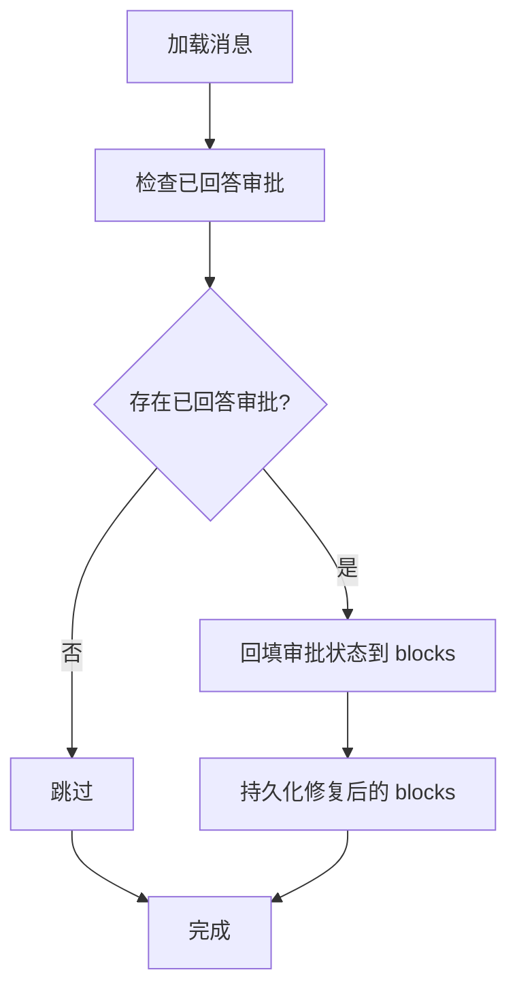
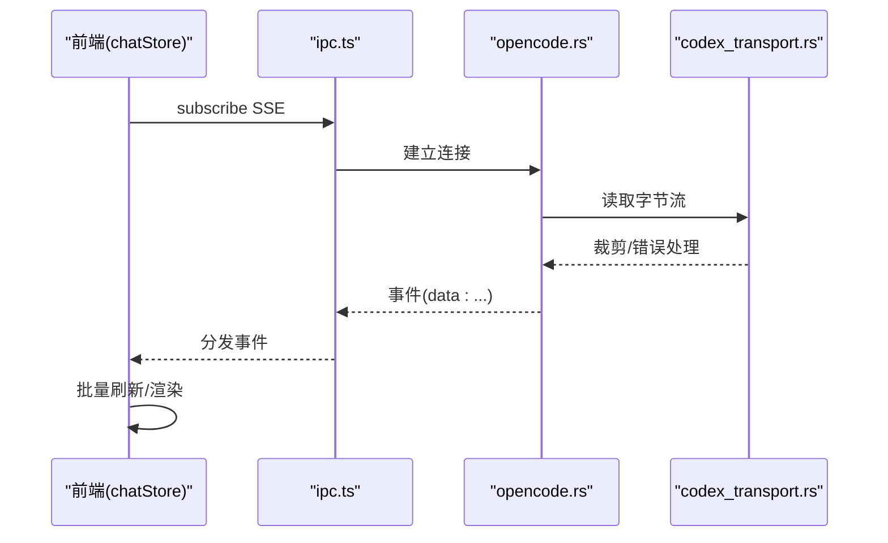
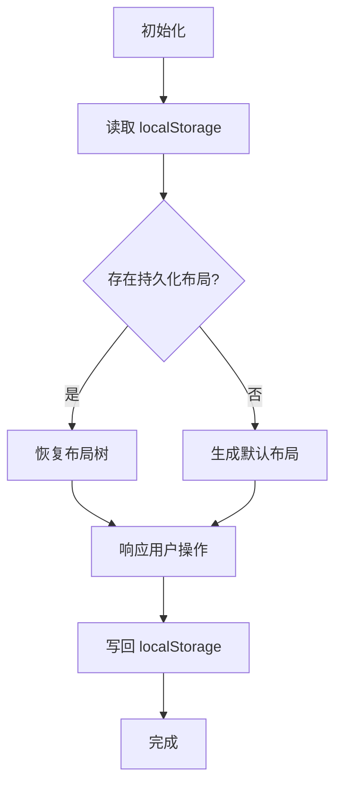
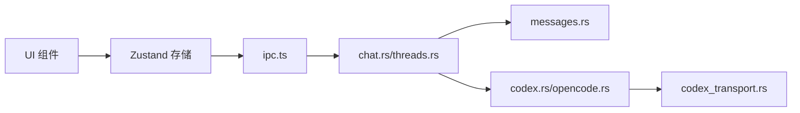

# 状态同步

<cite>
**本文引用的文件**
- [ipc.ts](file://src/lib/ipc.ts)
- [chatStore.ts](file://src/stores/chatStore.ts)
- [threadStore.ts](file://src/stores/threadStore.ts)
- [workspacePaneStore.ts](file://src/stores/workspacePaneStore.ts)
- [workspaceStore.ts](file://src/stores/workspaceStore.ts)
- [uiStore.ts](file://src/stores/uiStore.ts)
- [chat.rs](file://src-tauri/src/commands/chat.rs)
- [threads.rs](file://src-tauri/src/commands/threads.rs)
- [messages.rs](file://src-tauri/src/db/messages.rs)
- [codex.rs](file://src-tauri/src/engines/codex.rs)
- [opencode.rs](file://src-tauri/src/engines/opencode.rs)
- [codex_transport.rs](file://src-tauri/src/engines/codex_transport.rs)
- [perfTelemetry.ts](file://src/lib/perfTelemetry.ts)
</cite>

## 目录
1. [引言](#引言)
2. [项目结构](#项目结构)
3. [核心组件](#核心组件)
4. [架构总览](#架构总览)
5. [详细组件分析](#详细组件分析)
6. [依赖关系分析](#依赖关系分析)
7. [性能考量](#性能考量)
8. [故障排查指南](#故障排查指南)
9. [结论](#结论)
10. [附录](#附录)

## 引言
本文件系统化阐述 Panes 的“状态同步”机制，覆盖前端状态与后端状态的双向同步策略、IPC 通信协议与事件驱动模型、状态变更传播路径、冲突解决与一致性保障、实时/批量/增量同步的实现方式，以及性能优化、网络异常处理与重连机制，并给出调试方法与监控指标。

## 项目结构
围绕状态同步的关键代码分布在以下层次：
- 前端存储层（Zustand）：负责 UI 状态与业务状态的本地管理与持久化。
- IPC 层：封装 Tauri invoke 与事件监听，统一前后端交互接口。
- 后端命令层（Tauri Commands）：处理线程、消息、工作区等资源的读写与状态变更。
- 数据库层：消息与审批等状态的持久化与一致性修复。
- 引擎层：Codex/OpenCode 等引擎通过传输层接收流式事件并转换为应用事件。
- 性能遥测：记录关键性能指标，辅助诊断与优化。

图表来源
- [ipc.ts](file://src/lib/ipc.ts)
- [chatStore.ts](file://src/stores/chatStore.ts)
- [threadStore.ts](file://src/stores/threadStore.ts)
- [workspacePaneStore.ts](file://src/stores/workspacePaneStore.ts)
- [workspaceStore.ts](file://src/stores/workspaceStore.ts)
- [chat.rs](file://src-tauri/src/commands/chat.rs)
- [threads.rs](file://src-tauri/src/commands/threads.rs)
- [messages.rs](file://src-tauri/src/db/messages.rs)
- [codex.rs](file://src-tauri/src/engines/codex.rs)
- [opencode.rs](file://src-tauri/src/engines/opencode.rs)
- [codex_transport.rs](file://src-tauri/src/engines/codex_transport.rs)

章节来源
- [ipc.ts](file://src/lib/ipc.ts)
- [chatStore.ts](file://src/stores/chatStore.ts)
- [threadStore.ts](file://src/stores/threadStore.ts)
- [workspacePaneStore.ts](file://src/stores/workspacePaneStore.ts)
- [workspaceStore.ts](file://src/stores/workspaceStore.ts)

## 核心组件
- IPC 封装：提供 invoke 调用与事件监听，统一线程事件、终端事件、引擎运行时更新等事件通道。
- 聊天状态（chatStore）：维护当前线程的消息窗口、流式事件队列与批处理刷新逻辑；绑定线程并按序应用事件，确保 UI 与后端状态一致。
- 线程状态（threadStore）：集中管理线程列表、归档线程、活动线程与远程线程挂接；提供本地更新与远端同步能力。
- 工作区面板布局（workspacePaneStore）：以树形结构描述面板布局，支持分割、关闭、激活等操作，并持久化到 localStorage。
- 工作区状态（workspaceStore）：管理工作区集合、仓库选择与信任级别、扫描与切换等。
- 界面状态（uiStore）：侧边栏、Git 面板、探索器等 UI 可见性与焦点模式的状态管理。
- 后端命令（chat.rs/threads.rs）：负责线程状态持久化、消息窗口刷新、事件合并与派发、线程更新事件广播。
- 数据库（messages.rs）：消息块一致性修复、审批状态回填、滚动删除与批量导入。
- 引擎（codex.rs/opencode.rs）：从远端传输层接收事件流，解析为应用事件并触发持久化与 UI 更新。
- 传输（codex_transport.rs）：对大输出进行裁剪与错误行截断，避免传输风暴与内存膨胀。
- 性能遥测（perfTelemetry.ts）：记录关键指标并提供快照查询，辅助定位卡顿与延迟瓶颈。

章节来源
- [ipc.ts](file://src/lib/ipc.ts)
- [chatStore.ts](file://src/stores/chatStore.ts)
- [threadStore.ts](file://src/stores/threadStore.ts)
- [workspacePaneStore.ts](file://src/stores/workspacePaneStore.ts)
- [workspaceStore.ts](file://src/stores/workspaceStore.ts)
- [uiStore.ts](file://src/stores/uiStore.ts)
- [chat.rs](file://src-tauri/src/commands/chat.rs)
- [threads.rs](file://src-tauri/src/commands/threads.rs)
- [messages.rs](file://src-tauri/src/db/messages.rs)
- [codex.rs](file://src-tauri/src/engines/codex.rs)
- [opencode.rs](file://src-tauri/src/engines/opencode.rs)
- [codex_transport.rs](file://src-tauri/src/engines/codex_transport.rs)
- [perfTelemetry.ts](file://src/lib/perfTelemetry.ts)

## 架构总览
状态同步采用“事件驱动 + 批量合并 + 持久化”的架构：
- 前端通过 IPC 订阅后端事件（如线程事件、线程更新、引擎运行时更新），并在本地状态中应用。
- 后端在引擎产生事件或用户操作触发时，将状态变更写入数据库，并广播事件给前端。
- 对于流式事件，前端采用时间窗口聚合与批量刷新，降低渲染压力。
- 对于布局与 UI 状态，前端使用 localStorage 进行跨会话持久化，确保一致性。

图表来源
- [ipc.ts](file://src/lib/ipc.ts)
- [chatStore.ts](file://src/stores/chatStore.ts)
- [threadStore.ts](file://src/stores/threadStore.ts)
- [chat.rs](file://src-tauri/src/commands/chat.rs)
- [threads.rs](file://src-tauri/src/commands/threads.rs)
- [messages.rs](file://src-tauri/src/db/messages.rs)
- [codex.rs](file://src-tauri/src/engines/codex.rs)
- [opencode.rs](file://src-tauri/src/engines/opencode.rs)

## 详细组件分析

### 前端状态与 IPC 事件驱动
- 事件订阅：前端通过 ipc.ts 提供的 listenThreadEvents、listenThreadUpdated、listenEngineRuntimeUpdated 等函数订阅后端事件。
- 绑定与解绑：chatStore 在设置活动线程时绑定事件监听，后台保持监听以避免事件丢失；取消或完成时清理监听。
- 流式事件批处理：chatStore 使用定时器与队列聚合流式事件，在固定时间窗内一次性应用，减少渲染抖动。

图表来源
- [chatStore.ts](file://src/stores/chatStore.ts)
- [ipc.ts](file://src/lib/ipc.ts)

章节来源
- [ipc.ts](file://src/lib/ipc.ts)
- [chatStore.ts](file://src/stores/chatStore.ts)

### 后端命令与状态持久化
- 线程事件处理：chat.rs 中的 flush_stream_state 与 apply_event_to_blocks 将引擎事件转换为消息块与线程状态，必要时强制持久化。
- 线程更新广播：当线程状态变化时，生成 ThreadUpdatedEvent 并通过 IPC 广播给前端。
- 线程同步：threads.rs 在需要时导入远端消息，确保本地与远端状态一致。

图表来源
- [chat.rs](file://src-tauri/src/commands/chat.rs)
- [messages.rs](file://src-tauri/src/db/messages.rs)
- [ipc.ts](file://src/lib/ipc.ts)
- [chatStore.ts](file://src/stores/chatStore.ts)

章节来源
- [chat.rs](file://src-tauri/src/commands/chat.rs)
- [threads.rs](file://src-tauri/src/commands/threads.rs)
- [messages.rs](file://src-tauri/src/db/messages.rs)

### 冲突解决与一致性保障
- 审批状态修复：messages.rs 在加载消息时对已回答的审批进行回填与修正，确保 UI 显示与数据库一致。
- 滚动删除与批量导入：messages.rs 支持分批删除动作/审批/消息，避免单次事务过大；threads.rs 支持批量导入远端消息，减少不一致窗口。
- 事件幂等与顺序：前端通过 bindSeq 与 activeThreadBindSeq 校验，确保事件仅应用于当前绑定的线程，避免交叉污染。

图表来源
- [messages.rs](file://src-tauri/src/db/messages.rs)

章节来源
- [messages.rs](file://src-tauri/src/db/messages.rs)
- [threads.rs](file://src-tauri/src/commands/threads.rs)
- [chatStore.ts](file://src/stores/chatStore.ts)

### 实时、批量与增量同步
- 实时：引擎事件通过 SSE/通知即时到达，chat.rs 在收到事件后尽快持久化并广播。
- 批量：前端将短时间内的流式事件聚合到批次，一次性应用，降低渲染成本。
- 增量：后端仅在状态发生实质性变化时标记 dirty 字段并持久化，避免冗余写入。

章节来源
- [chat.rs](file://src-tauri/src/commands/chat.rs)
- [chatStore.ts](file://src/stores/chatStore.ts)

### 引擎事件流与传输优化
- OpenCode：opencode.rs 通过 SSE 流泵取事件，带超时与回退重试，防止长时间无事件导致的卡死。
- Codex：codex.rs 通过 transport 订阅事件，遇到传输失败时尝试恢复并发出最终完成事件。
- 传输裁剪：codex_transport.rs 对大输出参数与错误行进行裁剪，控制内存与网络开销。

图表来源
- [opencode.rs](file://src-tauri/src/engines/opencode.rs)
- [codex_transport.rs](file://src-tauri/src/engines/codex_transport.rs)
- [ipc.ts](file://src/lib/ipc.ts)
- [chatStore.ts](file://src/stores/chatStore.ts)

章节来源
- [opencode.rs](file://src-tauri/src/engines/opencode.rs)
- [codex_transport.rs](file://src-tauri/src/engines/codex_transport.rs)
- [codex.rs](file://src-tauri/src/engines/codex.rs)

### 布局与 UI 状态的持久化
- 工作区面板布局：workspacePaneStore 将布局树序列化到 localStorage，重启后恢复；支持分割、关闭、激活等操作。
- UI 状态：uiStore 将侧边栏、Git 面板、探索器等状态持久化，确保用户偏好一致。

图表来源
- [workspacePaneStore.ts](file://src/stores/workspacePaneStore.ts)
- [uiStore.ts](file://src/stores/uiStore.ts)

章节来源
- [workspacePaneStore.ts](file://src/stores/workspacePaneStore.ts)
- [uiStore.ts](file://src/stores/uiStore.ts)

## 依赖关系分析
- 前端依赖链：UI 组件依赖多个 Zustand 存储；chatStore 与 threadStore 通过 ipc.ts 与后端交互；workspacePaneStore 与 uiStore 依赖 localStorage。
- 后端依赖链：chat.rs/threads.rs 依赖数据库层；引擎层依赖传输层；事件最终通过 IPC 广播到前端。
- 耦合与内聚：IPC 封装提供统一接口，降低前端对具体命令与引擎的耦合；数据库层承担一致性修复职责，提升整体健壮性。

图表来源
- [ipc.ts](file://src/lib/ipc.ts)
- [chat.rs](file://src-tauri/src/commands/chat.rs)
- [threads.rs](file://src-tauri/src/commands/threads.rs)
- [messages.rs](file://src-tauri/src/db/messages.rs)
- [codex.rs](file://src-tauri/src/engines/codex.rs)
- [opencode.rs](file://src-tauri/src/engines/opencode.rs)
- [codex_transport.rs](file://src-tauri/src/engines/codex_transport.rs)

章节来源
- [ipc.ts](file://src/lib/ipc.ts)
- [chat.rs](file://src-tauri/src/commands/chat.rs)
- [threads.rs](file://src-tauri/src/commands/threads.rs)
- [messages.rs](file://src-tauri/src/db/messages.rs)
- [codex.rs](file://src-tauri/src/engines/codex.rs)
- [opencode.rs](file://src-tauri/src/engines/opencode.rs)
- [codex_transport.rs](file://src-tauri/src/engines/codex_transport.rs)

## 性能考量
- 事件批处理：前端将短时间内的流式事件聚合，减少渲染次数与重排。
- 指标监控：perfTelemetry.ts 记录关键指标（首屏、首内容、首文本、渲染提交耗时、Markdown worker 耗时等），并提供 p95、avg、max 快照。
- 传输裁剪：对大输出与错误行进行截断，避免内存与网络峰值。
- 持久化策略：后端仅在状态实质性变化时持久化，降低 IO 压力。

章节来源
- [chatStore.ts](file://src/stores/chatStore.ts)
- [perfTelemetry.ts](file://src/lib/perfTelemetry.ts)
- [codex_transport.rs](file://src-tauri/src/engines/codex_transport.rs)
- [chat.rs](file://src-tauri/src/commands/chat.rs)

## 故障排查指南
- 事件丢失：确认 chatStore 是否正确绑定/解绑监听；检查 bindSeq 与 activeThreadBindSeq 是否匹配。
- 事件堆积：观察 STREAM_EVENT_BATCH_WINDOW_MS 与队列长度，适当增大阈值或优化渲染。
- 传输异常：查看 opencode.rs 的 SSE pump 日志与回退重试；codex.rs 的传输失败处理与恢复。
- 审批状态不一致：检查 messages.rs 的审批回填逻辑与数据库状态。
- 网络异常与重连：关注 opencode.rs 的 backoff 与超时处理；必要时在前端增加指数退避与手动重试。
- 性能告警：通过 perfTelemetry.ts 的快照与控制台警告定位瓶颈。

章节来源
- [chatStore.ts](file://src/stores/chatStore.ts)
- [opencode.rs](file://src-tauri/src/engines/opencode.rs)
- [codex.rs](file://src-tauri/src/engines/codex.rs)
- [messages.rs](file://src-tauri/src/db/messages.rs)
- [perfTelemetry.ts](file://src/lib/perfTelemetry.ts)

## 结论
Panes 的状态同步通过 IPC 事件驱动与后端持久化相结合，实现了从前端到后端、从引擎到 UI 的全链路一致性。前端采用批处理与时间窗聚合降低渲染压力，后端通过增量持久化与一致性修复保障数据稳定。配合性能遥测与传输裁剪，系统在复杂场景下仍能保持良好的实时性与稳定性。

## 附录
- 关键事件类型与来源
  - 线程事件：stream-event-<threadId>（来自后端引擎事件）
  - 线程更新：thread-updated（后端广播）
  - 引擎运行时更新：engine-runtime-updated（后端广播）
  - Git 变更：git-repo-changed（后端广播）
- 常用 IPC 接口
  - listenThreadEvents、listenThreadUpdated、listenEngineRuntimeUpdated、listenGitRepoChanged
  - invoke 调用：createThread、sendMessage、getThreadMessages、listThreads 等

章节来源
- [ipc.ts](file://src/lib/ipc.ts)
- [chatStore.ts](file://src/stores/chatStore.ts)
- [threadStore.ts](file://src/stores/threadStore.ts)
- [workspacePaneStore.ts](file://src/stores/workspacePaneStore.ts)
- [workspaceStore.ts](file://src/stores/workspaceStore.ts)