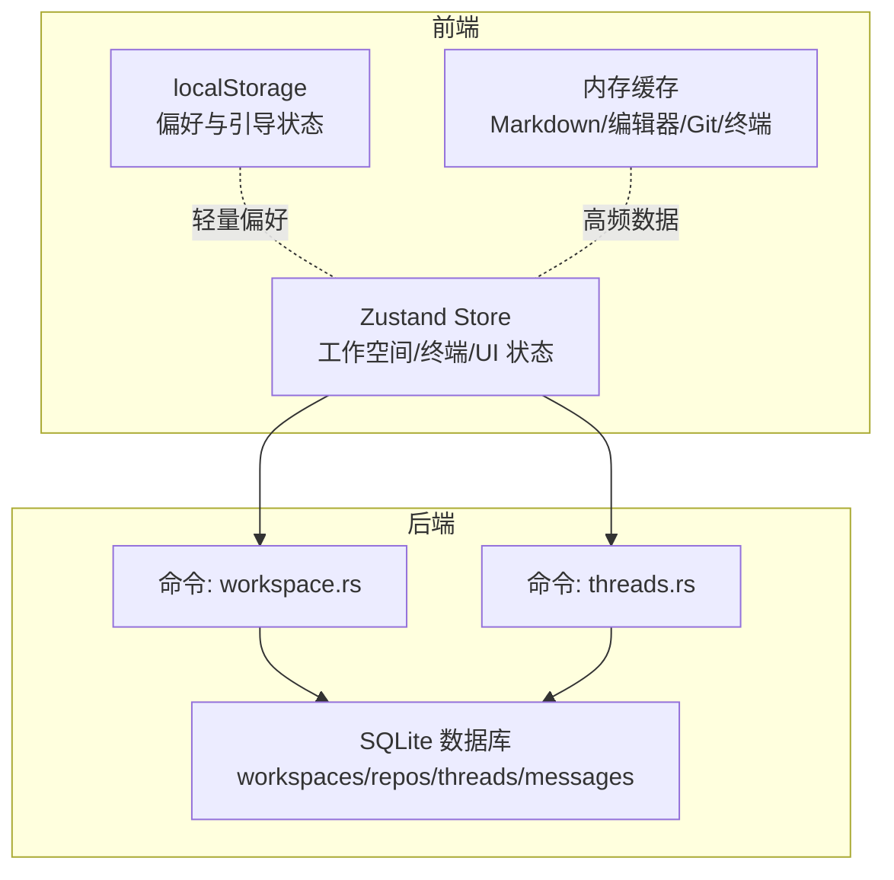
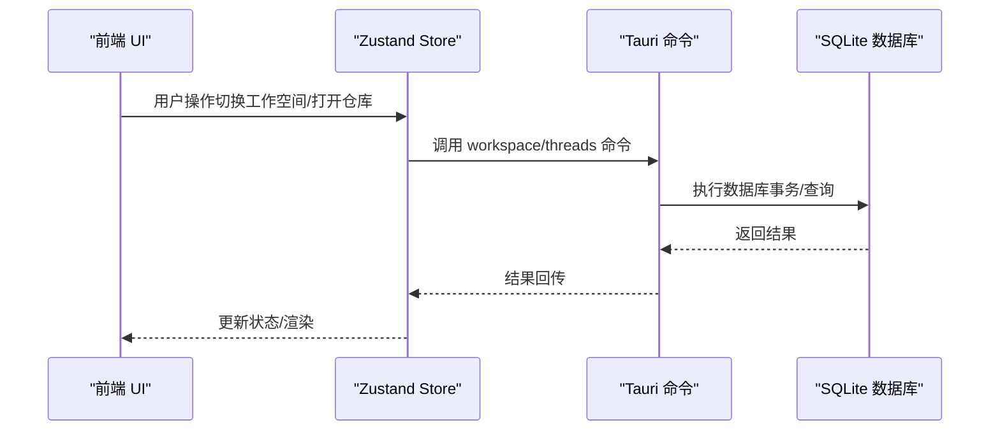
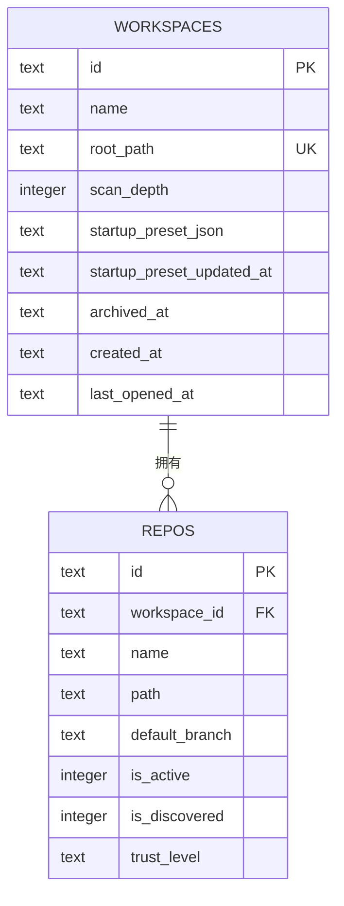
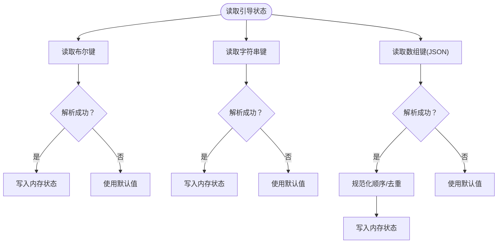
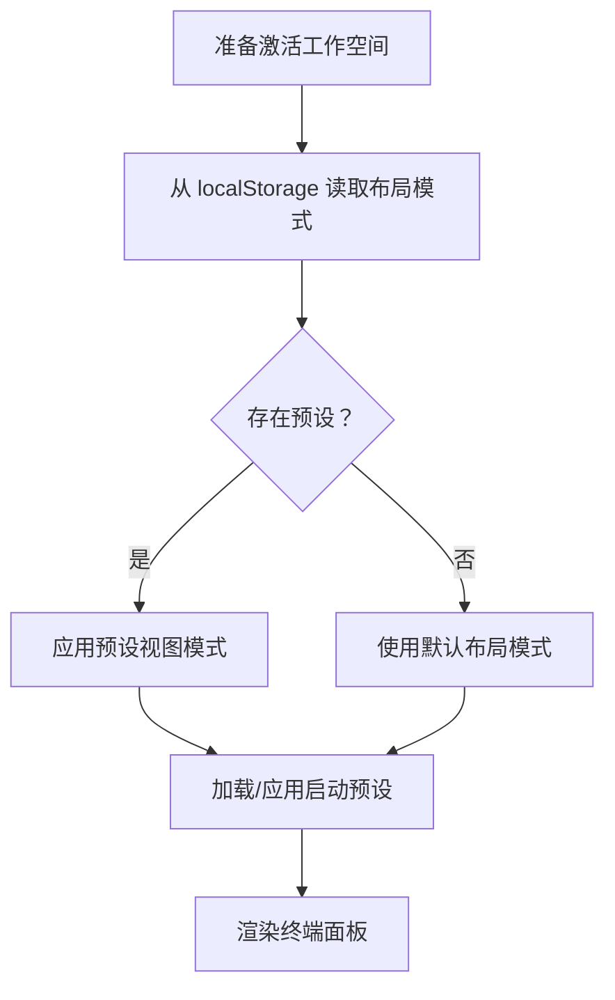
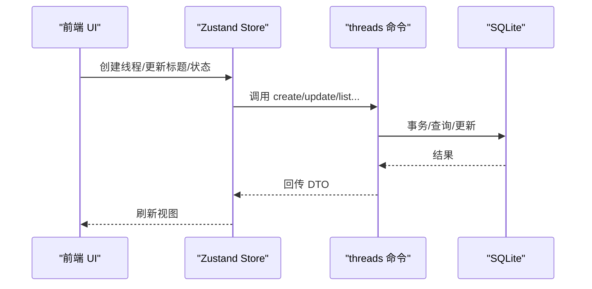
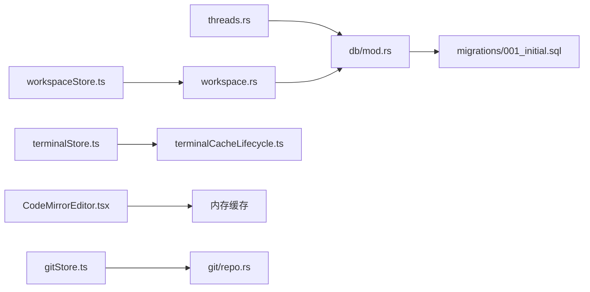

# 存储策略

<cite>
**本文引用的文件**
- [src-tauri/src/db/mod.rs](file://src-tauri/src/db/mod.rs)
- [src-tauri/src/db/migrations/001_initial.sql](file://src-tauri/src/db/migrations/001_initial.sql)
- [src-tauri/src/db/workspaces.rs](file://src-tauri/src/db/workspaces.rs)
- [src-tauri/src/db/threads.rs](file://src-tauri/src/db/threads.rs)
- [src-tauri/src/commands/workspace.rs](file://src-tauri/src/commands/workspace.rs)
- [src-tauri/src/commands/threads.rs](file://src-tauri/src/commands/threads.rs)
- [src/stores/workspaceStore.ts](file://src/stores/workspaceStore.ts)
- [src/stores/onboardingStore.ts](file://src/stores/onboardingStore.ts)
- [src/stores/terminalStore.ts](file://src/stores/terminalStore.ts)
- [src/components/terminal/terminalCacheLifecycle.ts](file://src/components/terminal/terminalCacheLifecycle.ts)
- [src/components/editor/CodeMirrorEditor.tsx](file://src/components/editor/CodeMirrorEditor.tsx)
- [src/components/chat/MarkdownContent.tsx](file://src/components/chat/MarkdownContent.tsx)
- [src/stores/gitStore.ts](file://src/stores/gitStore.ts)
- [src-tauri/src/git/repo.rs](file://src-tauri/src/git/repo.rs)
</cite>

## 目录
1. [简介](#简介)
2. [项目结构与存储角色定位](#项目结构与存储角色定位)
3. [核心存储组件](#核心存储组件)
4. [架构总览](#架构总览)
5. [详细组件分析](#详细组件分析)
6. [依赖关系分析](#依赖关系分析)
7. [性能考量](#性能考量)
8. [故障排查指南](#故障排查指南)
9. [结论](#结论)
10. [附录：存储容量与清理策略](#附录存储容量与清理策略)

## 简介
本文件系统性阐述 Panes 的存储策略，覆盖三类存储介质：浏览器端本地持久化（localStorage）、前端内存缓存与淘汰机制、以及后端 SQLite 数据库存储。文档重点说明不同状态类型（工作空间信息、用户界面状态、引导流程状态、终端会话与编辑器缓存、Git 差异与状态缓存）的存储选择原则、访问模式、优先级与性能权衡，并给出容量限制、清理策略、迁移与版本兼容性、以及数据完整性保障措施。

## 项目结构与存储角色定位
- 前端（React + Zustand）
  - localStorage：用于轻量、跨会话的偏好设置与引导状态（如上次打开的工作空间、引导偏好、布局模式等）。
  - 内存缓存：用于高频读取且体积较大的运行时数据（如 Markdown 渲染结果、编辑器视图、Git 状态/Diff 缓存、终端会话缓存等），并配合 LRU/字节限制进行主动回收。
- 后端（Tauri + Rust）
  - SQLite：作为主数据仓库，持久化工作空间、仓库、线程、消息、审批、动作等结构化数据；通过连接池与迁移机制保障一致性与可演进性。

图表来源
- [src/stores/workspaceStore.ts:142-158](file://src/stores/workspaceStore.ts#L142-L158)
- [src/stores/terminalStore.ts:754-797](file://src/stores/terminalStore.ts#L754-L797)
- [src-tauri/src/commands/workspace.rs:34-66](file://src-tauri/src/commands/workspace.rs#L34-L66)
- [src-tauri/src/commands/threads.rs:32-52](file://src-tauri/src/commands/threads.rs#L32-L52)
- [src-tauri/src/db/mod.rs:74-135](file://src-tauri/src/db/mod.rs#L74-L135)

章节来源
- [src/stores/workspaceStore.ts:36-102](file://src/stores/workspaceStore.ts#L36-L102)
- [src/stores/onboardingStore.ts:10-151](file://src/stores/onboardingStore.ts#L10-L151)
- [src/stores/terminalStore.ts:27-37](file://src/stores/terminalStore.ts#L27-L37)
- [src-tauri/src/db/mod.rs:74-135](file://src-tauri/src/db/mod.rs#L74-L135)

## 核心存储组件
- localStorage（前端）
  - 用途：保存轻量、跨会话的状态键值对，如“最后打开的工作空间 ID”、“每个工作空间的最后仓库 ID”、“引导完成标记与偏好”、“终端布局模式”等。
  - 特点：简单可靠、易用、容量有限（通常数 MB），适合非敏感、小体量配置。
- 内存缓存（前端）
  - 用途：承载高频读写、体积较大或生命周期短的数据，如 Markdown HTML 缓存、编辑器视图缓存、Git 状态/Diff 缓存、终端会话缓存等。
  - 特点：命中率高、延迟低，但受内存限制，需 LRU/字节上限控制与定期清理。
- SQLite（后端）
  - 用途：持久化结构化业务数据（工作空间、仓库、线程、消息、动作、审批、事件日志等），支持复杂查询与事务。
  - 特点：强一致、可迁移、索引优化、全文检索支持；通过连接池降低开销。

章节来源
- [src/stores/workspaceStore.ts:67-111](file://src/stores/workspaceStore.ts#L67-L111)
- [src/stores/onboardingStore.ts:61-151](file://src/stores/onboardingStore.ts#L61-L151)
- [src/stores/terminalStore.ts:27-37](file://src/stores/terminalStore.ts#L27-L37)
- [src-tauri/src/db/migrations/001_initial.sql:1-132](file://src-tauri/src/db/migrations/001_initial.sql#L1-L132)
- [src-tauri/src/db/mod.rs:21-27](file://src-tauri/src/db/mod.rs#L21-L27)

## 架构总览
前端通过 Tauri 命令调用后端数据库操作，实现“前端状态 + 本地持久化 + 后端持久化”的分层存储体系。命令在后台线程中执行数据库操作，避免阻塞 UI。

图表来源
- [src-tauri/src/commands/workspace.rs:22-31](file://src-tauri/src/commands/workspace.rs#L22-L31)
- [src-tauri/src/commands/threads.rs:21-30](file://src-tauri/src/commands/threads.rs#L21-L30)
- [src-tauri/src/db/mod.rs:98-112](file://src-tauri/src/db/mod.rs#L98-L112)

## 详细组件分析

### 工作空间与仓库信息存储（SQLite + localStorage）
- localStorage
  - 最后打开的工作空间 ID：用于启动时恢复最近工作区。
  - 每工作空间的最后仓库 ID：用于恢复仓库选择。
- SQLite
  - 表：workspaces、repos。
  - 关键字段：唯一路径约束、扫描深度、归档时间、启动预设 JSON、Git 仓库选择状态等。
  - 命令：打开/列出/归档/恢复工作空间，获取/设置仓库信任级别与 Git 活跃状态。

图表来源
- [src-tauri/src/db/migrations/001_initial.sql:1-23](file://src-tauri/src/db/migrations/001_initial.sql#L1-L23)
- [src-tauri/src/db/workspaces.rs:15-58](file://src-tauri/src/db/workspaces.rs#L15-L58)
- [src-tauri/src/commands/workspace.rs:34-66](file://src-tauri/src/commands/workspace.rs#L34-L66)

章节来源
- [src/stores/workspaceStore.ts:142-158](file://src/stores/workspaceStore.ts#L142-L158)
- [src/stores/workspaceStore.ts:67-111](file://src/stores/workspaceStore.ts#L67-L111)
- [src-tauri/src/db/workspaces.rs:60-96](file://src-tauri/src/db/workspaces.rs#L60-L96)
- [src-tauri/src/commands/workspace.rs:68-78](file://src-tauri/src/commands/workspace.rs#L68-L78)

### 引导流程状态存储（localStorage）
- 键名约定：包含“引导完成”、“工作流偏好”、“聊天引擎列表”等键，采用带版本号的命名以支持迁移。
- 读写策略：统一的布尔/字符串/JSON 解析与容错，失败即降级为空状态，不中断应用启动。

图表来源
- [src/stores/onboardingStore.ts:61-151](file://src/stores/onboardingStore.ts#L61-L151)

章节来源
- [src/stores/onboardingStore.ts:10-151](file://src/stores/onboardingStore.ts#L10-L151)

### 终端与 UI 状态存储（localStorage + 内存缓存）
- localStorage
  - 每工作空间的布局模式键：用于恢复终端/聊天/分割视图布局偏好。
- 内存缓存
  - 终端会话缓存：按工作空间分组，支持挂起/恢复、输出队列截断、空闲回收。
  - Markdown HTML 缓存：LRU 字节限制，过期淘汰。
  - 编辑器视图缓存：LRU 数量与字节限制，按需销毁。

图表来源
- [src/stores/terminalStore.ts:754-797](file://src/stores/terminalStore.ts#L754-L797)
- [src/stores/terminalStore.ts:33-37](file://src/stores/terminalStore.ts#L33-L37)

章节来源
- [src/stores/terminalStore.ts:27-37](file://src/stores/terminalStore.ts#L27-L37)
- [src/stores/terminalStore.ts:754-797](file://src/stores/terminalStore.ts#L754-L797)
- [src/components/terminal/terminalCacheLifecycle.ts:57-73](file://src/components/terminal/terminalCacheLifecycle.ts#L57-L73)
- [src/components/editor/CodeMirrorEditor.tsx:260-284](file://src/components/editor/CodeMirrorEditor.tsx#L260-L284)
- [src/components/chat/MarkdownContent.tsx:61-90](file://src/components/chat/MarkdownContent.tsx#L61-L90)

### 线程与消息存储（SQLite）
- SQLite
  - 表：threads、messages、actions、approvals、engine_event_logs。
  - 支持：线程状态机、消息计数与 token 统计、附件块序列化、全文检索（FTS）。
  - 命令：创建/查询/归档/恢复线程，更新引擎元数据，刷新统计等。
- 运行时恢复
  - 启动时对“流式助手消息”进行中断标记，根据审批与最新消息状态推导线程状态，确保一致性。

图表来源
- [src-tauri/src/commands/threads.rs:32-52](file://src-tauri/src/commands/threads.rs#L32-L52)
- [src-tauri/src/db/threads.rs:15-46](file://src-tauri/src/db/threads.rs#L15-L46)

章节来源
- [src-tauri/src/db/threads.rs:280-367](file://src-tauri/src/db/threads.rs#L280-L367)
- [src-tauri/src/commands/threads.rs:652-743](file://src-tauri/src/commands/threads.rs#L652-L743)

### Git 状态与差异缓存（内存）
- 缓存结构
  - 状态缓存：按仓库路径索引，记录更新时间与条目大小，超过阈值按最旧优先淘汰。
  - Diff 缓存：按“仓库::是否暂存::文件路径”键索引，同样支持字节与数量上限控制。
- 失效策略
  - 仓库变更、文件树刷新、路径包含关系变化时触发失效。

章节来源
- [src/stores/gitStore.ts:116-211](file://src/stores/gitStore.ts#L116-L211)
- [src-tauri/src/git/repo.rs:108-127](file://src-tauri/src/git/repo.rs#L108-L127)

## 依赖关系分析
- 前端 Store 依赖 Tauri 命令，命令依赖数据库模块；数据库模块负责连接池、迁移与表结构定义。
- 终端与编辑器缓存相互独立，均遵循 LRU/字节上限策略；Git 缓存与文件树缓存共享失效逻辑。

图表来源
- [src/stores/workspaceStore.ts:1-10](file://src/stores/workspaceStore.ts#L1-L10)
- [src-tauri/src/commands/workspace.rs:1-17](file://src-tauri/src/commands/workspace.rs#L1-L17)
- [src-tauri/src/commands/threads.rs:1-17](file://src-tauri/src/commands/threads.rs#L1-L17)
- [src-tauri/src/db/mod.rs:1-27](file://src-tauri/src/db/mod.rs#L1-L27)
- [src-tauri/src/db/migrations/001_initial.sql:1-132](file://src-tauri/src/db/migrations/001_initial.sql#L1-L132)
- [src/stores/terminalStore.ts:1-10](file://src/stores/terminalStore.ts#L1-L10)
- [src/components/terminal/terminalCacheLifecycle.ts:1-20](file://src/components/terminal/terminalCacheLifecycle.ts#L1-L20)
- [src/components/editor/CodeMirrorEditor.tsx:254-256](file://src/components/editor/CodeMirrorEditor.tsx#L254-L256)
- [src/stores/gitStore.ts:1-20](file://src/stores/gitStore.ts#L1-L20)
- [src-tauri/src/git/repo.rs:88-127](file://src-tauri/src/git/repo.rs#L88-L127)

## 性能考量
- 连接池与后台执行
  - SQLite 使用连接池与后台任务执行数据库操作，避免阻塞主线程。
- 索引与查询优化
  - 为 threads/messages/actions/approvals 等表建立复合索引，支持按工作空间、状态、活动时间等高效查询。
- 全文检索
  - 使用 FTS5 对消息内容建立可搜索索引，结合触发器自动维护。
- 缓存策略
  - 终端/编辑器/Markdown/Git 缓存均设置数量与字节上限，采用 LRU 或最旧优先淘汰，减少内存占用与 GC 压力。
- I/O 与序列化
  - 将大型 JSON/文本序列化与反序列化限制在必要范围，避免频繁大对象拷贝。

章节来源
- [src-tauri/src/db/mod.rs:21-27](file://src-tauri/src/db/mod.rs#L21-L27)
- [src-tauri/src/db/mod.rs:98-112](file://src-tauri/src/db/mod.rs#L98-L112)
- [src-tauri/src/db/migrations/001_initial.sql:96-131](file://src-tauri/src/db/migrations/001_initial.sql#L96-L131)
- [src/components/terminal/terminalCacheLifecycle.ts:57-73](file://src/components/terminal/terminalCacheLifecycle.ts#L57-L73)
- [src/components/editor/CodeMirrorEditor.tsx:260-284](file://src/components/editor/CodeMirrorEditor.tsx#L260-L284)
- [src/components/chat/MarkdownContent.tsx:61-90](file://src/components/chat/MarkdownContent.tsx#L61-L90)
- [src/stores/gitStore.ts:139-181](file://src/stores/gitStore.ts#L139-L181)

## 故障排查指南
- localStorage 不可用或空间不足
  - 现象：偏好设置无法保存或读取异常。
  - 处理：代码已捕获异常并降级为空状态，不影响应用启动；建议检查浏览器隐私模式或存储配额。
- SQLite 初始化失败
  - 现象：应用启动时报错，无法打开数据库。
  - 处理：检查应用数据目录权限、磁盘空间；确认迁移脚本未损坏；查看日志目录。
- 终端会话回收异常
  - 现象：长时间挂起后会话未被回收或回收时机不当。
  - 处理：核对空闲超时参数、检查定时器清理逻辑与缓存键生成规则。
- 缓存溢出导致内存紧张
  - 现象：页面卡顿、内存飙升。
  - 处理：调整缓存上限参数，观察淘汰日志；避免同时打开过多大型文件或终端会话。

章节来源
- [src/stores/workspaceStore.ts:96-102](file://src/stores/workspaceStore.ts#L96-L102)
- [src/stores/onboardingStore.ts:69-79](file://src/stores/onboardingStore.ts#L69-L79)
- [src-tauri/src/db/mod.rs:74-96](file://src-tauri/src/db/mod.rs#L74-L96)
- [src/components/terminal/terminalCacheLifecycle.ts:57-73](file://src/components/terminal/terminalCacheLifecycle.ts#L57-L73)

## 结论
Panes 的存储策略以“前端轻量持久化 + 内存缓存 + 后端结构化数据库”为核心，针对不同状态类型采用差异化存储方案：引导与 UI 偏好使用 localStorage，高频运行时数据使用内存缓存，核心业务数据使用 SQLite 并辅以索引与全文检索。通过连接池、后台任务、LRU/字节限制与迁移机制，系统在可用性、性能与可维护性之间取得平衡。

## 附录：存储容量与清理策略
- localStorage
  - 容量：通常受限于浏览器实现（常见数 MB），建议仅存放小体量键值。
  - 清理：异常忽略，不主动清理；可通过迁移键名版本实现兼容。
- SQLite
  - 容量：受宿主机磁盘空间限制；迁移脚本包含表结构与索引初始化。
  - 清理：无自动清理；可通过归档/删除命令清理历史数据。
- 内存缓存
  - 终端会话：空闲超时回收、输出队列截断、定时清理。
  - Markdown HTML：LRU 数量与字节上限，逐出最旧条目。
  - 编辑器视图：LRU 数量与字节上限，DOM 不再连接时优先淘汰。
  - Git 状态/Diff：LRU 数量与字节上限，按最旧优先淘汰；路径失效时批量清理。

章节来源
- [src-tauri/src/db/migrations/001_initial.sql:1-132](file://src-tauri/src/db/migrations/001_initial.sql#L1-L132)
- [src-tauri/src/db/mod.rs:122-134](file://src-tauri/src/db/mod.rs#L122-L134)
- [src/components/terminal/terminalCacheLifecycle.ts:57-73](file://src/components/terminal/terminalCacheLifecycle.ts#L57-L73)
- [src/components/chat/MarkdownContent.tsx:61-90](file://src/components/chat/MarkdownContent.tsx#L61-L90)
- [src/components/editor/CodeMirrorEditor.tsx:260-284](file://src/components/editor/CodeMirrorEditor.tsx#L260-L284)
- [src/stores/gitStore.ts:139-181](file://src/stores/gitStore.ts#L139-L181)