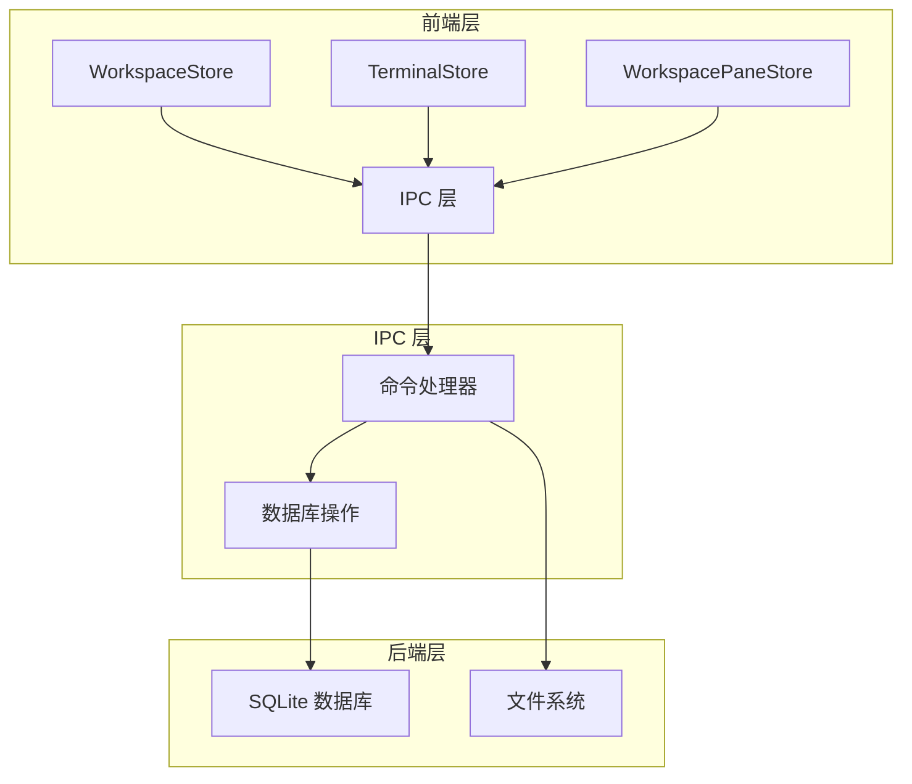
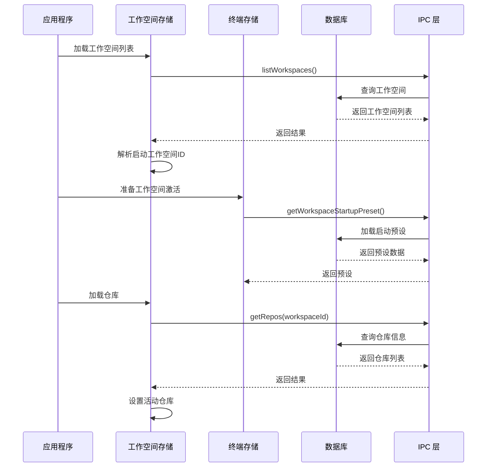
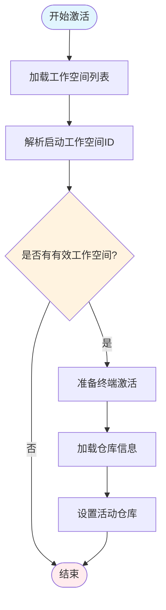
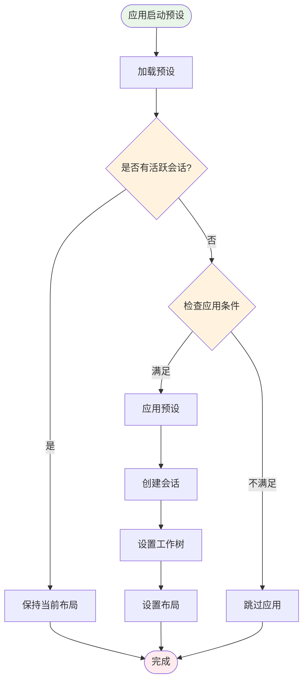
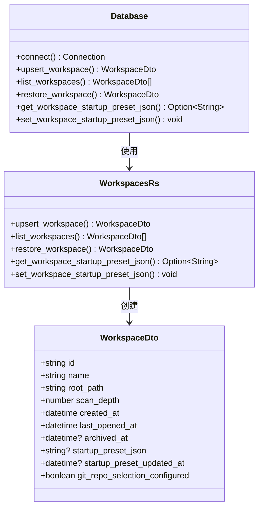
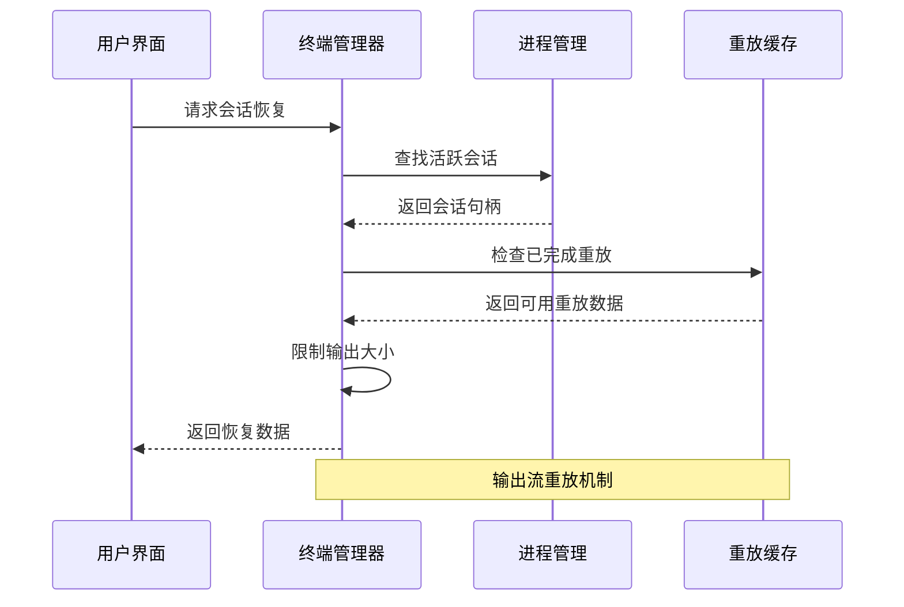
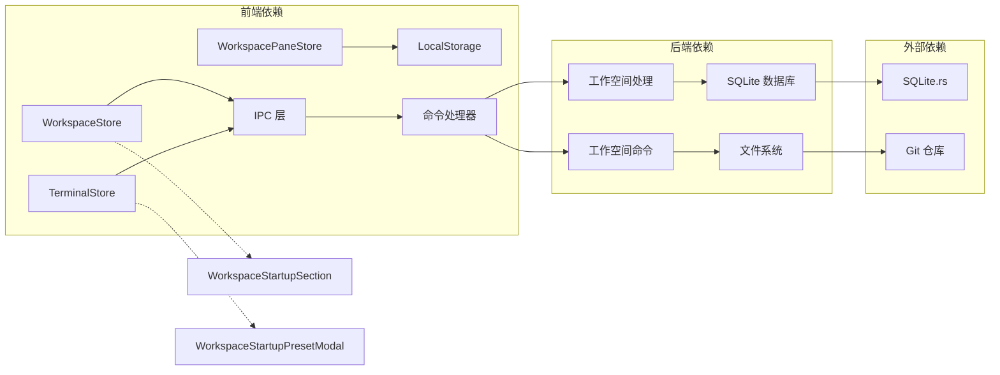
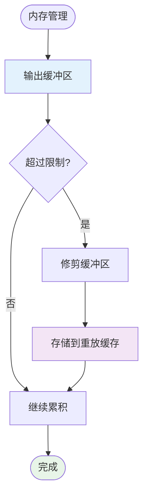
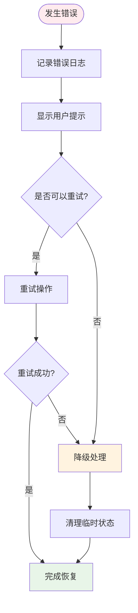

# 恢复机制

<cite>
**本文档引用的文件**
- [workspaceStore.ts](file://src/stores/workspaceStore.ts)
- [terminalStore.ts](file://src/stores/terminalStore.ts)
- [ipc.ts](file://src/lib/ipc.ts)
- [workspaces.rs](file://src-tauri/src/db/workspaces.rs)
- [workspace.rs](file://src-tauri/src/commands/workspace.rs)
- [mod.rs](file://src-tauri/src/terminal/mod.rs)
- [workspacePaneStore.ts](file://src/stores/workspacePaneStore.ts)
- [WorkspaceStartupPresetModal.tsx](file://src/components/workspace/WorkspaceStartupPresetModal.tsx)
- [WorkspaceStartupSection.tsx](file://src/components/workspace/WorkspaceStartupSection.tsx)
- [workspaceStartup.rs](file://src-tauri/src/workspace_startup.rs)
</cite>

## 目录
1. [简介](#简介)
2. [项目结构](#项目结构)
3. [核心组件](#核心组件)
4. [架构概览](#架构概览)
5. [详细组件分析](#详细组件分析)
6. [依赖分析](#依赖分析)
7. [性能考虑](#性能考虑)
8. [故障排除指南](#故障排除指南)
9. [结论](#结论)

## 简介

Panels 应用的状态恢复机制是一个复杂的多层系统，负责在应用重启后恢复用户的工作环境。该机制涵盖了工作空间激活、仓库加载、聊天记录恢复和终端会话重建等多个方面，确保用户能够无缝地回到之前的工作状态。

## 项目结构

应用程序采用分层架构设计，主要分为前端状态管理层、IPC 通信层和后端数据库层：

**图表来源**
- [workspaceStore.ts:134-158](file://src/stores/workspaceStore.ts#L134-L158)
- [terminalStore.ts:751-797](file://src/stores/terminalStore.ts#L751-L797)
- [ipc.ts:72-120](file://src/lib/ipc.ts#L72-L120)

**章节来源**
- [workspaceStore.ts:1-429](file://src/stores/workspaceStore.ts#L1-L429)
- [terminalStore.ts:1-200](file://src/stores/terminalStore.ts#L1-L200)
- [workspacePaneStore.ts:1-693](file://src/stores/workspacePaneStore.ts#L1-L693)

## 核心组件

### 工作空间状态管理器

工作空间状态管理器是整个恢复机制的核心组件，负责管理用户工作空间的生命周期和状态恢复。

**关键功能：**
- 工作空间列表加载和激活
- 仓库信息加载和缓存
- 最近工作空间和仓库的持久化
- 工作空间激活时的预处理逻辑

### 终端状态管理器

终端状态管理器专门处理终端会话的恢复和重建，包括启动预设的应用和会话重建。

**关键功能：**
- 启动预设的加载和应用
- 终端会话的创建和管理
- 输出流的重放和恢复
- 工作树配置的处理

### IPC 通信层

IPC 通信层提供了前端与后端之间的桥梁，负责执行实际的数据操作和系统调用。

**关键功能：**
- 命令调用的封装
- 异步操作的处理
- 错误处理和重试机制
- 事件监听和通知

**章节来源**
- [workspaceStore.ts:134-286](file://src/stores/workspaceStore.ts#L134-L286)
- [terminalStore.ts:751-978](file://src/stores/terminalStore.ts#L751-L978)
- [ipc.ts:72-792](file://src/lib/ipc.ts#L72-L792)

## 架构概览

应用重启后的状态恢复流程遵循严格的顺序和依赖关系：

**图表来源**
- [workspaceStore.ts:142-158](file://src/stores/workspaceStore.ts#L142-L158)
- [workspaceStore.ts:223-249](file://src/stores/workspaceStore.ts#L223-L249)
- [terminalStore.ts:754-797](file://src/stores/terminalStore.ts#L754-L797)

## 详细组件分析

### 工作空间激活流程

工作空间激活是状态恢复的第一步，涉及多个组件的协调工作：

**图表来源**
- [workspaceStore.ts:142-158](file://src/stores/workspaceStore.ts#L142-L158)
- [workspaceStore.ts:251-286](file://src/stores/workspaceStore.ts#L251-L286)

**章节来源**
- [workspaceStore.ts:142-158](file://src/stores/workspaceStore.ts#L142-L158)
- [workspaceStore.ts:251-286](file://src/stores/workspaceStore.ts#L251-L286)

### 终端启动预设应用

终端启动预设的应用过程包含多个步骤和条件检查：

**图表来源**
- [terminalStore.ts:754-797](file://src/stores/terminalStore.ts#L754-L797)
- [terminalStore.ts:960-978](file://src/stores/terminalStore.ts#L960-L978)

**章节来源**
- [terminalStore.ts:754-797](file://src/stores/terminalStore.ts#L754-L797)
- [terminalStore.ts:960-978](file://src/stores/terminalStore.ts#L960-L978)

### 数据库持久化机制

数据库层负责所有状态数据的持久化和恢复：

**图表来源**
- [workspaces.rs:15-58](file://src-tauri/src/db/workspaces.rs#L15-L58)
- [workspaces.rs:237-255](file://src-tauri/src/db/workspaces.rs#L237-L255)
- [workspaces.rs:265-306](file://src-tauri/src/db/workspaces.rs#L265-L306)

**章节来源**
- [workspaces.rs:15-58](file://src-tauri/src/db/workspaces.rs#L15-L58)
- [workspaces.rs:237-255](file://src-tauri/src/db/workspaces.rs#L237-L255)
- [workspaces.rs:265-306](file://src-tauri/src/db/workspaces.rs#L265-L306)

### 终端会话恢复

终端会话的恢复机制包括输出流的重放和会话状态的重建：

**图表来源**
- [mod.rs:347-383](file://src-tauri/src/terminal/mod.rs#L347-L383)
- [mod.rs:558-571](file://src-tauri/src/terminal/mod.rs#L558-L571)

**章节来源**
- [mod.rs:347-383](file://src-tauri/src/terminal/mod.rs#L347-L383)
- [mod.rs:558-571](file://src-tauri/src/terminal/mod.rs#L558-L571)

## 依赖分析

状态恢复机制中的组件依赖关系如下：

**图表来源**
- [workspaceStore.ts:1-38](file://src/stores/workspaceStore.ts#L1-L38)
- [terminalStore.ts:1-20](file://src/stores/terminalStore.ts#L1-L20)
- [workspace.rs:1-17](file://src-tauri/src/commands/workspace.rs#L1-L17)

**章节来源**
- [workspaceStore.ts:1-38](file://src/stores/workspaceStore.ts#L1-L38)
- [terminalStore.ts:1-20](file://src/stores/terminalStore.ts#L1-L20)
- [workspace.rs:1-17](file://src-tauri/src/commands/workspace.rs#L1-L17)

## 性能考虑

### 并发控制

应用采用了多种并发控制机制来确保状态恢复的性能和稳定性：

1. **请求序列号控制**：通过 `reposLoadSeq` 变量防止旧请求覆盖新请求
2. **异步任务池**：使用 Tokio 的任务池处理大量并发操作
3. **输出流缓冲**：终端输出采用共享缓冲区避免过度 IPC 调用

### 内存管理

**图表来源**
- [mod.rs:141-175](file://src-tauri/src/terminal/mod.rs#L141-L175)
- [mod.rs:573-586](file://src-tauri/src/terminal/mod.rs#L573-L586)

### 恢复策略

应用支持多种恢复策略以适应不同的使用场景：

1. **完整恢复**：恢复所有状态包括工作空间、仓库、终端会话等
2. **增量恢复**：仅恢复必要的状态，跳过耗时的操作
3. **部分恢复**：当某些组件恢复失败时，继续恢复其他组件

**章节来源**
- [mod.rs:141-175](file://src-tauri/src/terminal/mod.rs#L141-L175)
- [mod.rs:573-586](file://src-tauri/src/terminal/mod.rs#L573-L586)

## 故障排除指南

### 常见恢复问题

1. **工作空间无法激活**
   - 检查工作空间路径的有效性
   - 验证数据库连接状态
   - 确认工作空间未被归档

2. **仓库加载失败**
   - 检查 Git 仓库的可访问性
   - 验证仓库权限设置
   - 确认扫描深度配置正确

3. **终端会话恢复失败**
   - 检查会话 ID 的有效性
   - 验证工作树配置的正确性
   - 确认输出重放缓存状态

### 错误处理机制

应用实现了多层次的错误处理机制：

**图表来源**
- [workspaceStore.ts:247-249](file://src/stores/workspaceStore.ts#L247-L249)
- [terminalStore.ts:782-796](file://src/stores/terminalStore.ts#L782-L796)

**章节来源**
- [workspaceStore.ts:247-249](file://src/stores/workspaceStore.ts#L247-L249)
- [terminalStore.ts:782-796](file://src/stores/terminalStore.ts#L782-L796)

## 结论

Panels 应用的状态恢复机制通过精心设计的多层架构，实现了可靠且高效的重启后状态恢复。该机制的关键优势包括：

1. **模块化设计**：每个组件都有明确的职责和边界
2. **错误容错**：完善的错误处理和降级机制
3. **性能优化**：并发控制和内存管理确保快速响应
4. **用户体验**：无缝的状态恢复提升用户满意度

通过合理利用这些机制，开发者可以构建更加稳定和可靠的桌面应用程序，为用户提供一致的工作体验。