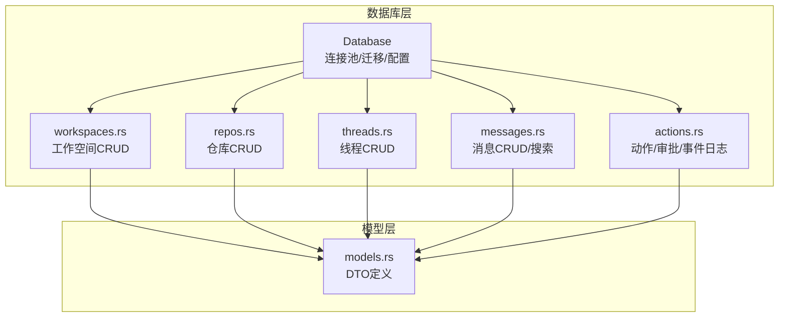
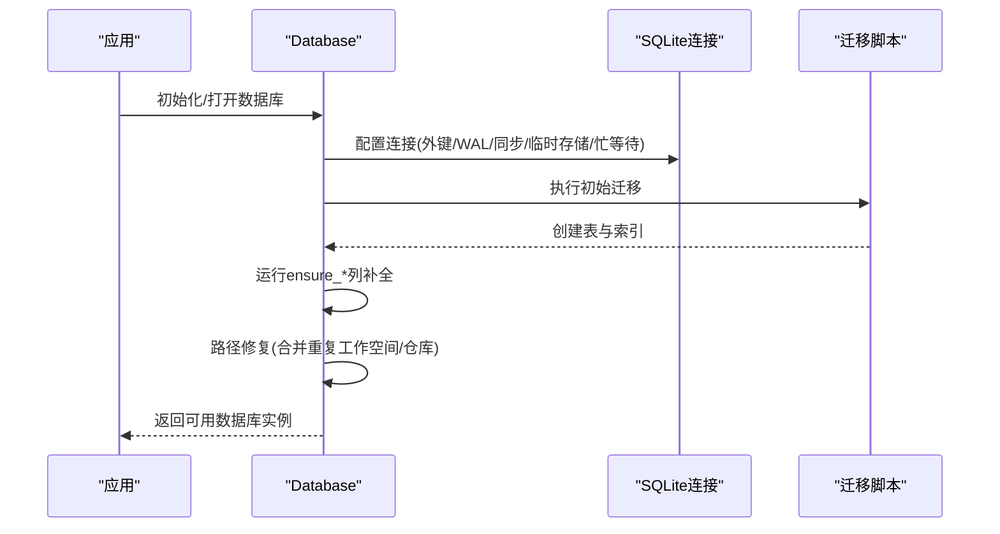
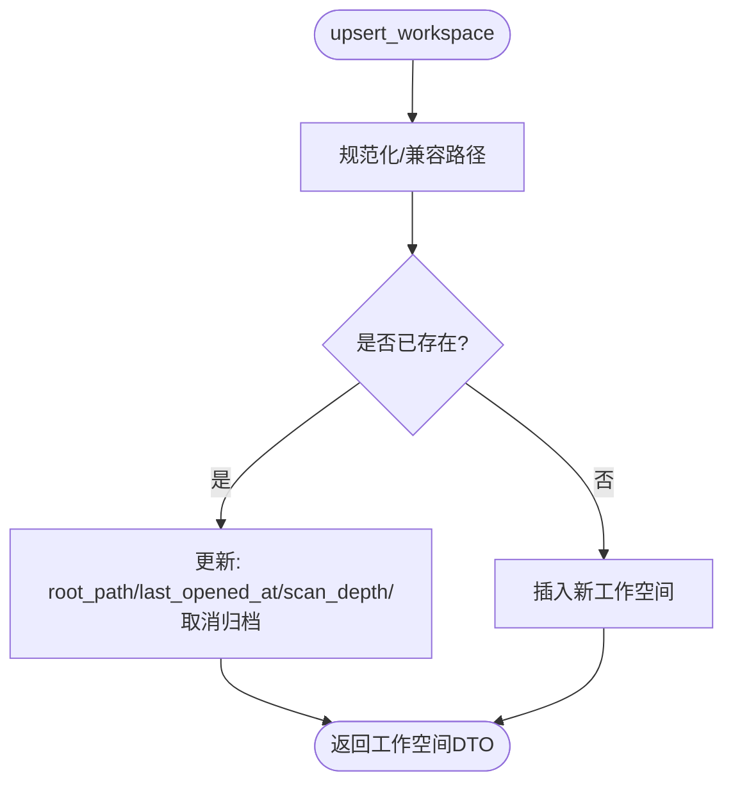
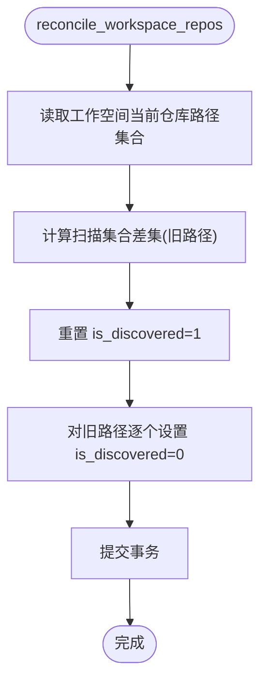
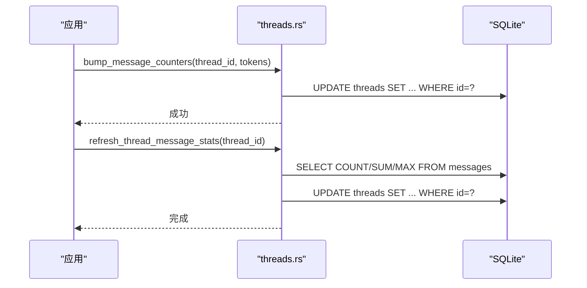
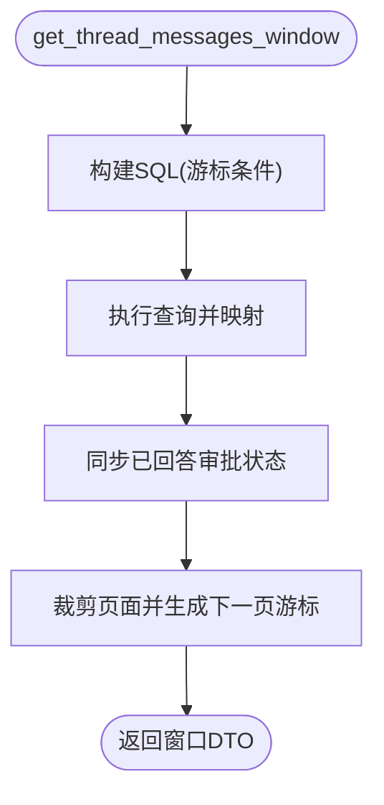
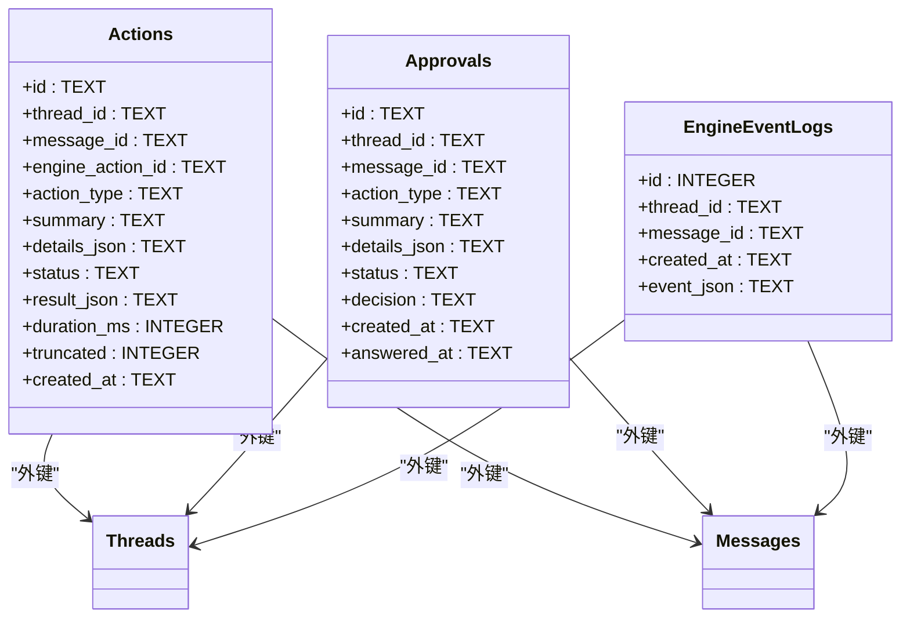
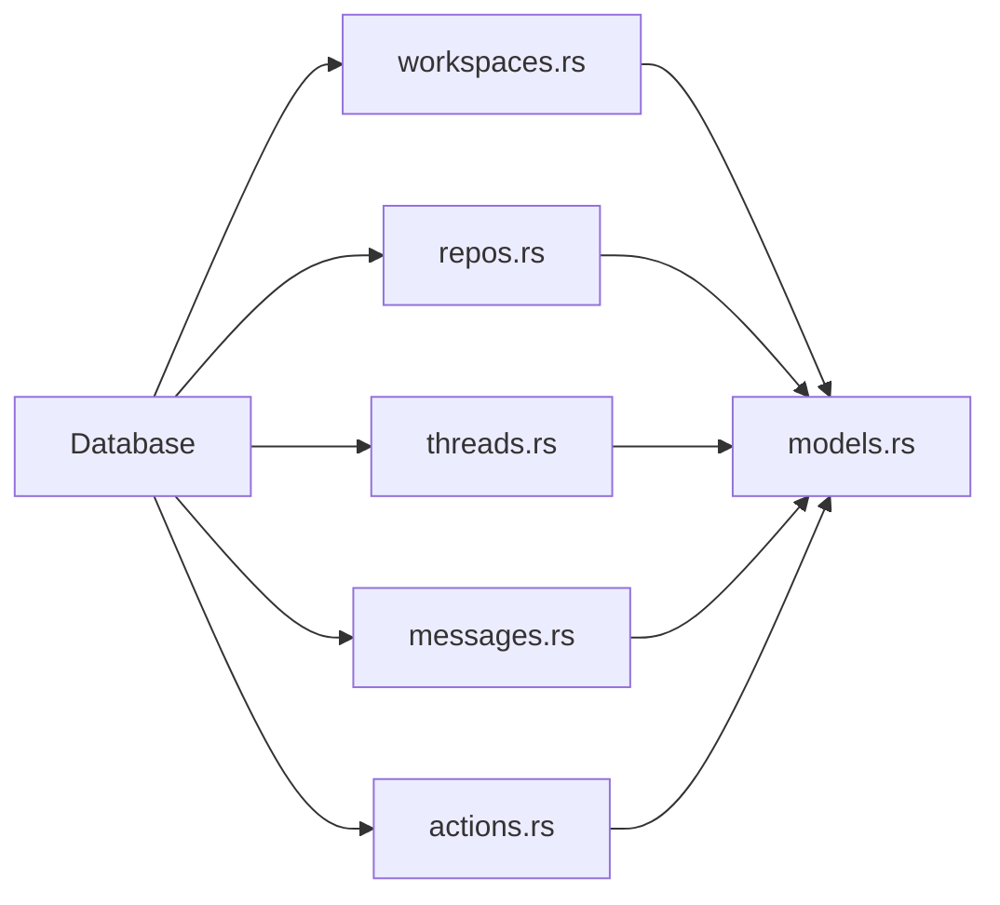

# 数据模型

<cite>
**本文引用的文件**
- [src-tauri/src/db/mod.rs](file://src-tauri/src/db/mod.rs)
- [src-tauri/src/db/migrations/001_initial.sql](file://src-tauri/src/db/migrations/001_initial.sql)
- [src-tauri/src/db/workspaces.rs](file://src-tauri/src/db/workspaces.rs)
- [src-tauri/src/db/repos.rs](file://src-tauri/src/db/repos.rs)
- [src-tauri/src/db/threads.rs](file://src-tauri/src/db/threads.rs)
- [src-tauri/src/db/messages.rs](file://src-tauri/src/db/messages.rs)
- [src-tauri/src/db/actions.rs](file://src-tauri/src/db/actions.rs)
- [src-tauri/src/models.rs](file://src-tauri/src/models.rs)
</cite>

## 目录
1. [简介](#简介)
2. [项目结构](#项目结构)
3. [核心组件](#核心组件)
4. [架构总览](#架构总览)
5. [详细组件分析](#详细组件分析)
6. [依赖分析](#依赖分析)
7. [性能考虑](#性能考虑)
8. [故障排查指南](#故障排查指南)
9. [结论](#结论)
10. [附录](#附录)

## 简介
本文件系统化梳理 Panes 的 SQLite 数据模型与实现，覆盖工作空间、仓库、线程、消息、动作与审批等核心实体，解释表结构、字段定义、主外键关系、索引设计与查询优化策略，并给出数据验证规则、业务约束、生命周期管理以及数据模型演进与迁移方案。

## 项目结构
数据库层采用模块化组织，按领域划分模块：工作空间、仓库、线程、消息、动作与审批；通过统一的数据库入口进行连接池管理、迁移执行与运行时列补全；模型层提供与前端交互的 DTO 结构。

图示来源
- [src-tauri/src/db/mod.rs:23-135](file://src-tauri/src/db/mod.rs#L23-L135)
- [src-tauri/src/db/workspaces.rs:15-58](file://src-tauri/src/db/workspaces.rs#L15-L58)
- [src-tauri/src/db/repos.rs:12-79](file://src-tauri/src/db/repos.rs#L12-L79)
- [src-tauri/src/db/threads.rs:15-33](file://src-tauri/src/db/threads.rs#L15-L33)
- [src-tauri/src/db/messages.rs:30-50](file://src-tauri/src/db/messages.rs#L30-L50)
- [src-tauri/src/db/actions.rs:10-37](file://src-tauri/src/db/actions.rs#L10-L37)
- [src-tauri/src/models.rs:4-168](file://src-tauri/src/models.rs#L4-L168)

章节来源
- [src-tauri/src/db/mod.rs:23-135](file://src-tauri/src/db/mod.rs#L23-L135)
- [src-tauri/src/db/migrations/001_initial.sql:1-132](file://src-tauri/src/db/migrations/001_initial.sql#L1-L132)

## 核心组件
- 工作空间（workspaces）：标识用户的工作区域，包含根路径、扫描深度、启动预设、归档时间等。
- 仓库（repos）：隶属于工作空间，记录仓库名称、路径、默认分支、激活状态、发现状态与信任级别。
- 线程（threads）：对话上下文，关联工作空间与可选仓库，记录引擎、模型、标题、状态、计数器与活动时间。
- 消息（messages）：线程内的消息记录，支持内容、块（blocks）、状态、令牌用量、流序列号与审计字段。
- 动作（actions）：在消息中触发的动作，记录类型、摘要、详情、结果、截断标记与持续时间。
- 审批（approvals）：需要人工确认的请求，记录动作类型、摘要、详情、状态与决策。
- 引擎事件日志（engine_event_logs）：线程级事件日志，便于调试与审计。

章节来源
- [src-tauri/src/db/migrations/001_initial.sql:1-132](file://src-tauri/src/db/migrations/001_initial.sql#L1-L132)
- [src-tauri/src/db/workspaces.rs:15-58](file://src-tauri/src/db/workspaces.rs#L15-L58)
- [src-tauri/src/db/repos.rs:12-79](file://src-tauri/src/db/repos.rs#L12-L79)
- [src-tauri/src/db/threads.rs:15-33](file://src-tauri/src/db/threads.rs#L15-L33)
- [src-tauri/src/db/messages.rs:30-50](file://src-tauri/src/db/messages.rs#L30-L50)
- [src-tauri/src/db/actions.rs:10-37](file://src-tauri/src/db/actions.rs#L10-L37)

## 架构总览
数据库初始化时启用外键、WAL、同步模式与内存临时存储，并设置忙等待超时；迁移脚本创建核心表与索引；运行时通过 ensure_* 函数动态补齐新增列；路径修复逻辑合并重复工作空间与仓库条目，保证路径一致性。

图示来源
- [src-tauri/src/db/mod.rs:75-134](file://src-tauri/src/db/mod.rs#L75-L134)
- [src-tauri/src/db/migrations/001_initial.sql:1-132](file://src-tauri/src/db/migrations/001_initial.sql#L1-L132)

章节来源
- [src-tauri/src/db/mod.rs:137-149](file://src-tauri/src/db/mod.rs#L137-L149)
- [src-tauri/src/db/mod.rs:122-134](file://src-tauri/src/db/mod.rs#L122-L134)

## 详细组件分析

### 工作空间（workspaces）
- 主键：id（UUID 文本）
- 唯一约束：root_path（规范化后唯一）
- 关键字段：name、scan_depth（默认3）、startup_preset_json、startup_preset_updated_at、archived_at、created_at、last_opened_at
- 业务规则：
  - upsert 时若存在规范化的根路径或旧式 Windows verbatim 路径，则更新而非插入
  - 更新 last_opened_at 与保留现有 scan_depth（当未显式提供）
  - 归档/恢复通过 archived_at 字段控制
- 查询优化：
  - 列出未归档工作空间并按最近打开时间降序
  - 列出已归档工作空间并按归档时间降序

图示来源
- [src-tauri/src/db/workspaces.rs:15-58](file://src-tauri/src/db/workspaces.rs#L15-L58)

章节来源
- [src-tauri/src/db/migrations/001_initial.sql:1-11](file://src-tauri/src/db/migrations/001_initial.sql#L1-L11)
- [src-tauri/src/db/workspaces.rs:15-58](file://src-tauri/src/db/workspaces.rs#L15-L58)

### 仓库（repos）
- 主键：id（UUID 文本）
- 外键：workspace_id → workspaces(id)（级联删除）
- 唯一约束：(workspace_id, path)
- 关键字段：name、path（规范化存储）、default_branch（默认 main）、is_active（默认1）、is_discovered（默认1）、trust_level（默认 standard）
- 业务规则：
  - upsert 支持发现路径与激活状态
  - reconcile_workspace_repos 将未出现在扫描列表中的仓库标记为未发现
  - set_workspace_active_repos 清空后仅激活指定仓库
  - find_deepest_repo_containing_path 在同一工作空间内选择最深匹配路径
- 查询优化：
  - 仅列出 is_discovered = 1 的仓库并按名称排序

图示来源
- [src-tauri/src/db/repos.rs:101-154](file://src-tauri/src/db/repos.rs#L101-L154)

章节来源
- [src-tauri/src/db/migrations/001_initial.sql:13-23](file://src-tauri/src/db/migrations/001_initial.sql#L13-L23)
- [src-tauri/src/db/repos.rs:12-79](file://src-tauri/src/db/repos.rs#L12-L79)
- [src-tauri/src/db/repos.rs:101-154](file://src-tauri/src/db/repos.rs#L101-L154)

### 线程（threads）
- 主键：id（UUID 文本）
- 外键：workspace_id → workspaces(id)（级联删除），repo_id → repos(id)（SET NULL）
- 关键字段：engine_id、model_id、engine_thread_id、engine_metadata_json、engine_capabilities_json、title、status（默认 idle）、message_count（默认0）、total_tokens（默认0）、archived_at、created_at、last_activity_at
- 业务规则：
  - create_thread 插入默认 idle 状态
  - update_thread_status 只允许状态变更且更新 last_activity_at
  - bump_message_counters 原子递增 message_count 与 total_tokens 并更新 last_activity_at
  - refresh_thread_message_stats 基于消息统计重算计数与最后活动时间
  - reconcile_runtime_state 将过期流式助手消息标记为中断，并根据审批与最新消息推导线程状态
- 查询优化：
  - 按 workspace_id + last_activity_at DESC 排序
  - 按 workspace_id + status + last_activity_at DESC 排序

图示来源
- [src-tauri/src/db/threads.rs:223-278](file://src-tauri/src/db/threads.rs#L223-L278)

章节来源
- [src-tauri/src/db/migrations/001_initial.sql:25-41](file://src-tauri/src/db/migrations/001_initial.sql#L25-L41)
- [src-tauri/src/db/threads.rs:15-33](file://src-tauri/src/db/threads.rs#L15-L33)
- [src-tauri/src/db/threads.rs:126-141](file://src-tauri/src/db/threads.rs#L126-L141)
- [src-tauri/src/db/threads.rs:223-278](file://src-tauri/src/db/threads.rs#L223-L278)
- [src-tauri/src/db/threads.rs:314-367](file://src-tauri/src/db/threads.rs#L314-L367)

### 消息（messages）
- 主键：id（UUID 文本）
- 外键：thread_id → threads(id)（级联删除）
- 关键字段：role（user/assistant）、content、blocks_json、schema_version（默认1）、status（默认 completed）、token_input/token_output、turn_engine_id、turn_model_id、turn_reasoning_effort、stream_seq（默认0）、created_at
- 业务规则：
  - insert_user_message/insert_assistant_placeholder 插入用户消息与占位助手消息
  - update_assistant_blocks_json/update_assistant_status/complete_assistant_message 更新块、状态与令牌用量
  - get_thread_messages_window 支持基于时间戳+rowid的窗口分页游标
  - search_messages 使用 FTS5 全文检索，限制到未归档线程与工作空间范围
  - reconcile_answered_approvals_for_messages 将已回答的审批状态同步回消息块
- 查询优化：
  - 普通查询按 (thread_id, created_at ASC)
  - 按状态过滤查询按 (thread_id, status, created_at DESC)
  - FTS5 触发器自动维护全文索引

图示来源
- [src-tauri/src/db/messages.rs:397-476](file://src-tauri/src/db/messages.rs#L397-L476)

章节来源
- [src-tauri/src/db/migrations/001_initial.sql:43-58](file://src-tauri/src/db/migrations/001_initial.sql#L43-L58)
- [src-tauri/src/db/messages.rs:30-50](file://src-tauri/src/db/messages.rs#L30-L50)
- [src-tauri/src/db/messages.rs:292-358](file://src-tauri/src/db/messages.rs#L292-L358)
- [src-tauri/src/db/messages.rs:397-476](file://src-tauri/src/db/messages.rs#L397-L476)
- [src-tauri/src/db/messages.rs:637-682](file://src-tauri/src/db/messages.rs#L637-L682)

### 动作与审批（actions、approvals）
- 主键：id（UUID 文本）
- 外键：thread_id → threads(id)（级联删除），message_id → messages(id)（SET NULL）
- 关键字段：
  - actions：engine_action_id、action_type、summary、details_json、status（默认 running）、result_json、duration_ms、truncated（默认0）
  - approvals：action_type、summary、details_json、status（默认 pending）、decision、answered_at
- 业务规则：
  - insert_action_started/insert_approval 插入或替换记录
  - update_action_completed 更新状态与结果
  - answer_approval 设置审批状态与回答时间
  - append_event_log 记录引擎事件日志

图示来源
- [src-tauri/src/db/migrations/001_initial.sql:60-94](file://src-tauri/src/db/migrations/001_initial.sql#L60-L94)
- [src-tauri/src/db/actions.rs:10-37](file://src-tauri/src/db/actions.rs#L10-L37)

章节来源
- [src-tauri/src/db/migrations/001_initial.sql:60-94](file://src-tauri/src/db/migrations/001_initial.sql#L60-L94)
- [src-tauri/src/db/actions.rs:10-37](file://src-tauri/src/db/actions.rs#L10-L37)

### 终端会话（概念说明）
- 终端会话数据模型在 Rust 层以 DTO 形式定义，包含会话标识、工作空间、shell、cwd、环境快照、IO计数器、延迟与输出节流等诊断信息。
- 终端输出回放采用序列号与字节限制的滑动窗口策略，支持冷启动重连与间隙检测。

章节来源
- [src-tauri/src/models.rs:846-933](file://src-tauri/src/models.rs#L846-L933)
- [src-tauri/src/terminal/mod.rs:38-298](file://src-tauri/src/terminal/mod.rs#L38-L298)

## 依赖分析
- 模块耦合：
  - 所有领域模块依赖统一的 Database 抽象，通过连接池与迁移机制解耦
  - 线程与消息之间存在强依赖（消息外键指向线程），仓库与工作空间之间存在层级关系
- 外部依赖：
  - rusqlite 提供 SQLite 访问
  - uuid 用于生成主键
  - serde/serde_json 用于 DTO 序列化与消息块解析
- 循环依赖：
  - 未见循环导入；各模块职责清晰，通过公共模型层进行数据交换

图示来源
- [src-tauri/src/db/mod.rs:15-19](file://src-tauri/src/db/mod.rs#L15-L19)
- [src-tauri/src/models.rs:4-168](file://src-tauri/src/models.rs#L4-L168)

章节来源
- [src-tauri/src/db/mod.rs:15-19](file://src-tauri/src/db/mod.rs#L15-L19)

## 性能考虑
- 连接与事务：
  - 连接池最大空闲数为8；启用 WAL 模式提升并发写入性能
  - 重要操作使用显式事务（如仓库去重、消息克隆、导入）
- 索引与查询：
  - 线程：按 workspace_id + last_activity_at DESC、workspace_id + status + last_activity_at DESC
  - 消息：按 thread_id + created_at ASC、thread_id + status + created_at DESC
  - 审批：按 thread_id + created_at ASC、message_id + status + created_at ASC
  - FTS5：messages_fts 基于 content 自动维护，支持全文检索
- 写入优化：
  - 消息批量导入与回滚采用分块删除（每批最多500条），减少锁竞争
  - 线程计数器原子更新，避免额外查询
- 读取优化：
  - 分页游标使用 created_at + rowid 或 created_at + id，确保稳定排序
  - 审批状态与消息块的同步在加载时一次性完成，减少后续多次查询

章节来源
- [src-tauri/src/db/mod.rs:137-149](file://src-tauri/src/db/mod.rs#L137-L149)
- [src-tauri/src/db/migrations/001_initial.sql:96-106](file://src-tauri/src/db/migrations/001_initial.sql#L96-L106)
- [src-tauri/src/db/messages.rs:232-270](file://src-tauri/src/db/messages.rs#L232-L270)
- [src-tauri/src/db/threads.rs:223-240](file://src-tauri/src/db/threads.rs#L223-L240)

## 故障排查指南
- 外键约束失败：
  - 确认父表记录存在后再插入子表记录；线程删除会级联删除消息与动作
- 路径冲突与重复：
  - 运行迁移后会自动合并重复工作空间与仓库；检查 archived_at 与 is_discovered 字段
- 搜索无结果：
  - 确认线程未归档；FTS 查询需满足工作空间过滤条件
- 状态不一致：
  - 使用 reconcile_runtime_state 修复过期流式消息与线程状态
- 权限与信任级别：
  - 仓库信任级别支持 trusted/standard/restricted，影响权限与可见性

章节来源
- [src-tauri/src/db/mod.rs:151-155](file://src-tauri/src/db/mod.rs#L151-L155)
- [src-tauri/src/db/mod.rs:253-330](file://src-tauri/src/db/mod.rs#L253-L330)
- [src-tauri/src/db/threads.rs:314-367](file://src-tauri/src/db/threads.rs#L314-L367)
- [src-tauri/src/db/messages.rs:637-682](file://src-tauri/src/db/messages.rs#L637-L682)

## 结论
该数据模型围绕“工作空间—仓库—线程—消息”的层次结构展开，辅以动作与审批保障安全可控的执行流程。通过迁移与运行时列补全机制，确保数据库演进的平滑过渡；通过索引与 FTS5 检索提升查询效率；通过事务与原子更新保证数据一致性。终端会话作为独立的运行时数据模型，与数据库层解耦，专注于会话生命周期与回放能力。

## 附录

### 表结构与索引一览
- workspaces：主键 id，唯一 root_path，关键列 archived_at、git_repo_selection_configured、startup_preset_json 等
- repos：主键 id，外键 workspace_id，唯一 (workspace_id, path)，关键列 is_discovered、trust_level
- threads：主键 id，外键 workspace_id、repo_id，关键列 status、message_count、total_tokens、engine_metadata_json
- messages：主键 id，外键 thread_id，关键列 status、token_input/token_output、blocks_json、stream_seq
- actions：主键 id，外键 thread_id、message_id，关键列 status、truncated
- approvals：主键 id，外键 thread_id、message_id，关键列 status、decision
- engine_event_logs：自增 id，外键 thread_id、message_id

章节来源
- [src-tauri/src/db/migrations/001_initial.sql:1-132](file://src-tauri/src/db/migrations/001_initial.sql#L1-L132)

### 数据模型演进与迁移
- 初始迁移：创建所有表与索引
- 运行时列补全：ensure_archived_columns、ensure_workspace_git_columns、ensure_repo_columns、ensure_workspace_startup_columns、ensure_runtime_columns、ensure_messages_audit_columns
- 路径修复：合并重复工作空间与仓库，规范化路径并迁移引用
- 版本兼容：通过 PRAGMA table_info 检测列是否存在，不存在则 ALTER TABLE 添加

章节来源
- [src-tauri/src/db/mod.rs:122-134](file://src-tauri/src/db/mod.rs#L122-L134)
- [src-tauri/src/db/mod.rs:151-225](file://src-tauri/src/db/mod.rs#L151-L225)
- [src-tauri/src/db/mod.rs:253-330](file://src-tauri/src/db/mod.rs#L253-L330)