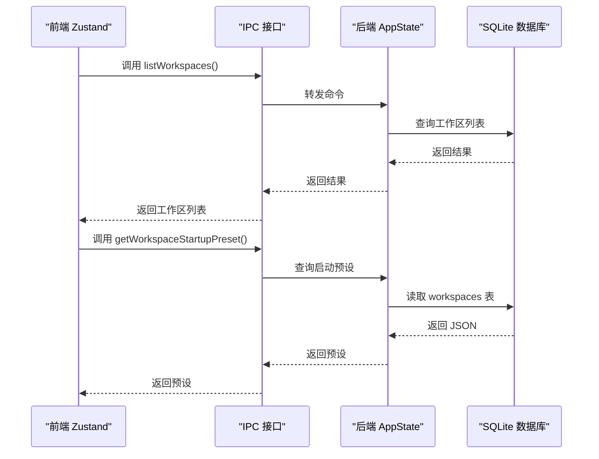
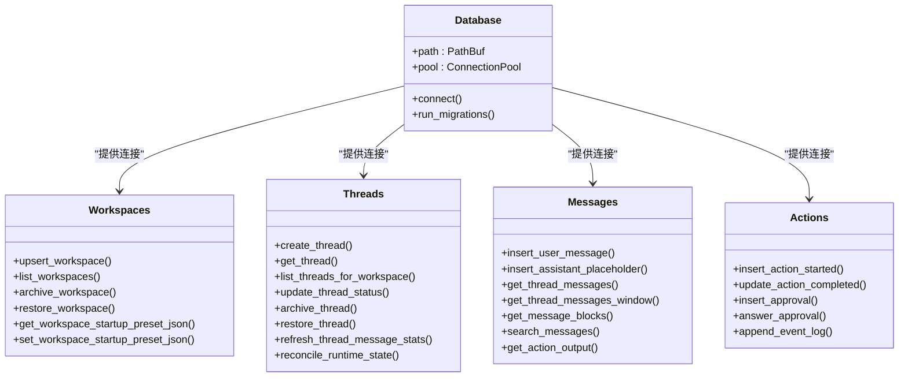
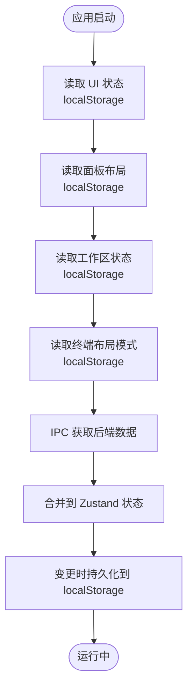
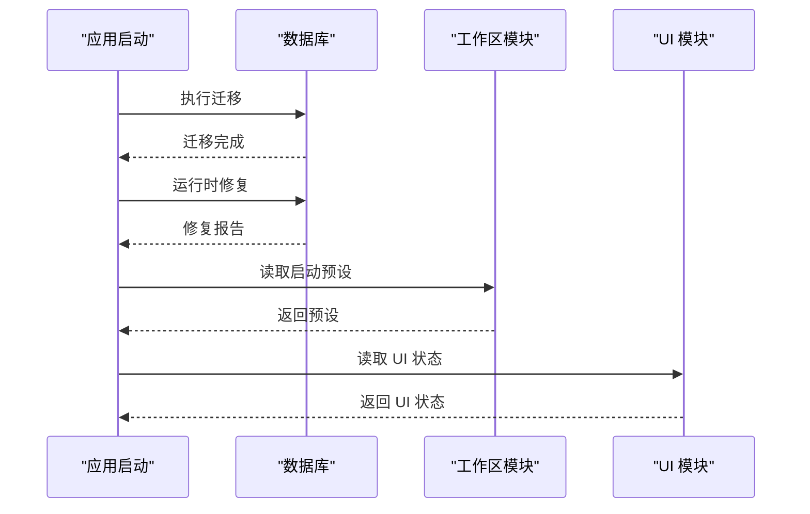
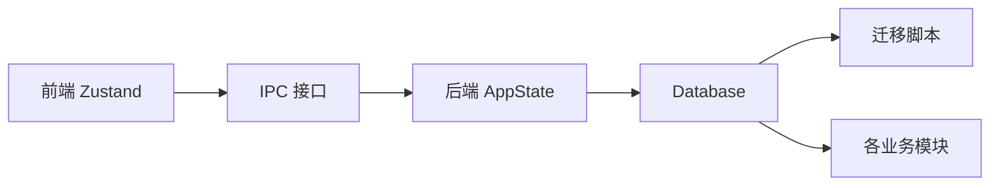

# 状态持久化

<cite>
**本文档引用的文件**
- [README.md](file://README.md)
- [main.rs](file://src-tauri/src/main.rs)
- [state.rs](file://src-tauri/src/state.rs)
- [db/mod.rs](file://src-tauri/src/db/mod.rs)
- [db/migrations/001_initial.sql](file://src-tauri/src/db/migrations/001_initial.sql)
- [db/messages.rs](file://src-tauri/src/db/messages.rs)
- [db/threads.rs](file://src-tauri/src/db/threads.rs)
- [db/workspaces.rs](file://src-tauri/src/db/workspaces.rs)
- [db/actions.rs](file://src-tauri/src/db/actions.rs)
- [ipc.ts](file://src/lib/ipc.ts)
- [workspacePaneStore.ts](file://src/stores/workspacePaneStore.ts)
- [workspaceStore.ts](file://src/stores/workspaceStore.ts)
- [uiStore.ts](file://src/stores/uiStore.ts)
- [terminalStore.ts](file://src/stores/terminalStore.ts)
- [chatStore.ts](file://src/stores/chatStore.ts)
</cite>

## 目录
1. [简介](#简介)
2. [项目结构](#项目结构)
3. [核心组件](#核心组件)
4. [架构总览](#架构总览)
5. [详细组件分析](#详细组件分析)
6. [依赖关系分析](#依赖关系分析)
7. [性能考虑](#性能考虑)
8. [故障排除指南](#故障排除指南)
9. [结论](#结论)

## 简介
本文件系统性阐述 Panes 的状态持久化机制，覆盖后端 SQLite 数据库存储、前端本地存储（localStorage）与内存状态管理三类方案，明确需要持久化的状态范围、持久化时机与存储位置，并给出状态恢复、数据迁移与版本兼容策略，以及性能优化、数据一致性和错误恢复机制。

## 项目结构
Panes 采用“React + Zustand 前端 + Tauri 后端”的分层架构，状态持久化在不同层面分别实现：
- 前端：Zustand 状态 + localStorage 持久化 UI 面板布局、工作区与仓库选择等轻量状态
- 后端：SQLite 数据库 + 连接池 + 迁移脚本，持久化对话、线程、动作、审批等核心业务数据
- IPC：前后端通过 IPC 接口交互，触发后端数据库写入与查询

```mermaid
graph TB
subgraph "前端"
UI["UI 状态<br/>sidebar/git/explorer 等"]
PaneLayout["面板布局状态<br/>chat/terminal/editor"]
WorkspaceState["工作区状态<br/>活动工作区/仓库"]
TerminalState["终端状态<br/>会话/分组/通知"]
ChatState["聊天状态<br/>消息窗口/流式事件"]
end
subgraph "IPC"
IPC["跨进程接口"]
end
subgraph "后端"
AppState["应用状态容器"]
DB["SQLite 数据库<br/>连接池/迁移"]
end
UI --> IPC
PaneLayout --> IPC
WorkspaceState --> IPC
TerminalState --> IPC
ChatState --> IPC
IPC --> AppState
AppState --> DB
```

**图表来源**
- [ipc.ts:72-627](file://src/lib/ipc.ts#L72-L627)
- [state.rs:12-24](file://src-tauri/src/state.rs#L12-L24)
- [db/mod.rs:24-135](file://src-tauri/src/db/mod.rs#L24-L135)

**章节来源**
- [README.md:236-256](file://README.md#L236-L256)
- [main.rs:1-14](file://src-tauri/src/main.rs#L1-L14)

## 核心组件
- 应用状态容器（AppState）
  - 统一持有数据库、配置、引擎、Git 监视器、终端管理器、通知管理器、保持清醒管理器、Turn 管理器、文件树缓存等实例，作为后端状态持久化的入口
- 数据库（Database）
  - 提供连接池、初始化、迁移执行、连接配置（外键、WAL、同步级别、超时）等能力
- IPC 接口
  - 定义前端调用后端的命令集合，如列出工作区、打开工作区、获取/设置启动预设、线程与消息读取、终端会话管理等
- 前端状态存储（Zustand + localStorage）
  - 工作区面板布局、UI 状态、工作区与仓库选择、终端布局模式等

**章节来源**
- [state.rs:12-24](file://src-tauri/src/state.rs#L12-L24)
- [db/mod.rs:24-135](file://src-tauri/src/db/mod.rs#L24-L135)
- [ipc.ts:72-627](file://src/lib/ipc.ts#L72-L627)
- [workspacePaneStore.ts:67-407](file://src/stores/workspacePaneStore.ts#L67-L407)
- [workspaceStore.ts:36-111](file://src/stores/workspaceStore.ts#L36-L111)
- [uiStore.ts:7-77](file://src/stores/uiStore.ts#L7-L77)

## 架构总览
Panes 的状态持久化遵循“前端轻量持久化 + 后端强一致存储”的设计原则：
- 前端持久化：localStorage 存储 UI 面板布局、侧边栏/Git 面板开关状态、最近工作区与仓库等，确保用户界面体验连续性
- 后端持久化：SQLite 存储对话历史、线程元数据、动作与审批记录、引擎事件日志等，保证业务数据可恢复与审计
- 恢复流程：应用启动时，后端执行数据库迁移与运行时修复；前端加载持久化 UI 状态并按需从后端拉取业务数据



**图表来源**
- [ipc.ts:101-121](file://src/lib/ipc.ts#L101-L121)
- [db/workspaces.rs:60-96](file://src-tauri/src/db/workspaces.rs#L60-L96)
- [db/mod.rs:122-134](file://src-tauri/src/db/mod.rs#L122-L134)

## 详细组件分析

### 数据库持久化（SQLite）
- 存储内容
  - 工作区（workspaces）、仓库（repos）、线程（threads）、消息（messages）、动作（actions）、审批（approvals）、引擎事件日志（engine_event_logs）
  - 支持全文检索（messages_fts）与触发器自动维护
- 连接与池化
  - 连接池最大空闲数限制，连接建立时启用外键、WAL、适度同步与忙等待超时
- 迁移与列演进
  - 初始化时执行迁移脚本，后续通过列存在性检查与动态添加列的方式实现向后兼容
  - 路径归一化与重复项合并，保障跨平台路径一致性
- 关键 API
  - 工作区：upsert/list/archive/restore、启动预设读写、Git 选择状态
  - 线程：创建/查询/更新状态/归档/恢复、统计刷新
  - 消息：插入/窗口查询/块解析/搜索、动作输出提取
  - 动作/审批：插入、完成、回答、事件日志追加



**图表来源**
- [db/mod.rs:24-135](file://src-tauri/src/db/mod.rs#L24-L135)
- [db/workspaces.rs:15-58](file://src-tauri/src/db/workspaces.rs#L15-L58)
- [db/threads.rs:15-34](file://src-tauri/src/db/threads.rs#L15-L34)
- [db/messages.rs:30-50](file://src-tauri/src/db/messages.rs#L30-L50)
- [db/actions.rs:10-37](file://src-tauri/src/db/actions.rs#L10-L37)

**章节来源**
- [db/mod.rs:122-135](file://src-tauri/src/db/mod.rs#L122-L135)
- [db/migrations/001_initial.sql:1-132](file://src-tauri/src/db/migrations/001_initial.sql#L1-L132)
- [db/workspaces.rs:257-306](file://src-tauri/src/db/workspaces.rs#L257-L306)
- [db/threads.rs:126-141](file://src-tauri/src/db/threads.rs#L126-L141)
- [db/messages.rs:376-395](file://src-tauri/src/db/messages.rs#L376-L395)
- [db/actions.rs:10-37](file://src-tauri/src/db/actions.rs#L10-L37)

### 前端持久化（localStorage + Zustand）
- 工作区面板布局（workspacePaneStore）
  - 使用 localStorage 键值对保存每个工作区的面板布局树，包含叶子节点、分割容器、焦点叶、比例等
  - 提供布局读取、校验、默认回退与持久化写入
- 工作区与仓库选择（workspaceStore）
  - 最近工作区 ID、最近仓库映射持久化，支持 Linux AppImage 临时根目录规避
  - 加载工作区列表后，根据持久化状态恢复活动工作区与仓库
- UI 状态（uiStore）
  - 侧边栏/Git 面板开关状态、资源管理器开关、专注模式快照等
- 终端布局模式（terminalStore）
  - 工作区级布局模式（chat/terminal/split/editor）持久化，支持启动预设与回退逻辑



**图表来源**
- [workspacePaneStore.ts:372-407](file://src/stores/workspacePaneStore.ts#L372-L407)
- [workspaceStore.ts:67-111](file://src/stores/workspaceStore.ts#L67-L111)
- [uiStore.ts:55-77](file://src/stores/uiStore.ts#L55-L77)
- [terminalStore.ts:33-37](file://src/stores/terminalStore.ts#L33-L37)

**章节来源**
- [workspacePaneStore.ts:67-407](file://src/stores/workspacePaneStore.ts#L67-L407)
- [workspaceStore.ts:36-111](file://src/stores/workspaceStore.ts#L36-L111)
- [uiStore.ts:7-77](file://src/stores/uiStore.ts#L7-L77)
- [terminalStore.ts:27-37](file://src/stores/terminalStore.ts#L27-L37)

### 状态恢复与数据迁移
- 后端恢复
  - 启动时执行迁移脚本，确保表结构与列存在性满足当前版本要求
  - 运行时修复：将过期的 assistant 消息标记为中断，重新推导线程状态
  - 路径归一化：合并重复工作区与仓库条目，统一规范化路径
- 前端恢复
  - 优先从 localStorage 恢复 UI 状态；若缺失则回退到默认布局或模式
  - 工作区加载完成后，按持久化状态恢复活动工作区与仓库



**图表来源**
- [db/mod.rs:122-134](file://src-tauri/src/db/mod.rs#L122-L134)
- [db/threads.rs:314-367](file://src-tauri/src/db/threads.rs#L314-L367)
- [db/workspaces.rs:265-306](file://src-tauri/src/db/workspaces.rs#L265-L306)

**章节来源**
- [db/mod.rs:122-134](file://src-tauri/src/db/mod.rs#L122-L134)
- [db/threads.rs:314-367](file://src-tauri/src/db/threads.rs#L314-L367)
- [db/workspaces.rs:265-306](file://src-tauri/src/db/workspaces.rs#L265-L306)

### 数据一致性与错误恢复
- 数据一致性
  - 外键约束启用，删除线程时级联清理动作与审批
  - 全文检索触发器自动维护，保证搜索一致性
- 错误恢复
  - IPC 调用失败时前端捕获错误并提示
  - 终端通知与输出事件监听，避免丢失重要状态
  - 启动预设无效时回退到默认布局模式

**章节来源**
- [db/migrations/001_initial.sql:13-86](file://src-tauri/src/db/migrations/001_initial.sql#L13-L86)
- [ipc.ts:629-742](file://src/lib/ipc.ts#L629-L742)
- [terminalStore.ts:754-791](file://src/stores/terminalStore.ts#L754-L791)

## 依赖关系分析
- 前端依赖
  - Zustand 管理状态，localStorage 提供持久化
  - IPC 封装后端命令，驱动数据库读写
- 后端依赖
  - Database 提供统一连接与迁移能力
  - 各模块（workspaces/threads/messages/actions）围绕 Database 实现 CRUD 与复杂查询



**图表来源**
- [ipc.ts:72-627](file://src/lib/ipc.ts#L72-L627)
- [state.rs:12-24](file://src-tauri/src/state.rs#L12-L24)
- [db/mod.rs:24-135](file://src-tauri/src/db/mod.rs#L24-L135)

**章节来源**
- [ipc.ts:72-627](file://src/lib/ipc.ts#L72-L627)
- [state.rs:12-24](file://src-tauri/src/state.rs#L12-L24)
- [db/mod.rs:24-135](file://src-tauri/src/db/mod.rs#L24-L135)

## 性能考虑
- 数据库性能
  - WAL 模式提升并发读写性能
  - 适度同步级别平衡可靠性与性能
  - 连接池减少连接开销
  - FTS5 全文检索加速消息搜索
- 前端性能
  - localStorage 仅用于轻量 UI 状态，避免阻塞主线程
  - 分页与窗口化加载长对话，降低内存占用
  - 事件批处理与去重，减少渲染压力

**章节来源**
- [db/mod.rs:137-149](file://src-tauri/src/db/mod.rs#L137-L149)
- [db/migrations/001_initial.sql:108-132](file://src-tauri/src/db/migrations/001_initial.sql#L108-L132)
- [chatStore.ts:231-291](file://src/stores/chatStore.ts#L231-L291)

## 故障排除指南
- 启动预设无效
  - 现象：启动预设解析失败，界面显示警告
  - 处理：回退到默认布局模式，忽略无效预设
- 本地存储不可用
  - 现象：localStorage 写入失败（测试环境或受限浏览器）
  - 处理：忽略持久化失败，不影响功能
- 数据库迁移失败
  - 现象：迁移脚本执行异常
  - 处理：检查数据库文件权限与磁盘空间，必要时重建数据库

**章节来源**
- [terminalStore.ts:782-796](file://src/stores/terminalStore.ts#L782-L796)
- [workspacePaneStore.ts:401-407](file://src/stores/workspacePaneStore.ts#L401-L407)
- [db/mod.rs:122-134](file://src-tauri/src/db/mod.rs#L122-L134)

## 结论
Panes 的状态持久化以“前端轻量 + 后端强一致”为核心策略：前端通过 localStorage 保证 UI 体验连续性，后端通过 SQLite 与严格的迁移/修复机制确保业务数据可靠与可恢复。配合 IPC 接口与连接池、WAL、FTS5 等技术手段，系统在性能、一致性与可用性之间取得良好平衡。