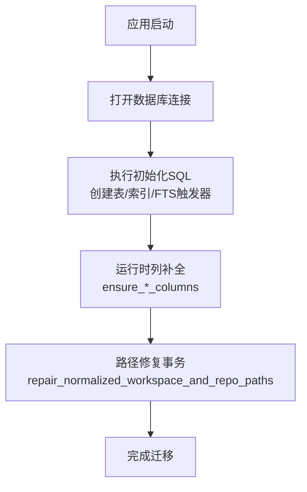
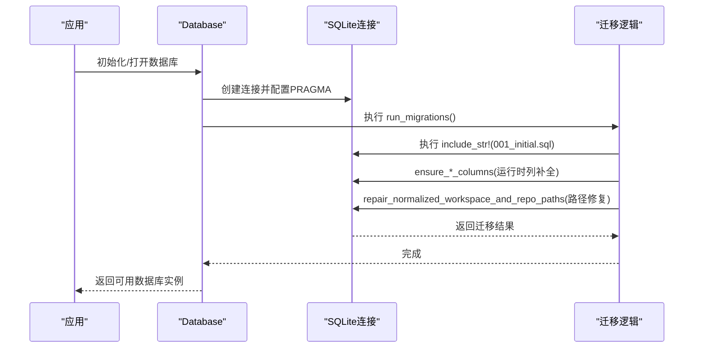
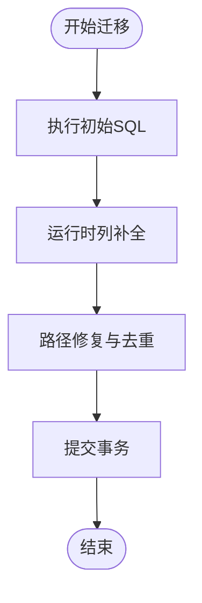
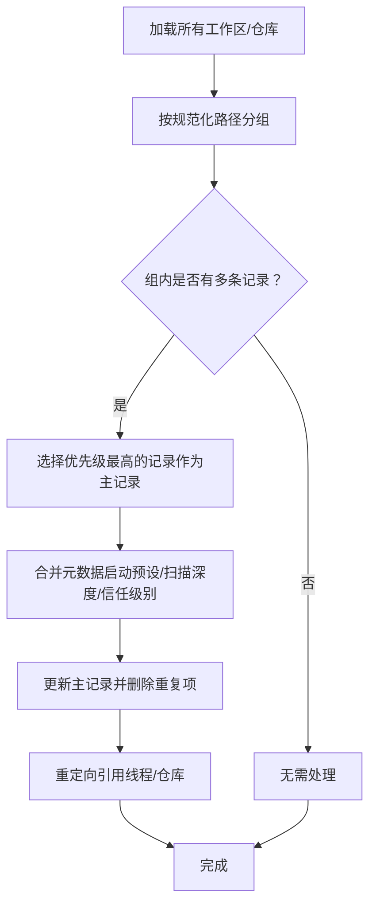
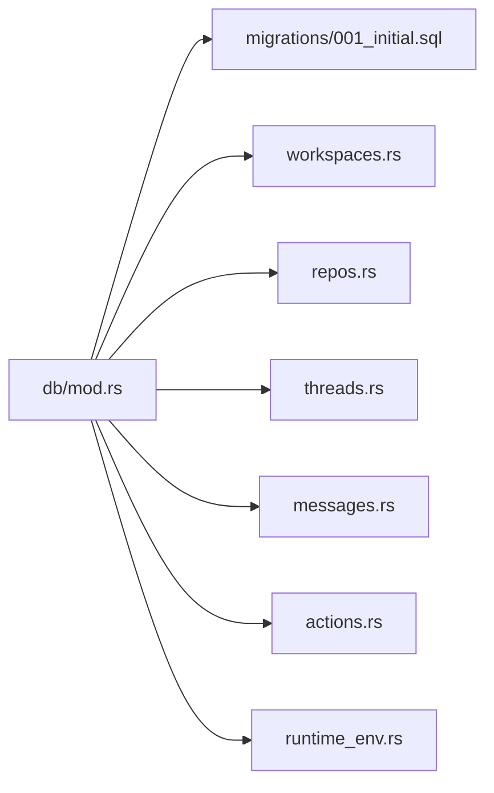

# 迁移和版本控制

<cite>
**本文档引用的文件**
- [src-tauri/src/db/mod.rs](file://src-tauri/src/db/mod.rs)
- [src-tauri/src/db/migrations/001_initial.sql](file://src-tauri/src/db/migrations/001_initial.sql)
- [src-tauri/src/db/workspaces.rs](file://src-tauri/src/db/workspaces.rs)
- [src-tauri/src/db/repos.rs](file://src-tauri/src/db/repos.rs)
- [src-tauri/src/db/threads.rs](file://src-tauri/src/db/threads.rs)
- [src-tauri/src/db/messages.rs](file://src-tauri/src/db/messages.rs)
- [src-tauri/src/db/actions.rs](file://src-tauri/src/db/actions.rs)
- [src-tauri/src/runtime_env.rs](file://src-tauri/src/runtime_env.rs)
</cite>

## 目录
1. [简介](#简介)
2. [项目结构](#项目结构)
3. [核心组件](#核心组件)
4. [架构总览](#架构总览)
5. [详细组件分析](#详细组件分析)
6. [依赖关系分析](#依赖关系分析)
7. [性能考虑](#性能考虑)
8. [故障排查指南](#故障排查指南)
9. [结论](#结论)
10. [附录](#附录)

## 简介
本文件系统化阐述 Panes 的数据库迁移与版本控制方案，覆盖以下主题：
- 数据库迁移策略与执行流程
- 版本管理机制与向后兼容保障
- 迁移脚本编写规范、执行顺序与回滚策略
- 数据格式变更、字段增删与表结构调整处理
- 迁移失败处理、数据备份与恢复机制
- 迁移测试策略、性能影响评估与生产部署注意事项

## 项目结构
Panes 使用 SQLite 作为本地数据库，采用“初始化 SQL + 运行时列补全 + 路径修复”的混合迁移策略：
- 初始化：通过包含初始 SQL 文件一次性创建所有表与索引
- 增量：运行时检测并添加缺失列，确保旧版本数据库平滑升级
- 修复：对历史路径差异进行合并与去重，保证跨平台路径一致性

图表来源
- [src-tauri/src/db/mod.rs:122-135](file://src-tauri/src/db/mod.rs#L122-L135)

章节来源
- [src-tauri/src/db/mod.rs:74-135](file://src-tauri/src/db/mod.rs#L74-L135)
- [src-tauri/src/db/migrations/001_initial.sql:1-132](file://src-tauri/src/db/migrations/001_initial.sql#L1-L132)

## 核心组件
- 数据库入口与连接池
  - 提供数据库初始化、连接池复用与迁移执行
  - 关键实现：[Database::init/open/connect/run_migrations:74-135](file://src-tauri/src/db/mod.rs#L74-L135)
- 迁移与列补全
  - 初始 SQL：[001_initial.sql:1-132](file://src-tauri/src/db/migrations/001_initial.sql#L1-L132)
  - 运行时列补全：[ensure_archived_columns 等:152-132](file://src-tauri/src/db/mod.rs#L152-L132)
  - 列存在性检查：[table_has_column/ensure_column:1036-1034](file://src-tauri/src/db/mod.rs#L1036-L1034)
- 路径修复与去重
  - 工作区与仓库路径归一化与重复项合并
  - 实现：[repair_normalized_workspace_and_repo_paths 及其子函数:259-466](file://src-tauri/src/db/mod.rs#L259-L466)
- 存储层模块
  - 工作区：[workspaces.rs:16-59](file://src-tauri/src/db/workspaces.rs#L16-L59)
  - 仓库：[repos.rs:12-79](file://src-tauri/src/db/repos.rs#L12-L79)
  - 线程：[threads.rs:15-34](file://src-tauri/src/db/threads.rs#L15-L34)
  - 消息：[messages.rs:30-50](file://src-tauri/src/db/messages.rs#L30-L50)
  - 动作与审批：[actions.rs:10-37](file://src-tauri/src/db/actions.rs#L10-L37)

章节来源
- [src-tauri/src/db/mod.rs:23-135](file://src-tauri/src/db/mod.rs#L23-L135)
- [src-tauri/src/db/migrations/001_initial.sql:1-132](file://src-tauri/src/db/migrations/001_initial.sql#L1-L132)

## 架构总览
迁移与版本控制的整体流程如下：

图表来源
- [src-tauri/src/db/mod.rs:98-135](file://src-tauri/src/db/mod.rs#L98-L135)
- [src-tauri/src/db/migrations/001_initial.sql:1-132](file://src-tauri/src/db/migrations/001_initial.sql#L1-L132)

## 详细组件分析

### 迁移策略与执行顺序
- 初始化阶段
  - 通过一次性执行初始 SQL 完成表结构、索引与 FTS 触发器的创建
  - 关键实现：[run_migrations 中的 include_str!("migrations/001_initial.sql"):122-125](file://src-tauri/src/db/mod.rs#L122-L125)
- 运行时列补全
  - 在不破坏现有数据的前提下，按需添加新列（如归档时间戳、信任级别等）
  - 关键实现：[ensure_*_columns 系列函数:152-132](file://src-tauri/src/db/mod.rs#L152-L132)
- 路径修复与去重
  - 合并同一工作区下不同表示形式的路径（如 Windows Verbatim 路径），并保留最新元数据
  - 关键实现：[repair_normalized_workspace_and_repo_paths 及其子函数:259-466](file://src-tauri/src/db/mod.rs#L259-L466)

图表来源
- [src-tauri/src/db/mod.rs:122-135](file://src-tauri/src/db/mod.rs#L122-L135)

章节来源
- [src-tauri/src/db/mod.rs:122-135](file://src-tauri/src/db/mod.rs#L122-L135)

### 字段增删与表结构调整
- 新增列（非空默认值）
  - 归档时间戳：workspaces/threads 表新增 archived_at
  - 仓库发现状态：repos 表新增 is_discovered，默认 1
  - 工作区启动预设：workspaces 表新增 startup_preset_json 与 startup_preset_updated_at
  - 运行时审计：threads 表 engine_capabilities_json；messages 表 stream_seq；actions 表 truncated
  - 审计字段：messages 表新增 turn_engine_id、turn_model_id、turn_reasoning_effort
  - CueLight 绑定：workspaces 表新增 cuelight_binding_json
  - 关键实现：[ensure_*_columns:152-132](file://src-tauri/src/db/mod.rs#L152-L132)
- 删除与修改
  - 当前实现以“新增列”为主，未见显式删除或修改列的迁移逻辑
  - 若未来需要删除列，建议先迁移数据到新结构，再重建表或使用 ALTER TABLE RENAME COLUMN（视 SQLite 支持情况）

章节来源
- [src-tauri/src/db/mod.rs:152-132](file://src-tauri/src/db/mod.rs#L152-L132)

### 数据格式变更与向后兼容
- JSON 字段与审计字段
  - actions、approvals、messages、workspaces 等表均支持 JSON 文本存储，便于承载扩展字段
  - messages 表 schema_version 字段用于标识消息结构版本，便于未来演进
- 兼容策略
  - 读取 JSON 时进行解析与降级处理（如解析失败返回空值），避免因格式差异导致崩溃
  - 示例：[actions.rs 中 JSON 解析降级:144-150](file://src-tauri/src/db/actions.rs#L144-L150)

章节来源
- [src-tauri/src/db/actions.rs:144-150](file://src-tauri/src/db/actions.rs#L144-L150)

### 回滚策略
- 当前迁移流程未提供显式回滚步骤
- 建议在生产环境引入“迁移版本记录”与“回滚脚本”，并在重大变更前执行备份
- 对于可逆操作（如新增列），可通过“删除列”或“还原默认值”实现有限回滚

章节来源
- [src-tauri/src/db/mod.rs:122-135](file://src-tauri/src/db/mod.rs#L122-L135)

### 路径修复与去重算法
- 工作区去重
  - 将不同表示形式的根路径归一化（如 Windows Verbatim），选择优先级最高的条目保留
  - 合并启动预设、扫描深度、归档状态等元数据
- 仓库去重
  - 在同一工作区内合并重复路径，保留活跃与信任级别更高的记录
  - 自动重定向线程引用，确保引用完整性
- 关键实现：
  - [merge_duplicate_workspaces/merge_duplicate_repos:270-336](file://src-tauri/src/db/mod.rs#L270-L336)
  - [move_workspace_references/update_workspace_row/update_repo_row:338-466](file://src-tauri/src/db/mod.rs#L338-L466)

图表来源
- [src-tauri/src/db/mod.rs:270-466](file://src-tauri/src/db/mod.rs#L270-L466)

章节来源
- [src-tauri/src/db/mod.rs:270-466](file://src-tauri/src/db/mod.rs#L270-L466)

### 数据库连接与 PRAGMA 配置
- 连接池
  - 最大空闲连接数固定，减少频繁打开/关闭连接的开销
- PRAGMA 设置
  - 外键约束开启、WAL 日志模式、同步级别 NORMAL、临时存储 MEMORY、忙等待超时
  - 关键实现：[configure_connection:138-149](file://src-tauri/src/db/mod.rs#L138-L149)

章节来源
- [src-tauri/src/db/mod.rs:21-149](file://src-tauri/src/db/mod.rs#L21-L149)

### 应用数据目录迁移
- 启动时自动迁移旧版应用数据目录至新位置，避免用户手动迁移
- 关键实现：[migrate_legacy_app_data_dir:66-69](file://src-tauri/src/runtime_env.rs#L66-L69)

章节来源
- [src-tauri/src/runtime_env.rs:66-69](file://src-tauri/src/runtime_env.rs#L66-L69)

## 依赖关系分析

图表来源
- [src-tauri/src/db/mod.rs:15-19](file://src-tauri/src/db/mod.rs#L15-L19)
- [src-tauri/src/db/migrations/001_initial.sql:1-132](file://src-tauri/src/db/migrations/001_initial.sql#L1-L132)

章节来源
- [src-tauri/src/db/mod.rs:15-19](file://src-tauri/src/db/mod.rs#L15-L19)

## 性能考虑
- 连接池与 PRAGMA
  - 连接池减少连接开销；WAL 模式提升并发写入性能；NORMAL 同步级别平衡可靠性与性能
- FTS 与索引
  - 使用 FTS5 全文检索配合专用触发器，查询效率高但写入有额外开销
- 路径修复事务
  - 采用单事务批量合并，避免多次往返数据库，降低锁竞争
- 建议
  - 大型迁移（如大量消息导入）应分批执行，并在事务中进行
  - 生产环境监控 WAL 文件大小与磁盘空间

章节来源
- [src-tauri/src/db/mod.rs:138-149](file://src-tauri/src/db/mod.rs#L138-L149)
- [src-tauri/src/db/migrations/001_initial.sql:108-131](file://src-tauri/src/db/migrations/001_initial.sql#L108-L131)

## 故障排查指南
- 迁移失败
  - 检查日志目录创建与权限（初始化时会创建 logs 目录）
  - 关键实现：[Database::init 创建 logs 目录:78-80](file://src-tauri/src/db/mod.rs#L78-L80)
- 列补全失败
  - 确认 PRAGMA 设置已生效；检查 ensure_column/table_has_column 的错误上下文
  - 关键实现：[ensure_column/table_has_column:1017-1051](file://src-tauri/src/db/mod.rs#L1017-L1051)
- 路径修复异常
  - 确保事务成功提交；检查规范化路径与优先级规则
  - 关键实现：[repair_normalized_workspace_and_repo_paths:259-268](file://src-tauri/src/db/mod.rs#L259-L268)
- JSON 解析问题
  - 读取 JSON 时进行降级处理，避免因格式异常中断
  - 关键实现：[actions.rs 中 JSON 解析降级:144-150](file://src-tauri/src/db/actions.rs#L144-L150)

章节来源
- [src-tauri/src/db/mod.rs:78-80](file://src-tauri/src/db/mod.rs#L78-L80)
- [src-tauri/src/db/mod.rs:1017-1051](file://src-tauri/src/db/mod.rs#L1017-L1051)
- [src-tauri/src/db/mod.rs:259-268](file://src-tauri/src/db/mod.rs#L259-L268)
- [src-tauri/src/db/actions.rs:144-150](file://src-tauri/src/db/actions.rs#L144-L150)

## 结论
Panes 的迁移与版本控制方案以“初始化 SQL + 运行时列补全 + 路径修复”为核心，兼顾了快速上线与长期演进能力。通过 PRAGMA 优化与连接池设计，保证了性能与稳定性。建议在后续迭代中补充迁移版本记录与回滚脚本，以进一步增强生产环境的安全性与可控性。

## 附录

### 迁移脚本编写规范
- 初始化 SQL
  - 仅包含“创建表/索引/触发器”的幂等语句
  - 不包含数据迁移或列变更
  - 参考：[001_initial.sql:1-132](file://src-tauri/src/db/migrations/001_initial.sql#L1-L132)
- 运行时列补全
  - 使用 ensure_column 检查列是否存在，不存在则添加
  - 默认值与类型必须明确，避免破坏现有数据
  - 参考：[ensure_*_columns:152-132](file://src-tauri/src/db/mod.rs#L152-L132)
- 路径修复
  - 使用事务包裹批量操作，确保原子性
  - 明确优先级规则（如活跃度、信任级别、时间戳）
  - 参考：[repair_normalized_workspace_and_repo_paths:259-466](file://src-tauri/src/db/mod.rs#L259-L466)

### 执行顺序与回滚策略
- 执行顺序
  1) 初始化 SQL
  2) 运行时列补全
  3) 路径修复与去重
- 回滚策略
  - 当前未提供显式回滚
  - 建议：为重大变更增加回滚脚本与版本记录

### 数据备份与恢复
- 建议在生产环境迁移前复制数据库文件
- 可利用 SQLite 的备份工具或直接复制 .db 文件
- 恢复时确保应用停止写入后再替换数据库文件

### 迁移测试策略
- 单元测试
  - 验证列补全与路径修复逻辑
  - 参考：[mod.rs 测试用例:706-1015](file://src-tauri/src/db/mod.rs#L706-L1015)
- 集成测试
  - 模拟多平台路径差异与历史数据，验证合并正确性
- 性能测试
  - 大规模消息导入与全文检索性能评估