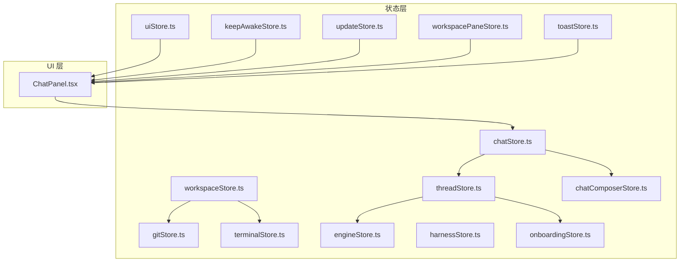
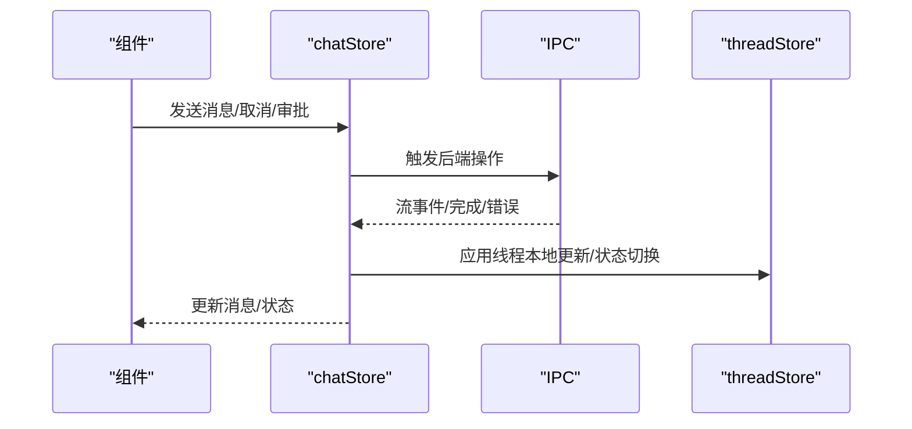
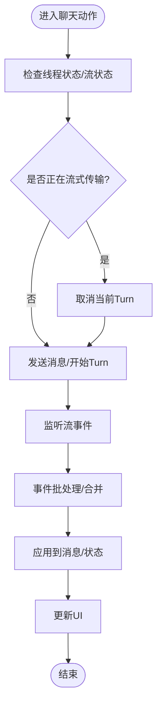
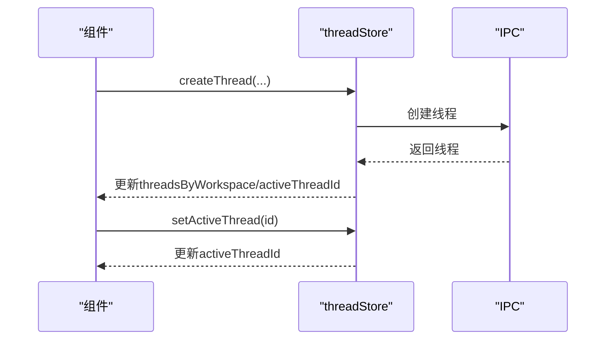
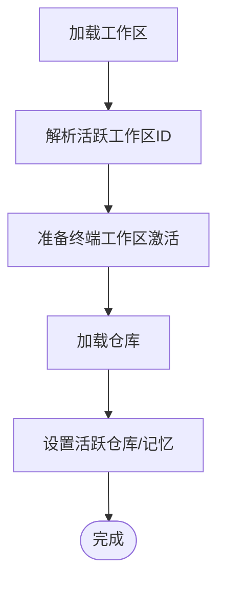
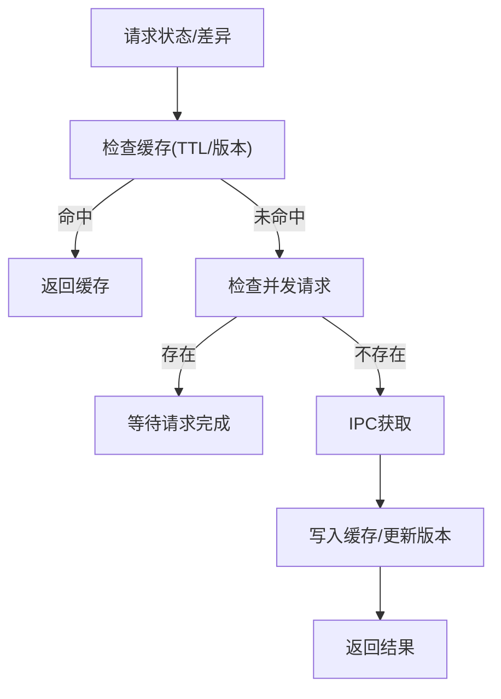
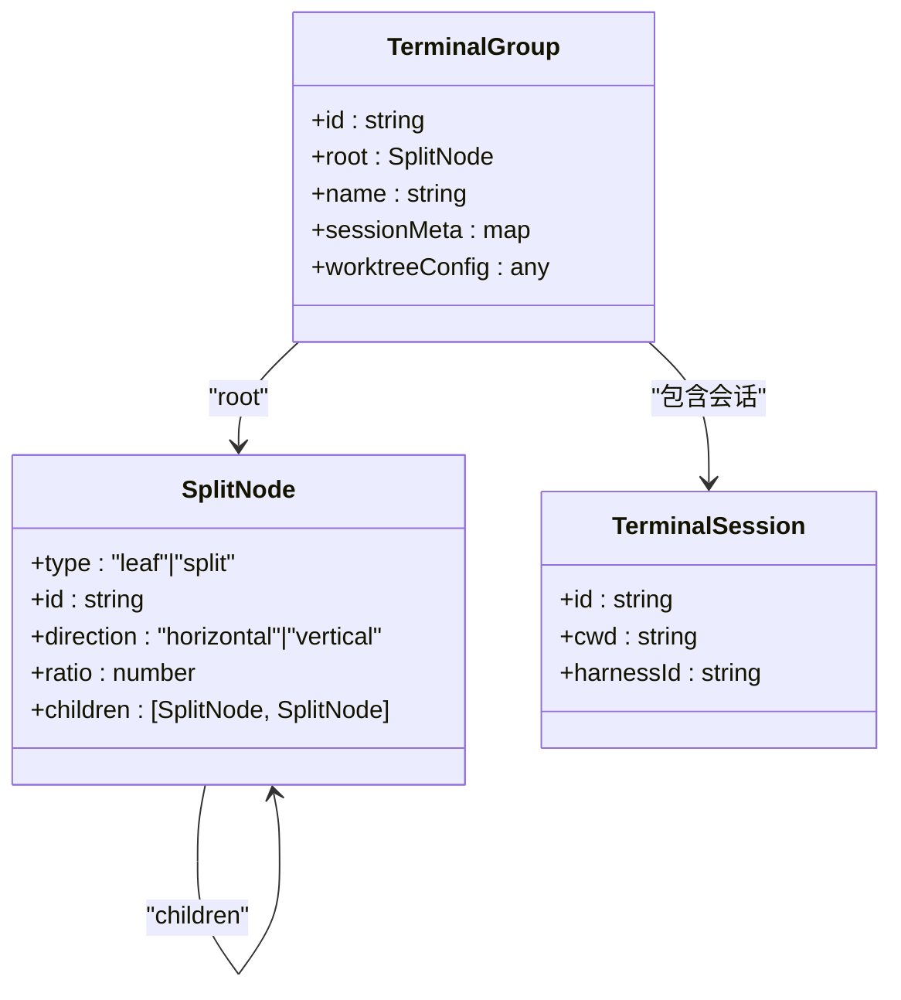
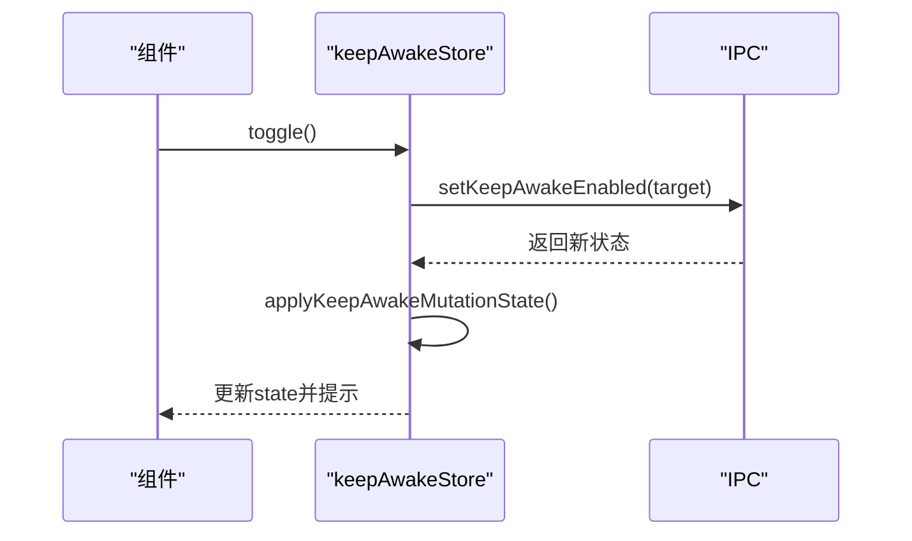
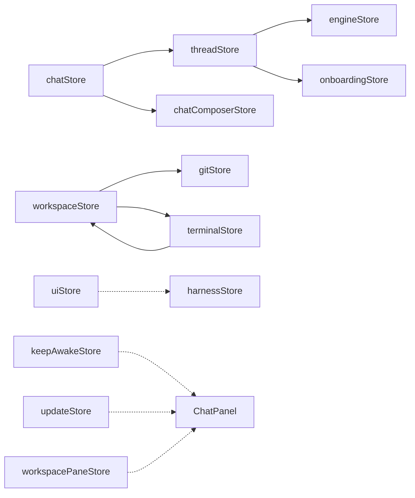

# 状态管理

<cite>
**本文引用的文件**
- [src/stores/chatStore.ts](file://src/stores/chatStore.ts)
- [src/stores/threadStore.ts](file://src/stores/threadStore.ts)
- [src/stores/workspaceStore.ts](file://src/stores/workspaceStore.ts)
- [src/stores/gitStore.ts](file://src/stores/gitStore.ts)
- [src/stores/terminalStore.ts](file://src/stores/terminalStore.ts)
- [src/stores/engineStore.ts](file://src/stores/engineStore.ts)
- [src/stores/uiStore.ts](file://src/stores/uiStore.ts)
- [src/stores/harnessStore.ts](file://src/stores/harnessStore.ts)
- [src/stores/onboardingStore.ts](file://src/stores/onboardingStore.ts)
- [src/stores/keepAwakeStore.ts](file://src/stores/keepAwakeStore.ts)
- [src/stores/updateStore.ts](file://src/stores/updateStore.ts)
- [src/stores/workspacePaneStore.ts](file://src/stores/workspacePaneStore.ts)
- [src/stores/chatComposerStore.ts](file://src/stores/chatComposerStore.ts)
- [src/stores/toastStore.ts](file://src/stores/toastStore.ts)
- [src/components/chat/ChatPanel.tsx](file://src/components/chat/ChatPanel.tsx)
</cite>

## 目录
1. [简介](#简介)
2. [项目结构](#项目结构)
3. [核心组件](#核心组件)
4. [架构总览](#架构总览)
5. [详细组件分析](#详细组件分析)
6. [依赖关系分析](#依赖关系分析)
7. [性能考量](#性能考量)
8. [故障排查指南](#故障排查指南)
9. [结论](#结论)
10. [附录](#附录)

## 简介
本文件系统性梳理 Panes 基于 Zustand 的状态管理体系，覆盖 Store 架构设计、状态结构、动作定义、订阅机制、持久化与同步策略，并结合 UI 绑定、异步更新与错误处理进行深入解析。目标是帮助开发者快速理解各 Store 的职责边界、交互关系与最佳实践，同时提供性能优化与调试建议。

## 项目结构
- 状态集中于 src/stores 下，按功能域拆分（聊天、线程、工作区、终端、Git、引擎、UI、引导流程、唤醒策略、更新、面板布局等）。
- 每个 Store 使用 create 进行声明，导出 useXStore 实例，供组件通过选择器订阅局部状态。
- 大部分 Store 采用 set/get 形式，支持内部状态计算与跨 Store 协作（如 useWorkspaceStore 与 useTerminalStore 的联动）。
- 部分 Store 提供本地持久化（localStorage），用于恢复用户偏好或上次活动项。

图表来源
- [src/stores/chatStore.ts:1-800](file://src/stores/chatStore.ts#L1-L800)
- [src/stores/threadStore.ts:1-713](file://src/stores/threadStore.ts#L1-L713)
- [src/stores/workspaceStore.ts:1-429](file://src/stores/workspaceStore.ts#L1-L429)
- [src/stores/gitStore.ts:1-800](file://src/stores/gitStore.ts#L1-L800)
- [src/stores/terminalStore.ts:1-800](file://src/stores/terminalStore.ts#L1-L800)
- [src/stores/engineStore.ts:1-164](file://src/stores/engineStore.ts#L1-L164)
- [src/stores/uiStore.ts:1-231](file://src/stores/uiStore.ts#L1-L231)
- [src/stores/harnessStore.ts:1-89](file://src/stores/harnessStore.ts#L1-L89)
- [src/stores/onboardingStore.ts:1-285](file://src/stores/onboardingStore.ts#L1-L285)
- [src/stores/keepAwakeStore.ts:1-317](file://src/stores/keepAwakeStore.ts#L1-L317)
- [src/stores/updateStore.ts:1-69](file://src/stores/updateStore.ts#L1-L69)
- [src/stores/workspacePaneStore.ts:1-693](file://src/stores/workspacePaneStore.ts#L1-L693)
- [src/stores/chatComposerStore.ts:1-30](file://src/stores/chatComposerStore.ts#L1-L30)
- [src/stores/toastStore.ts:1-66](file://src/stores/toastStore.ts#L1-L66)
- [src/components/chat/ChatPanel.tsx:1664-1701](file://src/components/chat/ChatPanel.tsx#L1664-L1701)

章节来源
- [src/stores/chatStore.ts:1-800](file://src/stores/chatStore.ts#L1-L800)
- [src/stores/threadStore.ts:1-713](file://src/stores/threadStore.ts#L1-L713)
- [src/stores/workspaceStore.ts:1-429](file://src/stores/workspaceStore.ts#L1-L429)
- [src/stores/gitStore.ts:1-800](file://src/stores/gitStore.ts#L1-L800)
- [src/stores/terminalStore.ts:1-800](file://src/stores/terminalStore.ts#L1-L800)
- [src/stores/engineStore.ts:1-164](file://src/stores/engineStore.ts#L1-L164)
- [src/stores/uiStore.ts:1-231](file://src/stores/uiStore.ts#L1-L231)
- [src/stores/harnessStore.ts:1-89](file://src/stores/harnessStore.ts#L1-L89)
- [src/stores/onboardingStore.ts:1-285](file://src/stores/onboardingStore.ts#L1-L285)
- [src/stores/keepAwakeStore.ts:1-317](file://src/stores/keepAwakeStore.ts#L1-L317)
- [src/stores/updateStore.ts:1-69](file://src/stores/updateStore.ts#L1-L69)
- [src/stores/workspacePaneStore.ts:1-693](file://src/stores/workspacePaneStore.ts#L1-L693)
- [src/stores/chatComposerStore.ts:1-30](file://src/stores/chatComposerStore.ts#L1-L30)
- [src/stores/toastStore.ts:1-66](file://src/stores/toastStore.ts#L1-L66)
- [src/components/chat/ChatPanel.tsx:1664-1701](file://src/components/chat/ChatPanel.tsx#L1664-L1701)

## 核心组件
- 聊天与消息流：chatStore 负责当前线程的消息窗口、加载旧消息、发送/取消、审批、流事件批处理与性能指标记录。
- 线程生命周期：threadStore 管理线程列表、归档、重命名、创建/派生/回滚/压缩、附加远端会话、本地更新应用。
- 工作区与仓库：workspaceStore 管理工作区、仓库集合、活跃项、信任级别、扫描与刷新、持久化上次活动。
- 终端与分屏：terminalStore 管理会话、组、分割树、启动预设、通知水合与广播。
- Git 面板：gitStore 提供状态缓存（内存+TTL）、差异缓存、视图刷新节流、草稿持久化。
- 引擎与运行时：engineStore 管理引擎发现、健康检查、运行时更新事件合并。
- UI 与交互：uiStore 管理侧边栏/Git 面板开关与固定、焦点模式、命令面板、视图切换、持久化面板状态。
- 引导流程：onboardingStore 管理引导步骤、偏好、安装日志、依赖与 Harness 安装。
- 唤醒策略：keepAwakeStore 管理电源设置、助手注册、请求/变更幂等与去抖。
- 更新：updateStore 管理应用更新检查、下载安装与重启。
- 面板布局：workspacePaneStore 管理多表面（聊天/终端/编辑器）的叶子与分割树、比例与聚焦。
- 聊天编排：chatComposerStore 记录工作区级运行时快照，辅助新线程默认值推断。
- 通知：toastStore 提供全局轻提示队列管理。

章节来源
- [src/stores/chatStore.ts:1-800](file://src/stores/chatStore.ts#L1-L800)
- [src/stores/threadStore.ts:1-713](file://src/stores/threadStore.ts#L1-L713)
- [src/stores/workspaceStore.ts:1-429](file://src/stores/workspaceStore.ts#L1-L429)
- [src/stores/terminalStore.ts:1-800](file://src/stores/terminalStore.ts#L1-L800)
- [src/stores/gitStore.ts:1-800](file://src/stores/gitStore.ts#L1-L800)
- [src/stores/engineStore.ts:1-164](file://src/stores/engineStore.ts#L1-L164)
- [src/stores/uiStore.ts:1-231](file://src/stores/uiStore.ts#L1-L231)
- [src/stores/onboardingStore.ts:1-285](file://src/stores/onboardingStore.ts#L1-L285)
- [src/stores/keepAwakeStore.ts:1-317](file://src/stores/keepAwakeStore.ts#L1-L317)
- [src/stores/updateStore.ts:1-69](file://src/stores/updateStore.ts#L1-L69)
- [src/stores/workspacePaneStore.ts:1-693](file://src/stores/workspacePaneStore.ts#L1-L693)
- [src/stores/chatComposerStore.ts:1-30](file://src/stores/chatComposerStore.ts#L1-L30)
- [src/stores/toastStore.ts:1-66](file://src/stores/toastStore.ts#L1-L66)

## 架构总览
Zustand Store 以“函数式 Store + 选择器订阅”为核心，遵循以下原则：
- 单一事实源：每个领域用独立 Store 维护状态，避免交叉污染。
- 动作内聚：动作封装副作用（IPC、持久化、缓存），返回 Promise 以便调用方等待。
- 选择器订阅：组件通过 useXStore(selector) 只订阅所需字段，降低重渲染。
- 跨 Store 协作：通过 getState()/其他 Store 的 useXStore.getState() 进行必要联动。
- 持久化与恢复：localStorage 保存用户偏好、上次活动项；Store 初始化时读取并恢复。

图表来源
- [src/stores/chatStore.ts:1-800](file://src/stores/chatStore.ts#L1-L800)
- [src/stores/threadStore.ts:1-713](file://src/stores/threadStore.ts#L1-L713)

## 详细组件分析

### 聊天状态管理（chatStore）
职责
- 维护当前线程的消息窗口、游标、加载状态、流状态与使用限制。
- 处理流事件批处理、合并与去重，减少渲染压力。
- 支持加载旧消息、发送消息、取消、审批响应、动作输出水合等。

关键点
- 状态结构：threadId、messages、olderCursor、hasOlderMessages、loadingOlderMessages、olderLoadBlockedUntil、status/streaming、usageLimits、error、unlisten。
- 动作：setActiveThread、loadOlderMessages、send、steer、cancel、respondApproval、hydrateActionOutput。
- 性能：流事件批量窗口、队列阈值、消息窗口初始大小、最大全量水合条数、动作输出截断与分块。
- 错误：区分可恢复/不可恢复错误，转换为错误状态并停止流。

图表来源
- [src/stores/chatStore.ts:1-800](file://src/stores/chatStore.ts#L1-L800)

章节来源
- [src/stores/chatStore.ts:1-800](file://src/stores/chatStore.ts#L1-L800)

### 线程状态管理（threadStore）
职责
- 维护线程列表、归档、活跃线程 ID。
- 创建/重命名/删除/恢复线程。
- 新线程运行时推断与默认值。
- 本地应用线程更新、推理努力度与最后模型设置。

关键点
- 状态结构：threads、threadsByWorkspace、archivedThreadsByWorkspace、activeThreadId、loading、error。
- 动作：createThread、renameThread、ensureThreadForScope、refreshThreads/archived/all、remove/restore、fork/rollback/compact、attach远端会话、setActiveThread、applyThreadUpdateLocal、setThreadReasoningEffortLocal、setThreadLastModelLocal。
- 默认运行时：从引擎、聊天编排器、引导选择与活跃线程中综合推断。
- 本地更新：applyThreadUpdateLocal 将远端更新合并入本地存储，保持归档/工作区映射一致。

图表来源
- [src/stores/threadStore.ts:1-713](file://src/stores/threadStore.ts#L1-L713)

章节来源
- [src/stores/threadStore.ts:1-713](file://src/stores/threadStore.ts#L1-L713)

### 工作区与仓库（workspaceStore）
职责
- 列举/打开/归档/恢复工作区。
- 加载仓库、设置活跃仓库、Git 活跃状态、信任级别。
- 启动时准备终端工作区激活、加载 Git 草稿。

关键点
- 状态结构：workspaces、archivedWorkspaces、activeWorkspaceId、repos、activeRepoId、reposLoading、loading、error。
- 持久化：上次工作区 ID、按工作区的上次仓库映射。
- 并发控制：reposLoadSeq 防止过期请求覆盖最新结果。
- 依赖联动：激活工作区时调用终端与 Git Store 准备。

图表来源
- [src/stores/workspaceStore.ts:1-429](file://src/stores/workspaceStore.ts#L1-L429)

章节来源
- [src/stores/workspaceStore.ts:1-429](file://src/stores/workspaceStore.ts#L1-L429)

### Git 面板（gitStore）
职责
- Git 状态与差异缓存（内存+TTL），命中即返回，未命中发起 IPC 请求并写入缓存。
- 视图刷新节流，避免频繁刷新导致抖动。
- 草稿持久化（commit message、branch name、历史）。
- 提供分支/提交/stash/worktree/远程等操作动作。

关键点
- 缓存策略：状态缓存与差异缓存，带 TTL 与字节上限，LRU 渐进淘汰。
- 版本号：repoRevisionByPath 用于校验缓存有效性。
- 刷新策略：shouldRefreshActiveView 控制视图最小刷新间隔。
- 草稿：draftStorageKey 以工作区维度持久化。

图表来源
- [src/stores/gitStore.ts:1-800](file://src/stores/gitStore.ts#L1-L800)

章节来源
- [src/stores/gitStore.ts:1-800](file://src/stores/gitStore.ts#L1-L800)

### 终端与分屏（terminalStore）
职责
- 会话生命周期：创建、关闭、分割、广播、组管理。
- 分割树：平衡二叉 SplitNode，支持水平/垂直方向与比例。
- 启动预设：从工作区读取/序列化/反序列化，支持工作树配置。
- 通知水合：按会话聚合通知，支持“全部触碰/按会话触碰”的水合策略。

关键点
- 分割算法：buildGridSplitTree、buildVerticalColumn、replaceLeafInTree/removeLeafFromTree/updateRatioInTree。
- 会话元数据：sessionMeta 包含 harness/worktree 等运行时信息。
- 启动预设：materialize/serializeRuntimeSplitNode，支持工作树分支与路径推断。
- 通知：indexNotificationsBySession、resolveHydratedNotifications、clearNotificationRecord。

图表来源
- [src/stores/terminalStore.ts:1-800](file://src/stores/terminalStore.ts#L1-L800)

章节来源
- [src/stores/terminalStore.ts:1-800](file://src/stores/terminalStore.ts#L1-L800)

### 引擎与运行时（engineStore）
职责
- 列举引擎、健康检查、合并健康报告、应用运行时更新事件。
- 去重与并发健康请求管理。

关键点
- pendingHealthRequests 避免重复请求。
- applyRuntimeUpdate 合并协议诊断信息，标记可用状态。

章节来源
- [src/stores/engineStore.ts:1-164](file://src/stores/engineStore.ts#L1-L164)

### UI 与交互（uiStore）
职责
- 侧边栏/Git 面板开关与固定、探索器开关、焦点模式、活跃视图、命令面板、消息聚焦目标。
- 持久化：sidebarPinned、gitPanelPinned、explorerOpen。

关键点
- toggle/set 系列动作自动写入 localStorage。
- setActiveView 在切换到 harnesses 时惰性扫描 harness。

章节来源
- [src/stores/uiStore.ts:1-231](file://src/stores/uiStore.ts#L1-L231)

### 引导流程（onboardingStore）
职责
- 引导步骤、偏好、聊天引擎选择、安装日志、依赖/Harness 安装。
- 持久化：引导完成标志、工作流偏好、聊天引擎选择。

关键点
- 读写 localStorage 的工具函数，保证在受限环境下的健壮性。
- installDependency/installHarness 通过 IPC 监听安装进度事件。

章节来源
- [src/stores/onboardingStore.ts:1-285](file://src/stores/onboardingStore.ts#L1-L285)

### 唤醒策略（keepAwakeStore）
职责
- 获取/刷新/切换 Keep Awake 状态，读取/保存电源设置，注册助手。
- 请求/变更幂等：beginKeepAwakeRequest/beginKeepAwakeMutation、applyKeepAwakeReadState/applyKeepAwakeMutationState。
- 去抖与失败提示：toast 显示启用/禁用成功/失败与受限提示。

图表来源
- [src/stores/keepAwakeStore.ts:1-317](file://src/stores/keepAwakeStore.ts#L1-L317)

章节来源
- [src/stores/keepAwakeStore.ts:1-317](file://src/stores/keepAwakeStore.ts#L1-L317)

### 更新（updateStore）
职责
- 检查更新、下载安装、重启、静默网络错误、用户“稍后提醒”。

章节来源
- [src/stores/updateStore.ts:1-69](file://src/stores/updateStore.ts#L1-L69)

### 面板布局（workspacePaneStore）
职责
- 多表面（chat/terminal/editor）的叶子与分割树管理，比例调整、聚焦、关闭、拆分、单表面显示。
- 持久化：localStorage 存储布局，支持从 legacy 模式推导。

关键点
- sanitizeNode/sanitizeTab 校验与修复持久化布局。
- deriveLegacyMode 根据当前布局推导 legacy 模式。
- splitLeaf/showSurface/closeLeaf 等动作均通过 updateWorkspace 写回持久化。

章节来源
- [src/stores/workspacePaneStore.ts:1-693](file://src/stores/workspacePaneStore.ts#L1-L693)

### 聊天编排（chatComposerStore）
职责
- 记录工作区级运行时快照，辅助新线程默认值推断。

章节来源
- [src/stores/chatComposerStore.ts:1-30](file://src/stores/chatComposerStore.ts#L1-L30)

### 通知（toastStore）
职责
- 全局轻提示队列，最多保留 N 条，按类型设定默认时长。

章节来源
- [src/stores/toastStore.ts:1-66](file://src/stores/toastStore.ts#L1-L66)

### UI 组件绑定与订阅
- ChatPanel 通过 useWorkspaceStore/useThreadStore/useShallow 选择器订阅工作区、仓库、线程等状态片段，避免无关重渲染。
- 通过 setActiveThreadInStore、applyThreadUpdateLocal 等动作与 Store 同步。

章节来源
- [src/components/chat/ChatPanel.tsx:1664-1701](file://src/components/chat/ChatPanel.tsx#L1664-L1701)

## 依赖关系分析
- chatStore 依赖 threadStore（读取活跃线程）、chatComposerStore（运行时快照）、engineStore（引擎信息）。
- threadStore 依赖 engineStore、onboardingStore、chatComposerStore。
- workspaceStore 依赖 gitStore、terminalStore。
- terminalStore 依赖 workspaceStore（根路径推断）、harnessStore（运行时元数据）。
- uiStore 与多个 Store 解耦，仅在特定场景触发（如 setActiveView -> harnessStore.lazy scan）。
- keepAwakeStore 与 updateStore 与 UI 交互，但不直接依赖业务 Store。
- workspacePaneStore 与 terminalStore 协作，共同决定终端面板布局。

图表来源
- [src/stores/chatStore.ts:1-800](file://src/stores/chatStore.ts#L1-L800)
- [src/stores/threadStore.ts:1-713](file://src/stores/threadStore.ts#L1-L713)
- [src/stores/workspaceStore.ts:1-429](file://src/stores/workspaceStore.ts#L1-L429)
- [src/stores/gitStore.ts:1-800](file://src/stores/gitStore.ts#L1-L800)
- [src/stores/terminalStore.ts:1-800](file://src/stores/terminalStore.ts#L1-L800)
- [src/stores/engineStore.ts:1-164](file://src/stores/engineStore.ts#L1-L164)
- [src/stores/onboardingStore.ts:1-285](file://src/stores/onboardingStore.ts#L1-L285)
- [src/stores/chatComposerStore.ts:1-30](file://src/stores/chatComposerStore.ts#L1-L30)
- [src/stores/uiStore.ts:1-231](file://src/stores/uiStore.ts#L1-L231)
- [src/stores/harnessStore.ts:1-89](file://src/stores/harnessStore.ts#L1-L89)
- [src/stores/keepAwakeStore.ts:1-317](file://src/stores/keepAwakeStore.ts#L1-L317)
- [src/stores/updateStore.ts:1-69](file://src/stores/updateStore.ts#L1-L69)
- [src/stores/workspacePaneStore.ts:1-693](file://src/stores/workspacePaneStore.ts#L1-L693)
- [src/components/chat/ChatPanel.tsx:1664-1701](file://src/components/chat/ChatPanel.tsx#L1664-L1701)

## 性能考量
- 流事件批处理：chatStore 对 TextDelta/ThinkingDelta/ActionOutputDelta/Progress/Diff/UsageLimits 等事件进行合并，减少渲染与状态更新频率。
- 缓存与去抖：gitStore 的状态/差异缓存带 TTL 与字节上限，repoRevision 校验失效；keepAwakeStore 的请求/变更幂等与 pending 计数避免竞态。
- 并发控制：workspaceStore 的 reposLoadSeq、gitStore 的 in-flight Map、engineStore 的 pendingHealthRequests。
- 渲染优化：UI 通过 useShallow 选择器只订阅必要字段，避免整 Store 重渲染。
- 通知与提示：toastStore 限制数量，避免 UI 抖动。

## 故障排查指南
- IPC 失败与错误传播
  - chatStore/threadStore/workspaceStore/gitStore/engineStore 在发生错误时设置 error 字段，UI 可据此展示。
  - keepAwakeStore/updateStore 在失败时通过 toast 提示，便于用户感知。
- 缓存一致性
  - gitStore 通过 repoRevision 与 TTL 保障缓存一致性；若出现脏数据，可调用 invalidateRepoCache 或强制刷新。
- 并发竞态
  - chatStore/backgroundStreamListeners 确保切后台时仍保持事件流，避免丢失；threadStore/workspaceStore 的 seq 控制防止过期请求覆盖。
- 本地持久化异常
  - onboardingStore/workspacePaneStore/gitStore 的持久化读写在受限环境下可能失败，Store 内部已捕获并降级处理。

章节来源
- [src/stores/chatStore.ts:1-800](file://src/stores/chatStore.ts#L1-L800)
- [src/stores/threadStore.ts:1-713](file://src/stores/threadStore.ts#L1-L713)
- [src/stores/workspaceStore.ts:1-429](file://src/stores/workspaceStore.ts#L1-L429)
- [src/stores/gitStore.ts:1-800](file://src/stores/gitStore.ts#L1-L800)
- [src/stores/engineStore.ts:1-164](file://src/stores/engineStore.ts#L1-L164)
- [src/stores/keepAwakeStore.ts:1-317](file://src/stores/keepAwakeStore.ts#L1-L317)
- [src/stores/updateStore.ts:1-69](file://src/stores/updateStore.ts#L1-L69)
- [src/stores/onboardingStore.ts:1-285](file://src/stores/onboardingStore.ts#L1-L285)

## 结论
Panes 的 Zustand 状态体系以“领域 Store + 选择器订阅 + 持久化 + 缓存/去抖”为核心，既保证了模块内聚与职责清晰，又通过跨 Store 协作实现复杂业务闭环。推荐在新增功能时遵循现有模式：单一 Store、明确动作、必要持久化、合理缓存与并发控制，并通过 UI 选择器最小化重渲染。

## 附录
- 最佳实践
  - 使用选择器订阅局部状态，避免整 Store 订阅。
  - 将副作用封装在动作内，返回 Promise 以便上层等待。
  - 对外暴露稳定的动作签名，内部通过 set/get 与外部 Store 协作。
  - 对关键状态（如 Git、聊天流）建立缓存与去抖策略。
- 常见陷阱
  - 忽略过期请求覆盖：使用 seq/revision 校验。
  - 未处理 IPC 错误：统一设置 error 字段并在 UI 层反馈。
  - 持久化失败：在 Store 内捕获异常并降级，避免阻塞主流程。
- 调试技巧
  - 为关键动作添加日志（如 chatStore 的性能指标记录）。
  - 使用浏览器 DevTools 的 Redux DevTools 扩展观察 Store 变化。
  - 对并发问题，优先检查 pending/seq/in-flight Map 的使用。