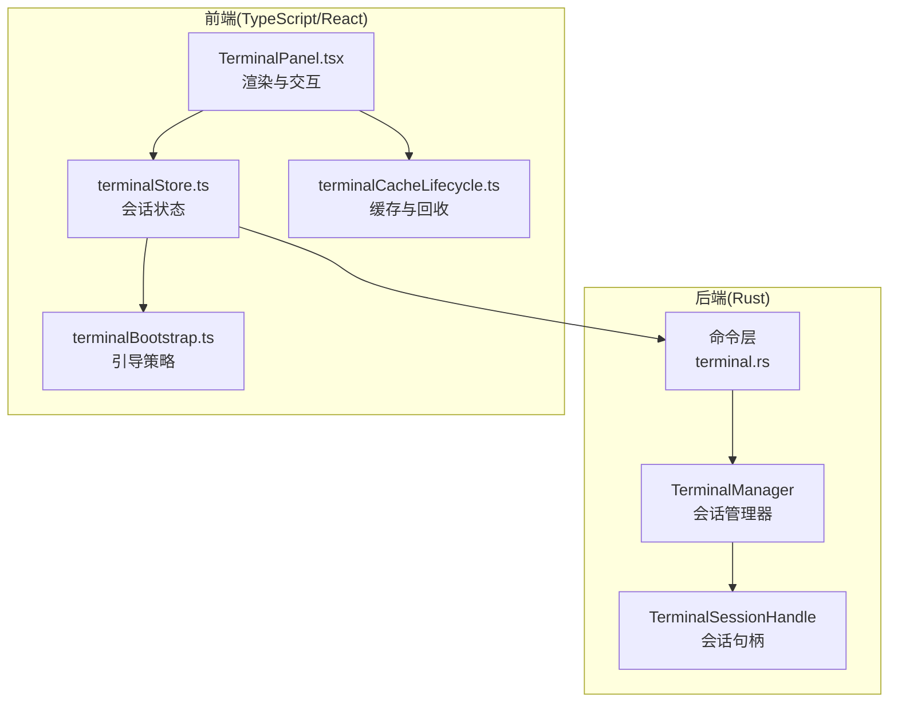
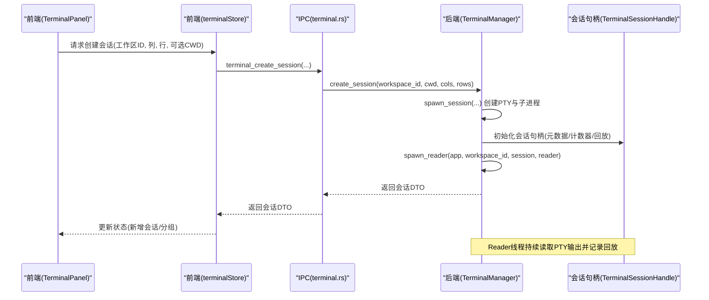
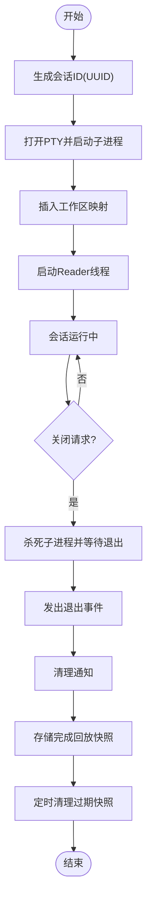
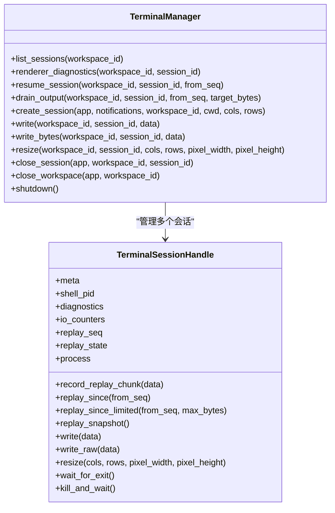

# 会话管理

<cite>
**本文引用的文件**
- [mod.rs](file://src-tauri/src/terminal/mod.rs)
- [terminal.rs](file://src-tauri/src/commands/terminal.rs)
- [terminalStore.ts](file://src/stores/terminalStore.ts)
- [TerminalPanel.tsx](file://src/components/terminal/TerminalPanel.tsx)
- [terminalCacheLifecycle.ts](file://src/components/terminal/terminalCacheLifecycle.ts)
- [terminalBootstrap.ts](file://src/lib/terminalBootstrap.ts)
- [terminalStore.multiSession.test.ts](file://src/stores/terminalStore.multiSession.test.ts)
</cite>

## 目录
1. [简介](#简介)
2. [项目结构](#项目结构)
3. [核心组件](#核心组件)
4. [架构总览](#架构总览)
5. [详细组件分析](#详细组件分析)
6. [依赖关系分析](#依赖关系分析)
7. [性能考量](#性能考量)
8. [故障排查指南](#故障排查指南)
9. [结论](#结论)

## 简介
本文件系统性阐述 Panes 的终端会话管理机制，覆盖会话生命周期（创建、运行、恢复、关闭）、工作空间隔离、会话 ID 生成与映射、输出回放与缓存、环境变量注入与进程管理策略、前端缓存与回收策略、以及健康检查与错误处理。目标是帮助开发者与使用者理解从后端 Rust 到前端 TypeScript 的完整会话管理链路。

## 项目结构
围绕终端会话管理的关键模块分布如下：
- 后端（Rust）
  - 终端管理器：负责会话创建、IO 处理、输出回放、完成会话快照、事件发布等
  - 命令层：暴露 IPC 能力，供前端调用
- 前端（TypeScript/React）
  - 终端状态存储：维护工作空间内会话集合、布局树、通知与元数据
  - 终端面板：负责渲染、输入队列、输出应用、缓存与回收、事件监听
  - 缓存生命周期：分离“已附着/已脱离”的会话，支持空闲回收
  - 引导策略：根据界面状态决定是否自动创建会话或按启动预设创建

图示来源
- [mod.rs:44-48](file://src-tauri/src/terminal/mod.rs#L44-L48)
- [terminal.rs:25-62](file://src-tauri/src/commands/terminal.rs#L25-L62)
- [terminalStore.ts:751-800](file://src/stores/terminalStore.ts#L751-L800)
- [TerminalPanel.tsx:1-120](file://src/components/terminal/TerminalPanel.tsx#L1-L120)
- [terminalCacheLifecycle.ts:1-74](file://src/components/terminal/terminalCacheLifecycle.ts#L1-L74)
- [terminalBootstrap.ts:13-44](file://src/lib/terminalBootstrap.ts#L13-L44)

章节来源
- [mod.rs:44-48](file://src-tauri/src/terminal/mod.rs#L44-L48)
- [terminal.rs:25-62](file://src-tauri/src/commands/terminal.rs#L25-L62)
- [terminalStore.ts:751-800](file://src/stores/terminalStore.ts#L751-L800)
- [TerminalPanel.tsx:1-120](file://src/components/terminal/TerminalPanel.tsx#L1-L120)
- [terminalCacheLifecycle.ts:1-74](file://src/components/terminal/terminalCacheLifecycle.ts#L1-L74)
- [terminalBootstrap.ts:13-44](file://src/lib/terminalBootstrap.ts#L13-L44)

## 核心组件
- TerminalManager：后端会话管理中心，持有工作空间到会话映射，负责创建、写入、调整大小、关闭、列出、诊断、恢复输出等
- TerminalSessionHandle：单个会话的句柄，封装元数据、进程、IO 计数器、回放序列与状态、诊断信息
- 命令层（terminal.rs）：对外暴露 IPC 接口，如创建、写入、调整大小、关闭、列表、恢复等
- 前端终端状态（terminalStore.ts）：维护每个工作空间内的会话集合、分组布局、通知、启动预设等
- 终端面板（TerminalPanel.tsx）：负责渲染、输入队列、输出应用、事件监听、缓存与回收
- 缓存生命周期（terminalCacheLifecycle.ts）：标记会话“已脱离”，判定回收时机
- 引导策略（terminalBootstrap.ts）：根据界面状态决定是否自动创建会话或按预设创建

章节来源
- [mod.rs:44-1345](file://src-tauri/src/terminal/mod.rs#L44-L1345)
- [terminal.rs:25-294](file://src-tauri/src/commands/terminal.rs#L25-L294)
- [terminalStore.ts:415-525](file://src/stores/terminalStore.ts#L415-L525)
- [TerminalPanel.tsx:1-200](file://src/components/terminal/TerminalPanel.tsx#L1-L200)
- [terminalCacheLifecycle.ts:1-74](file://src/components/terminal/terminalCacheLifecycle.ts#L1-L74)
- [terminalBootstrap.ts:13-44](file://src/lib/terminalBootstrap.ts#L13-L44)

## 架构总览
后端通过 PTY 打开子进程，使用 Reader/Emitter 线程模型将高频输出合并为有限速率的 IPC 事件；前端监听事件并应用到 xterm 实例，同时维护会话缓存与回收策略。命令层作为 IPC 入口，统一校验参数与工作空间路径，再委派给 TerminalManager。

图示来源
- [terminal.rs:25-62](file://src-tauri/src/commands/terminal.rs#L25-L62)
- [mod.rs:385-429](file://src-tauri/src/terminal/mod.rs#L385-L429)
- [mod.rs:622-912](file://src-tauri/src/terminal/mod.rs#L622-L912)
- [TerminalPanel.tsx:1-120](file://src/components/terminal/TerminalPanel.tsx#L1-L120)

章节来源
- [terminal.rs:25-62](file://src-tauri/src/commands/terminal.rs#L25-L62)
- [mod.rs:385-429](file://src-tauri/src/terminal/mod.rs#L385-L429)
- [mod.rs:622-912](file://src-tauri/src/terminal/mod.rs#L622-L912)
- [TerminalPanel.tsx:1-120](file://src/components/terminal/TerminalPanel.tsx#L1-L120)

## 详细组件分析

### TerminalManager 结构体与职责
- 工作空间映射：以工作区 ID 为键，映射到会话 ID 到会话句柄的哈希表
- 完成会话回放：保存最近若干会话的输出快照，用于断连重连时恢复
- 关键方法：
  - 列出会话、渲染器诊断、恢复会话、拉取输出、创建会话、写入、写入字节、调整大小、关闭会话、关闭工作区、关机清理
  - 内部辅助：获取会话、移除/取出会话、存储/移除完成回放、Reader 线程启动与收尾

章节来源
- [mod.rs:44-48](file://src-tauri/src/terminal/mod.rs#L44-L48)
- [mod.rs:319-543](file://src-tauri/src/terminal/mod.rs#L319-L543)
- [mod.rs:558-620](file://src-tauri/src/terminal/mod.rs#L558-L620)
- [mod.rs:573-597](file://src-tauri/src/terminal/mod.rs#L573-L597)

### TerminalSessionHandle 实现
- 元数据：会话 ID、工作区 ID、Shell 路径、当前目录、创建时间
- 进程与IO：PTY 主端、写入器、子进程；IO 计数器统计输入/输出/丢弃/峰值缓冲等
- 回放：原子序号递增的回放序列，环形缓冲记录回放块，限制最大块数与字节数
- 诊断：环境快照、最后尺寸、零像素警告时间戳
- 方法：写入文本/字节、调整大小、等待退出、强制终止并等待、记录回放块、回放片段、回放快照

章节来源
- [mod.rs:50-58](file://src-tauri/src/terminal/mod.rs#L50-L58)
- [mod.rs:90-113](file://src-tauri/src/terminal/mod.rs#L90-L113)
- [mod.rs:1070-1160](file://src-tauri/src/terminal/mod.rs#L1070-L1160)
- [mod.rs:1162-1344](file://src-tauri/src/terminal/mod.rs#L1162-L1344)

### 会话创建与销毁流程
- 创建：生成 UUID 作为会话 ID；准备通知环境变量；在阻塞任务中打开 PTY、构建命令、启动子进程；将会话插入工作区映射；启动 Reader 线程
- 销毁：取出会话并杀死子进程，等待退出，发出退出事件，清理通知，一段时间后移除完成回放快照
- 关闭工作区：批量关闭该工作区内所有会话

图示来源
- [mod.rs:385-429](file://src-tauri/src/terminal/mod.rs#L385-L429)
- [mod.rs:482-497](file://src-tauri/src/terminal/mod.rs#L482-L497)
- [mod.rs:914-944](file://src-tauri/src/terminal/mod.rs#L914-L944)

章节来源
- [mod.rs:385-429](file://src-tauri/src/terminal/mod.rs#L385-L429)
- [mod.rs:482-497](file://src-tauri/src/terminal/mod.rs#L482-L497)
- [mod.rs:914-944](file://src-tauri/src/terminal/mod.rs#L914-L944)

### 会话状态管理与回放
- 输出回放：Reader 线程将 UTF-8 片段累积到共享缓冲，发射线程按固定最小间隔合并并发出；会话句柄记录回放块，维护最新序列号
- 完成回放：会话结束后将其回放快照存入“完成回放”映射，并在宽限时间内保留，便于断连重连时恢复
- 恢复策略：优先从当前会话回放，否则从完成回放中返回；若两者都不可用则报错

章节来源
- [mod.rs:622-912](file://src-tauri/src/terminal/mod.rs#L622-L912)
- [mod.rs:1070-1160](file://src-tauri/src/terminal/mod.rs#L1070-L1160)
- [mod.rs:347-383](file://src-tauri/src/terminal/mod.rs#L347-L383)
- [mod.rs:558-597](file://src-tauri/src/terminal/mod.rs#L558-L597)

### 会话 ID 生成、工作空间映射与持久化
- 会话 ID：使用 UUID v4 生成全局唯一标识
- 工作空间映射：TerminalManager 内部以 RwLock 保护的 HashMap 存储 workspace_id → session_id → TerminalSessionHandle
- 持久化与恢复：完成回放在内存中保留一段时间，配合“完成回放”上限与字节总量控制；前端可基于序列号增量恢复

章节来源
- [mod.rs](file://src-tauri/src/terminal/mod.rs#L394)
- [mod.rs:44-48](file://src-tauri/src/terminal/mod.rs#L44-L48)
- [mod.rs:1347-1398](file://src-tauri/src/terminal/mod.rs#L1347-L1398)

### 会话配置选项、环境变量处理与进程管理
- 配置选项：列数/行数、像素宽高、可选 CWD；CWD 校验必须位于工作区根目录内
- 环境变量：
  - 终端通用：TERM、COLORTERM、TERM_PROGRAM、TERM_PROGRAM_VERSION、PATH、HOME、TMPDIR 等
  - Windows 特有：USERPROFILE、LOCALAPPDATA、APPDATA、TEMP、TMP
  - 通知集成：PANES_WORKSPACE_ID、PANES_SESSION_ID、PANES_NOTIFY_ADDR、PANES_NOTIFY_TOKEN
- 进程管理：默认 Shell 选择（Windows 使用 COMSPEC/cmd），非 Windows 平台附加 shell 参数；检测前台进程（Linux/macOS 使用 pgrep/ps，Windows 使用 PowerShell 查询）

章节来源
- [terminal.rs:37-49](file://src-tauri/src/commands/terminal.rs#L37-L49)
- [mod.rs:1400-1471](file://src-tauri/src/terminal/mod.rs#L1400-L1471)
- [mod.rs:1522-1808](file://src-tauri/src/terminal/mod.rs#L1522-L1808)
- [mod.rs:1898-2300](file://src-tauri/src/terminal/mod.rs#L1898-L2300)

### 前端会话生命周期与缓存回收
- 生命周期：会话创建后加入状态树；当面板被移除或工作区切换导致“脱离”时，标记需要恢复；空闲超时后进行回收
- 回收策略：按“脱离时间”与“最后访问时间”排序，优先回收最旧且长时间未访问的会话
- 重连策略：若检测到回放缺口，触发重建渲染器或冷重新连接

章节来源
- [terminalCacheLifecycle.ts:1-74](file://src/components/terminal/terminalCacheLifecycle.ts#L1-L74)
- [TerminalPanel.tsx:1593-2040](file://src/components/terminal/TerminalPanel.tsx#L1593-L2040)

### 引导策略与多会话编排
- 引导策略：根据界面就绪、工作区打开、布局模式、会话数量、是否有待执行的启动预设，决定“无操作/按预设/单会话”
- 多会话：支持按预设批量创建会话，构建网格布局树，失败时回滚已创建会话

章节来源
- [terminalBootstrap.ts:13-44](file://src/lib/terminalBootstrap.ts#L13-L44)
- [terminalStore.ts:1385-1968](file://src/stores/terminalStore.ts#L1385-L1968)
- [terminalStore.multiSession.test.ts:799-837](file://src/stores/terminalStore.multiSession.test.ts#L799-L837)

## 依赖关系分析

图示来源
- [mod.rs:44-1345](file://src-tauri/src/terminal/mod.rs#L44-L1345)

章节来源
- [mod.rs:44-1345](file://src-tauri/src/terminal/mod.rs#L44-L1345)

## 性能考量
- 输出吞吐控制：Reader 线程持续读取，发射线程按固定最小间隔合并，避免高频 IPC；输出缓冲上限与丢弃策略防止内存膨胀
- 回放窗口限制：回放块数量与总字节上限，避免长期运行占用过多内存
- 完成回放缓存：按会话数与总字节裁剪，保留最近的完成回放快照
- 前端渲染：WebGL/Canvas 渲染模式切换、图像插件初始化与错误计数、输出队列与冲刷超时窗口

章节来源
- [mod.rs:35-42](file://src-tauri/src/terminal/mod.rs#L35-L42)
- [mod.rs:1347-1398](file://src-tauri/src/terminal/mod.rs#L1347-L1398)
- [TerminalPanel.tsx:1-200](file://src/components/terminal/TerminalPanel.tsx#L1-L200)

## 故障排查指南
- 会话创建失败：检查工作区根路径与 CWD 是否有效且在根目录内；确认 PTY 打开与子进程启动日志
- 输出卡顿/冻结：关注输出最小发射间隔与缓冲上限；检查前端输出队列与冲刷定时器状态
- 断连重连缺口：前端检测到 gap 时会尝试重建渲染器或冷重新连接；必要时清理缓存并重建
- 通知不显示：确认通知环境变量已注入；检查通知清理逻辑与焦点状态
- 前台进程检测异常：Linux/macOS 使用 pgrep/ps，Windows 使用 PowerShell；若检测不到前台进程属正常现象（存在后台作业时）

章节来源
- [terminal.rs:37-49](file://src-tauri/src/commands/terminal.rs#L37-L49)
- [mod.rs:622-912](file://src-tauri/src/terminal/mod.rs#L622-L912)
- [TerminalPanel.tsx:1593-2040](file://src/components/terminal/TerminalPanel.tsx#L1593-L2040)
- [mod.rs:1898-2300](file://src-tauri/src/terminal/mod.rs#L1898-L2300)

## 结论
Panes 的终端会话管理以 TerminalManager 为核心，结合命令层 IPC、前端状态与渲染链路，实现了工作空间隔离、稳定的输出回放与恢复、可控的资源占用与回收策略。通过严格的 CWD 校验、环境变量注入与前台进程检测，确保跨平台一致性与可观测性。建议在生产环境中关注输出缓冲与回放缓存的配额设置，并在复杂布局下验证多会话的启动与回收行为。