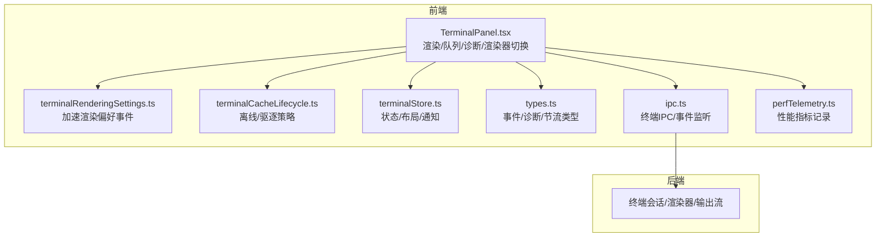
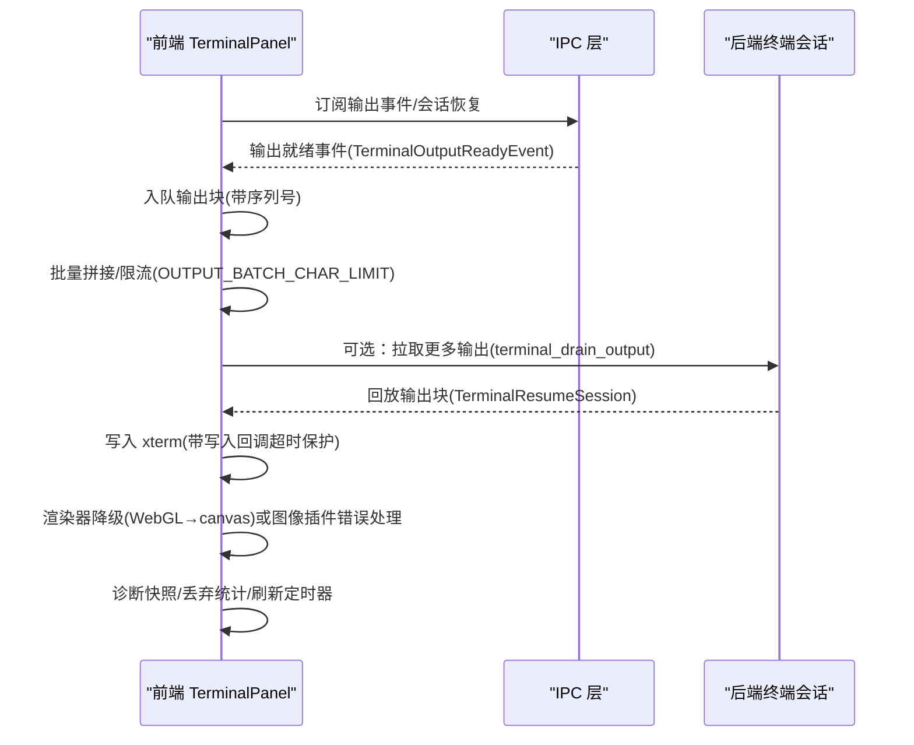
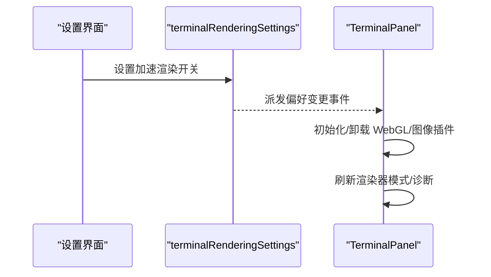
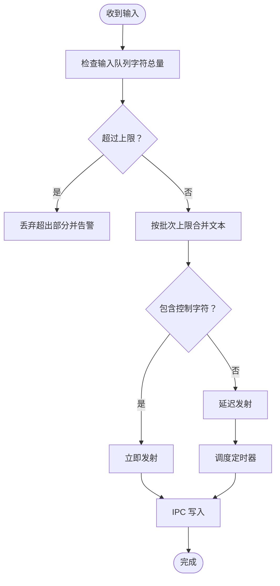
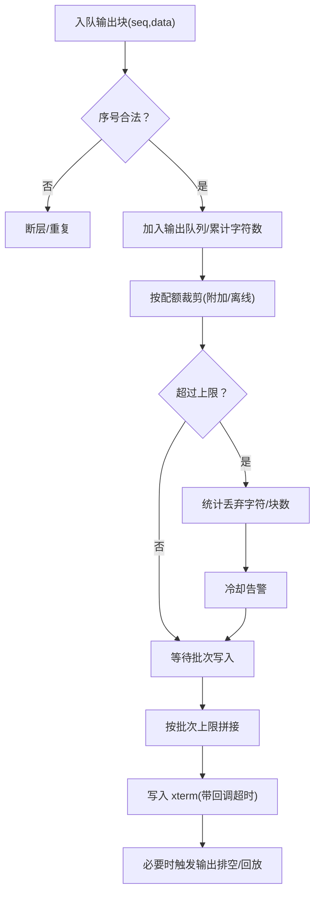
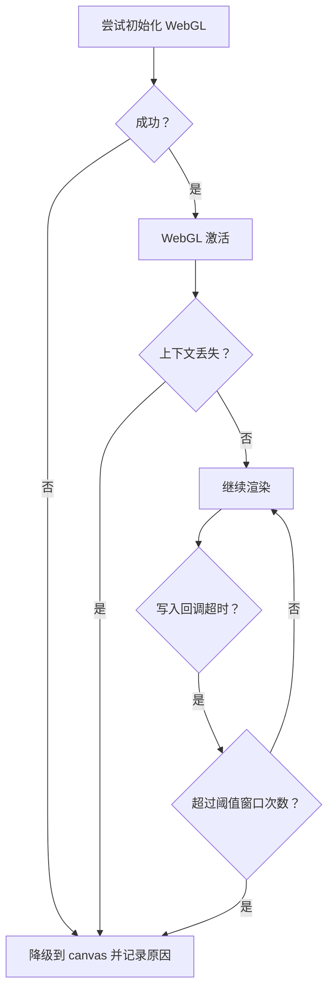
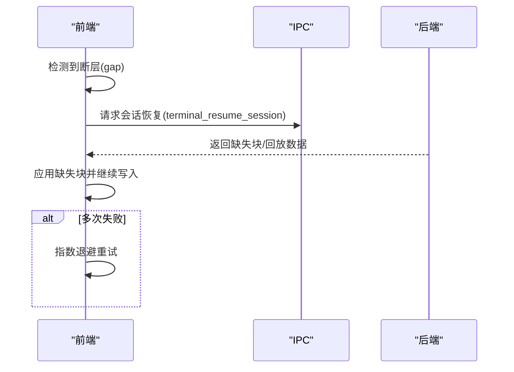
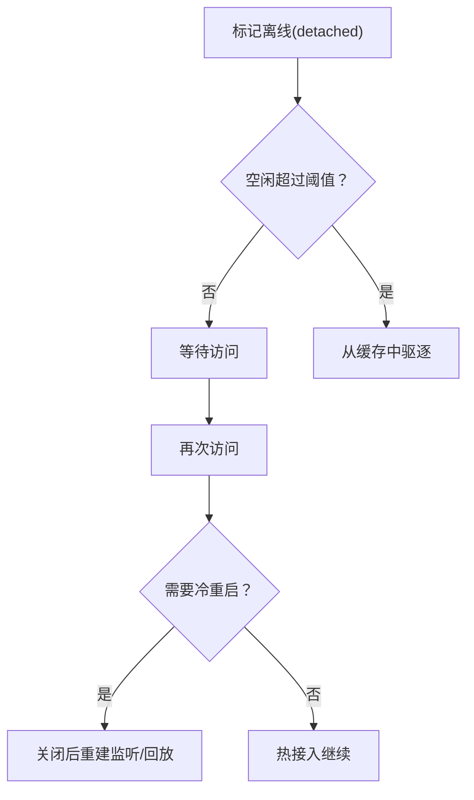
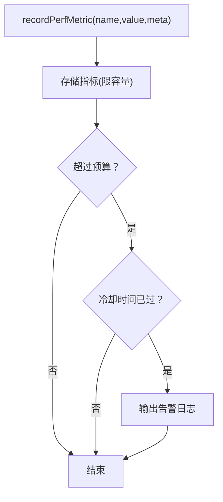
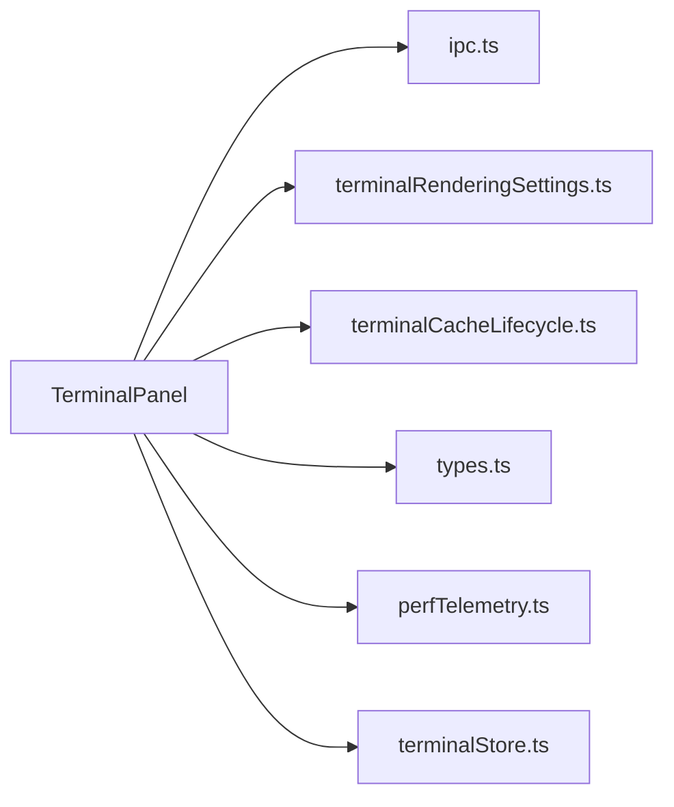

# 性能优化

<cite>
**本文引用的文件**
- [TerminalPanel.tsx](file://src/components/terminal/TerminalPanel.tsx)
- [terminalRenderingSettings.ts](file://src/lib/terminalRenderingSettings.ts)
- [terminalCacheLifecycle.ts](file://src/components/terminal/terminalCacheLifecycle.ts)
- [terminalStore.ts](file://src/stores/terminalStore.ts)
- [types.ts](file://src/types.ts)
- [ipc.ts](file://src/lib/ipc.ts)
- [perfTelemetry.ts](file://src/lib/perfTelemetry.ts)
</cite>

## 目录
1. [简介](#简介)
2. [项目结构](#项目结构)
3. [核心组件](#核心组件)
4. [架构总览](#架构总览)
5. [详细组件分析](#详细组件分析)
6. [依赖关系分析](#依赖关系分析)
7. [性能考量](#性能考量)
8. [故障排查指南](#故障排查指南)
9. [结论](#结论)
10. [附录](#附录)

## 简介
本文件聚焦 Panes 终端在前端侧的性能优化策略与实现，覆盖渲染优化（加速渲染开关、WebGL 渲染器降级）、内存使用控制（输出队列与挂起输出的容量限制）、CPU 负载管理（写入回调超时与退避重试）、背压控制（输入/输出队列限流与丢弃告警）、以及跨平台差异与针对性优化建议。文档同时提供性能监控指标、瓶颈识别方法与优化建议，并给出渲染设置配置、缓存策略与资源回收机制。

## 项目结构
终端性能优化主要集中在以下模块：
- 前端终端面板：负责渲染、事件监听、队列调度、渲染器选择与降级、诊断导出等
- 渲染设置：提供“加速渲染”偏好变更事件与版本号
- 缓存生命周期：分离/回收离线会话、空闲驱逐
- 存储层：终端状态、分屏布局、通知与元数据
- 类型系统：统一的终端事件、诊断、输出回放与节流参数
- IPC 层：与后端通信，包括输出拉取、会话恢复、渲染器诊断获取
- 性能遥测：通用性能指标记录与预算告警

图示来源
- [TerminalPanel.tsx](file://src/components/terminal/TerminalPanel.tsx)
- [terminalRenderingSettings.ts](file://src/lib/terminalRenderingSettings.ts)
- [terminalCacheLifecycle.ts](file://src/components/terminal/terminalCacheLifecycle.ts)
- [terminalStore.ts](file://src/stores/terminalStore.ts)
- [types.ts](file://src/types.ts)
- [ipc.ts](file://src/lib/ipc.ts)
- [perfTelemetry.ts](file://src/lib/perfTelemetry.ts)

章节来源
- [TerminalPanel.tsx:1-4409](file://src/components/terminal/TerminalPanel.tsx#L1-L4409)
- [terminalRenderingSettings.ts:1-37](file://src/lib/terminalRenderingSettings.ts#L1-L37)
- [terminalCacheLifecycle.ts:1-74](file://src/components/terminal/terminalCacheLifecycle.ts#L1-L74)
- [terminalStore.ts:1-2049](file://src/stores/terminalStore.ts#L1-L2049)
- [types.ts:897-1020](file://src/types.ts#L897-L1020)
- [ipc.ts:547-627](file://src/lib/ipc.ts#L547-L627)
- [perfTelemetry.ts:1-146](file://src/lib/perfTelemetry.ts#L1-L146)

## 核心组件
- 终端面板（TerminalPanel）：维护每个会话的输入/输出队列、渲染器模式（WebGL/canvas）、刷新定时器、丢弃统计、诊断快照与渲染器降级逻辑；通过 IPC 与后端交互并拉取渲染器诊断。
- 渲染设置（terminalRenderingSettings）：提供“加速渲染”偏好变更事件与版本号，驱动前端渲染器切换。
- 缓存生命周期（terminalCacheLifecycle）：标记离线、空闲驱逐阈值与回收策略。
- 存储层（terminalStore）：管理终端工作区状态、分屏树、会话元数据与通知。
- 类型系统（types）：定义终端输出就绪、回放、节流、渲染器诊断等关键类型。
- IPC（ipc）：封装终端会话创建、写入、尺寸调整、输出拉取、会话恢复、渲染器诊断查询等。
- 性能遥测（perfTelemetry）：通用性能指标记录与预算告警，便于识别整体性能瓶颈。

章节来源
- [TerminalPanel.tsx:171-218](file://src/components/terminal/TerminalPanel.tsx#L171-L218)
- [terminalRenderingSettings.ts:6-36](file://src/lib/terminalRenderingSettings.ts#L6-L36)
- [terminalCacheLifecycle.ts:15-55](file://src/components/terminal/terminalCacheLifecycle.ts#L15-L55)
- [terminalStore.ts:415-501](file://src/stores/terminalStore.ts#L415-L501)
- [types.ts:920-1020](file://src/types.ts#L920-L1020)
- [ipc.ts:547-627](file://src/lib/ipc.ts#L547-L627)
- [perfTelemetry.ts:55-127](file://src/lib/perfTelemetry.ts#L55-L127)

## 架构总览
终端性能优化采用“前端队列化 + 后端回放”的架构：前端以“序列化输出块”为单位接收后端输出，按批次写入 xterm，同时对输入进行批量与限流，避免高频小包导致的 CPU 峰值。渲染器可动态从 WebGL 切换到 canvas，以应对上下文丢失或写入回调卡顿。离线会话具备空闲驱逐与冷重启能力，保障内存占用可控。

图示来源
- [TerminalPanel.tsx:1525-1599](file://src/components/terminal/TerminalPanel.tsx#L1525-L1599)
- [ipc.ts:580-601](file://src/lib/ipc.ts#L580-L601)
- [types.ts:920-938](file://src/types.ts#L920-L938)

## 详细组件分析

### 渲染设置与加速渲染偏好
- 偏好事件：通过自定义事件广播“加速渲染”开关变化，前端据此加载/卸载 WebGL 与图像插件，并刷新渲染器模式。
- 版本号：每次变更递增版本号，用于检测偏好是否更新。
- 影响范围：决定是否启用 WebGL、图像插件初始化与运行时错误统计。

图示来源
- [terminalRenderingSettings.ts:14-36](file://src/lib/terminalRenderingSettings.ts#L14-L36)
- [TerminalPanel.tsx:741-795](file://src/components/terminal/TerminalPanel.tsx#L741-L795)

章节来源
- [terminalRenderingSettings.ts:10-36](file://src/lib/terminalRenderingSettings.ts#L10-L36)
- [TerminalPanel.tsx:741-795](file://src/components/terminal/TerminalPanel.tsx#L741-L795)

### 输入队列与发射间隔控制
- 输入批处理：将连续文本输入合并为不超过字符上限的批次，减少写入次数。
- 发射延迟：普通输入按固定延迟触发，遇到控制字符立即发射，降低阻塞风险。
- 队列限流：输入队列字符总量超过上限时丢弃多余内容并发出告警。
- 字节输入：直接以字节数组写入，不参与文本边界裁剪，确保二进制安全。

图示来源
- [TerminalPanel.tsx:1179-1262](file://src/components/terminal/TerminalPanel.tsx#L1179-L1262)
- [TerminalPanel.tsx:969-1021](file://src/components/terminal/TerminalPanel.tsx#L969-L1021)

章节来源
- [TerminalPanel.tsx:1179-1262](file://src/components/terminal/TerminalPanel.tsx#L1179-L1262)
- [TerminalPanel.tsx:969-1021](file://src/components/terminal/TerminalPanel.tsx#L969-L1021)

### 输出队列与字节配额管理
- 序列化输出块：后端以带序号的块推送，前端按序应用，出现断层则触发回放。
- 批次写入：将多个输出块拼接为不超过上限的批次一次性写入，降低渲染器压力。
- 队列配额：根据会话是否附加（attached）采用不同最大字符数限制，超过即丢弃头部块并统计丢弃量。
- 挂起输出：对未落盘的输出块建立“挂起输出”映射，同样受配额限制并记录丢弃统计。
- 丢弃告警：冷却期内仅告警一次，避免噪声。

图示来源
- [TerminalPanel.tsx:1539-1574](file://src/components/terminal/TerminalPanel.tsx#L1539-L1574)
- [TerminalPanel.tsx:1318-1351](file://src/components/terminal/TerminalPanel.tsx#L1318-L1351)
- [TerminalPanel.tsx:1525-1537](file://src/components/terminal/TerminalPanel.tsx#L1525-L1537)

章节来源
- [TerminalPanel.tsx:1539-1574](file://src/components/terminal/TerminalPanel.tsx#L1539-L1574)
- [TerminalPanel.tsx:1318-1351](file://src/components/terminal/TerminalPanel.tsx#L1318-L1351)
- [TerminalPanel.tsx:1525-1537](file://src/components/terminal/TerminalPanel.tsx#L1525-L1537)

### 渲染器选择与降级
- WebGL 启用：当支持且初始化成功时启用；失败或上下文丢失时降级至 canvas。
- 图像插件：按需初始化，捕获运行时错误并统计计数与最后错误信息。
- 降级触发：写入回调超时达到阈值窗口次数后主动降级，避免持续卡顿。

图示来源
- [TerminalPanel.tsx:673-720](file://src/components/terminal/TerminalPanel.tsx#L673-L720)
- [TerminalPanel.tsx:722-739](file://src/components/terminal/TerminalPanel.tsx#L722-L739)
- [TerminalPanel.tsx:800-811](file://src/components/terminal/TerminalPanel.tsx#L800-L811)

章节来源
- [TerminalPanel.tsx:673-720](file://src/components/terminal/TerminalPanel.tsx#L673-L720)
- [TerminalPanel.tsx:722-739](file://src/components/terminal/TerminalPanel.tsx#L722-L739)
- [TerminalPanel.tsx:800-811](file://src/components/terminal/TerminalPanel.tsx#L800-L811)

### 背压控制与会话恢复
- 输出拉取：在高吞吐场景下，前端可请求后端“拉取更多输出”，以缓解前端队列压力。
- 会话恢复：若出现断层（gap），前端发起“会话恢复”请求，后端返回缺失块并回放。
- 重试退避：恢复重试采用指数退避，避免频繁抖动。

图示来源
- [TerminalPanel.tsx:1576-1599](file://src/components/terminal/TerminalPanel.tsx#L1576-L1599)
- [ipc.ts:580-589](file://src/lib/ipc.ts#L580-L589)
- [types.ts:933-938](file://src/types.ts#L933-L938)

章节来源
- [TerminalPanel.tsx:1576-1599](file://src/components/terminal/TerminalPanel.tsx#L1576-L1599)
- [ipc.ts:580-589](file://src/lib/ipc.ts#L580-L589)
- [types.ts:933-938](file://src/types.ts#L933-L938)

### 缓存策略与资源回收
- 离线标记：切换工作区或面板时，会话被标记为离线，保留滚动历史但停止输出监听。
- 空闲驱逐：超过空闲时间阈值的离线会话将被清理，释放内存。
- 冷重启：离线期间丢弃过多输出时，重新接入需要冷启动回放。

图示来源
- [terminalCacheLifecycle.ts:28-55](file://src/components/terminal/terminalCacheLifecycle.ts#L28-L55)
- [TerminalPanel.tsx:1327-1351](file://src/components/terminal/TerminalPanel.tsx#L1327-L1351)

章节来源
- [terminalCacheLifecycle.ts:28-55](file://src/components/terminal/terminalCacheLifecycle.ts#L28-L55)
- [TerminalPanel.tsx:1327-1351](file://src/components/terminal/TerminalPanel.tsx#L1327-L1351)

### 性能监控指标与告警
- 指标记录：通用性能指标记录器支持按名称记录数值、时间戳与元信息。
- 预算告警：超过预算阈值后按冷却时间抑制重复告警。
- 快照聚合：按窗口期统计均值、P95、最大值与样本数，便于趋势分析。

图示来源
- [perfTelemetry.ts:55-87](file://src/lib/perfTelemetry.ts#L55-L87)
- [perfTelemetry.ts:89-122](file://src/lib/perfTelemetry.ts#L89-L122)

章节来源
- [perfTelemetry.ts:55-87](file://src/lib/perfTelemetry.ts#L55-L87)
- [perfTelemetry.ts:89-122](file://src/lib/perfTelemetry.ts#L89-L122)

## 依赖关系分析
- 终端面板依赖 IPC 进行输出拉取与会话恢复；依赖渲染设置事件驱动渲染器切换；依赖类型系统保证事件与诊断结构一致；依赖缓存生命周期实现离线/驱逐；依赖性能遥测进行全局性能观测。
- 存储层提供会话元数据与布局信息，影响终端面板的尺寸计算与诊断快照。

图示来源
- [TerminalPanel.tsx:1-50](file://src/components/terminal/TerminalPanel.tsx#L1-L50)
- [ipc.ts:547-627](file://src/lib/ipc.ts#L547-L627)
- [terminalRenderingSettings.ts:14-36](file://src/lib/terminalRenderingSettings.ts#L14-L36)
- [terminalCacheLifecycle.ts:15-55](file://src/components/terminal/terminalCacheLifecycle.ts#L15-L55)
- [types.ts:920-1020](file://src/types.ts#L920-L1020)
- [perfTelemetry.ts:55-127](file://src/lib/perfTelemetry.ts#L55-L127)
- [terminalStore.ts:415-501](file://src/stores/terminalStore.ts#L415-L501)

章节来源
- [TerminalPanel.tsx:1-50](file://src/components/terminal/TerminalPanel.tsx#L1-L50)
- [ipc.ts:547-627](file://src/lib/ipc.ts#L547-L627)
- [terminalRenderingSettings.ts:14-36](file://src/lib/terminalRenderingSettings.ts#L14-L36)
- [terminalCacheLifecycle.ts:15-55](file://src/components/terminal/terminalCacheLifecycle.ts#L15-L55)
- [types.ts:920-1020](file://src/types.ts#L920-L1020)
- [perfTelemetry.ts:55-127](file://src/lib/perfTelemetry.ts#L55-L127)
- [terminalStore.ts:415-501](file://src/stores/terminalStore.ts#L415-L501)

## 性能考量
- 渲染优化
  - 使用 WebGL 加速渲染，失败或上下文丢失自动降级 canvas，避免崩溃与卡顿。
  - 图像插件按需初始化，捕获运行时错误并统计，防止渲染器异常扩散。
- 内存控制
  - 输出队列按“附加/离线”采用不同上限，离线丢弃过多时要求冷重启，避免无限增长。
  - 挂起输出同样受上限约束，超过即丢弃并告警。
- CPU 负载管理
  - 写入回调超时保护：超过阈值后记录卡顿并可能降级渲染器，避免主线程长期阻塞。
  - 输入/输出批处理与延迟发射，减少频繁调度与渲染调用。
- 背压与体验
  - 输出拉取与会话恢复配合，缓解高吞吐场景下的前端压力。
  - 丢弃统计与告警帮助用户感知性能问题，必要时降低输出速率或调整终端大小。
- 跨平台差异
  - WebGL 支持度与上下文稳定性因平台而异，应优先启用 canvas 作为兜底。
  - 图像插件错误模式匹配有助于快速定位平台特定问题。

## 故障排查指南
- 渲染器降级频繁
  - 检查 WebGL 上下文丢失计数与错误日志；确认是否因写入回调超时触发降级。
  - 关闭加速渲染或降低输出速率，观察是否改善。
- 输出丢弃严重
  - 查看丢弃字符/块数量与最后丢弃时间；评估是否需要增大输出队列上限或降低输出速率。
  - 若离线会话频繁丢弃，考虑缩短空闲驱逐时间或减少并发会话。
- 输入延迟或丢失
  - 检查输入队列字符总量与丢弃告警；确认是否存在大量大块输入未及时清空。
  - 调整输入延迟与批次上限，避免过多小包。
- 会话断层与回放失败
  - 观察断层发生频率与恢复重试次数；必要时降低输出速率或增加后端缓冲。
  - 检查网络与后端稳定性，避免频繁断连。

章节来源
- [TerminalPanel.tsx:1318-1351](file://src/components/terminal/TerminalPanel.tsx#L1318-L1351)
- [TerminalPanel.tsx:1576-1599](file://src/components/terminal/TerminalPanel.tsx#L1576-L1599)
- [TerminalPanel.tsx:800-811](file://src/components/terminal/TerminalPanel.tsx#L800-L811)

## 结论
Panes 终端通过“前端队列化 + 后端回放”的设计，在保证用户体验的同时有效控制了 CPU 与内存开销。其关键策略包括：输入/输出批处理与限流、渲染器自动降级、输出队列配额与丢弃告警、会话恢复与重试退避、离线缓存与空闲驱逐。结合性能遥测与诊断导出，可实现对性能瓶颈的快速定位与优化闭环。

## 附录
- 渲染设置配置
  - 通过“加速渲染”偏好事件开启/关闭 WebGL 与图像插件；版本号用于检测变更。
- 缓存策略
  - 离线标记与空闲驱逐时间阈值；离线丢弃过多时要求冷重启。
- 资源回收机制
  - 清理定时器、取消渲染器监听、释放图像插件与 WebGL 资源；在降级时同步刷新渲染器状态。
- 跨平台优化建议
  - 在不稳定的平台上优先使用 canvas；针对图像插件错误模式进行专项修复；适当提高输出拉取窗口与恢复重试延迟，平衡吞吐与稳定性。