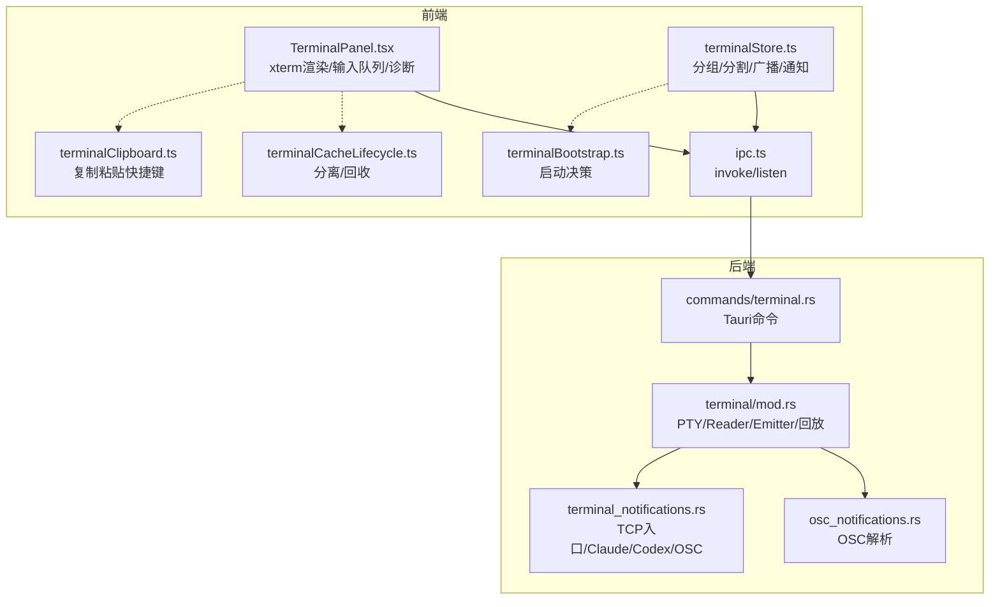
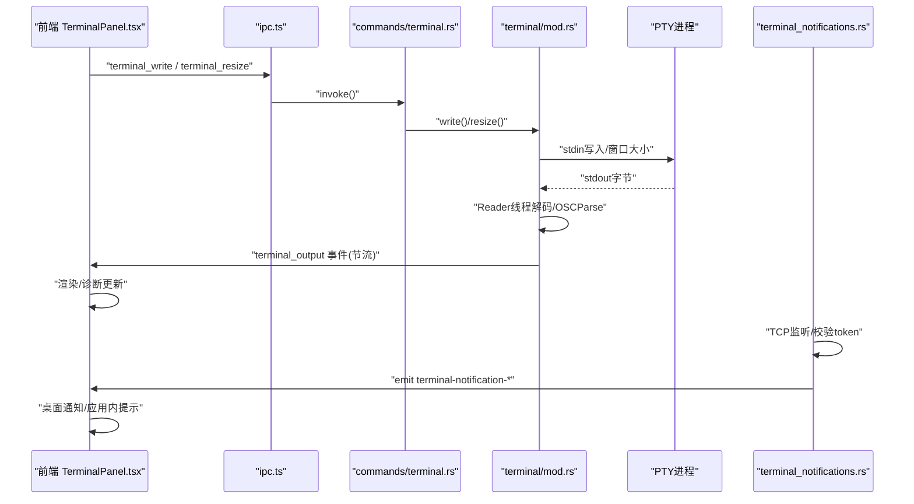
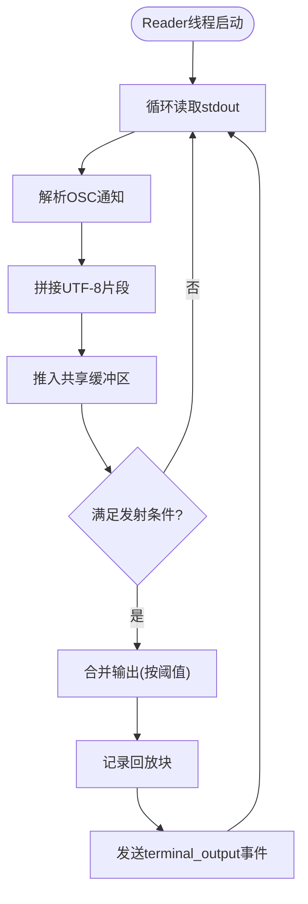
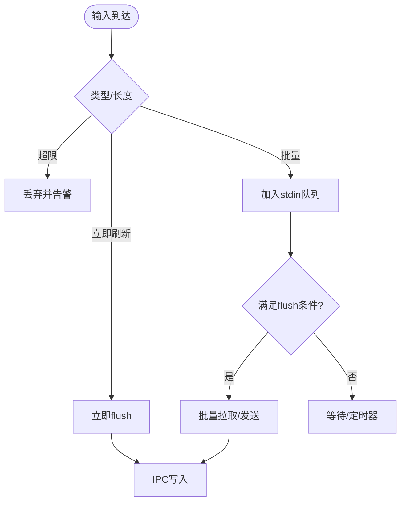
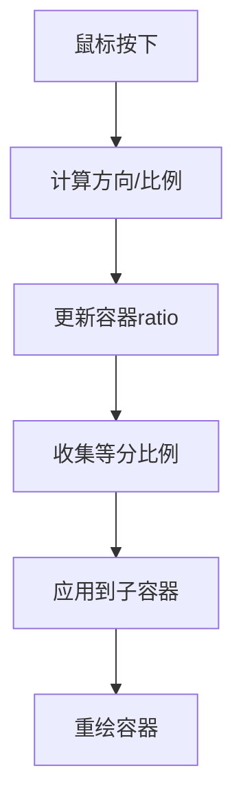
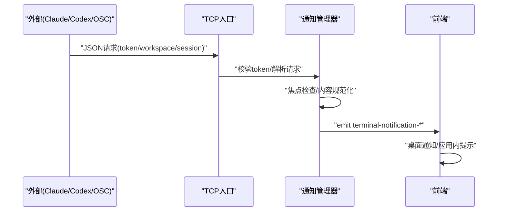
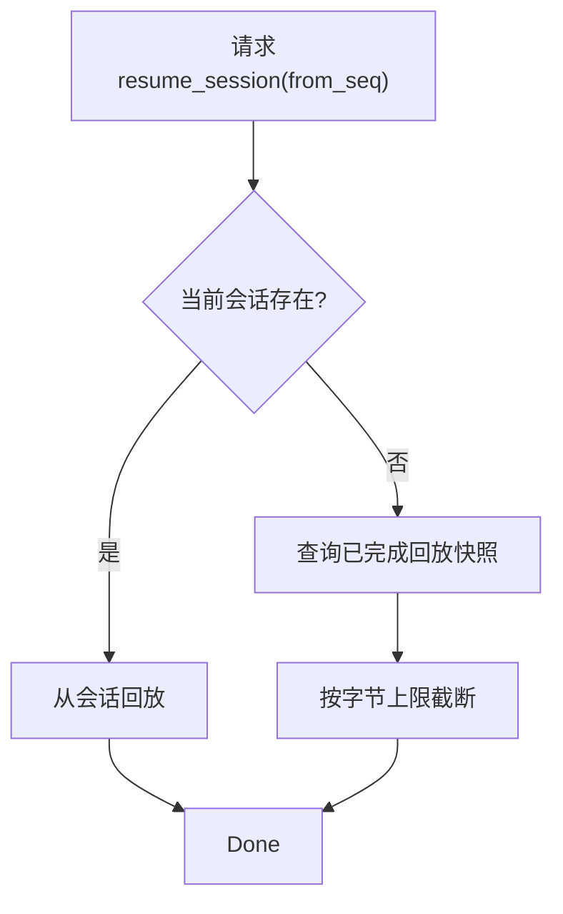
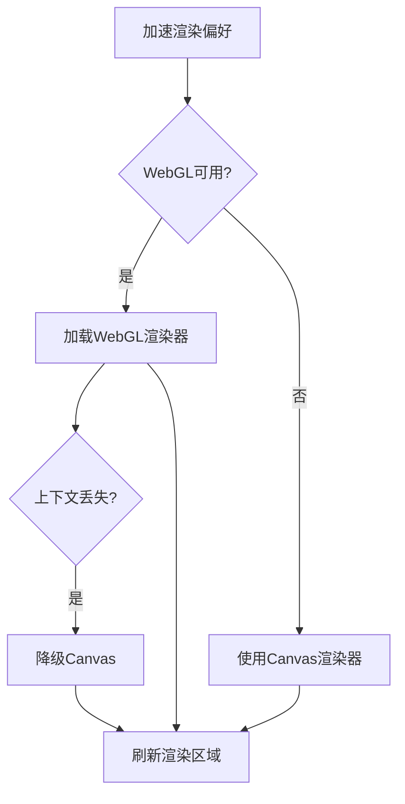
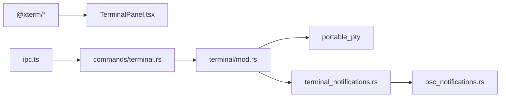

# 终端系统

<cite>
**本文引用的文件**
- [TerminalPanel.tsx](file://src/components/terminal/TerminalPanel.tsx)
- [mod.rs](file://src-tauri/src/terminal/mod.rs)
- [terminal_notifications.rs](file://src-tauri/src/terminal_notifications.rs)
- [osc_notifications.rs](file://src-tauri/src/terminal/osc_notifications.rs)
- [terminalStore.ts](file://src/stores/terminalStore.ts)
- [terminal.rs](file://src-tauri/src/commands/terminal.rs)
- [ipc.ts](file://src/lib/ipc.ts)
- [terminalCacheLifecycle.ts](file://src/components/terminal/terminalCacheLifecycle.ts)
- [terminalBootstrap.ts](file://src/lib/terminalBootstrap.ts)
- [terminalClipboard.ts](file://src/lib/terminalClipboard.ts)
- [README.md](file://README.md)
- [README.zh-CN.md](file://README.zh-CN.md)
</cite>

## 目录
1. [简介](#简介)
2. [项目结构](#项目结构)
3. [核心组件](#核心组件)
4. [架构总览](#架构总览)
5. [详细组件分析](#详细组件分析)
6. [依赖关系分析](#依赖关系分析)
7. [性能考量](#性能考量)
8. [故障排查指南](#故障排查指南)
9. [结论](#结论)
10. [附录](#附录)

## 简介
本文件面向 Panes 终端系统，系统性阐述其 PTY 实现、会话管理、输入输出处理与通知体系，覆盖终端组与分割面板、拖拽调整尺寸、广播模式、会话持久化与回放、渲染器诊断与性能优化、终端通知机制（Codex、Claude、OSC）、会话恢复与调试技巧，以及跨平台终端兼容性与原生集成优势。

## 项目结构
- 前端终端面板与渲染：位于 src/components/terminal/TerminalPanel.tsx，负责 xterm.js 渲染、输入队列、输出节流、图像与 WebGL 渲染器、诊断采集与 UI 展示。
- 后端 PTY 与会话管理：位于 src-tauri/src/terminal/mod.rs，使用 portable_pty 创建原生 PTY，多线程 Reader/Emitter 解耦输出，支持回放与诊断。
- 通知系统：位于 src-tauri/src/terminal_notifications.rs，提供 TCP 入口、Claude/Codex 集成与 OSC 通知解析。
- OSC 通知解析：位于 src-tauri/src/terminal/osc_notifications.rs，解析 OSC 9/777/99 通知并转为统一格式。
- 状态与布局：位于 src/stores/terminalStore.ts，管理分组、分割树、广播、通知索引与水合。
- IPC 命令桥接：位于 src-tauri/src/commands/terminal.rs，暴露终端相关命令给前端。
- 前端 IPC 封装：位于 src/lib/ipc.ts，封装 invoke/listen。
- 缓存与分离回收：位于 src/components/terminal/terminalCacheLifecycle.ts。
- 启动引导决策：位于 src/lib/terminalBootstrap.ts。
- 剪贴板快捷键：位于 src/lib/terminalClipboard.ts。
- 文档与集成说明：位于 README 与 README.zh-CN。

图示来源
- [TerminalPanel.tsx:1-800](file://src/components/terminal/TerminalPanel.tsx#L1-L800)
- [mod.rs:1-200](file://src-tauri/src/terminal/mod.rs#L1-L200)
- [terminal_notifications.rs:1-200](file://src-tauri/src/terminal_notifications.rs#L1-L200)
- [osc_notifications.rs:1-120](file://src-tauri/src/terminal/osc_notifications.rs#L1-L120)
- [terminalStore.ts:1-200](file://src/stores/terminalStore.ts#L1-L200)
- [terminal.rs:1-120](file://src-tauri/src/commands/terminal.rs#L1-L120)
- [ipc.ts:1-120](file://src/lib/ipc.ts#L1-L120)
- [terminalCacheLifecycle.ts:1-74](file://src/components/terminal/terminalCacheLifecycle.ts#L1-L74)
- [terminalBootstrap.ts:1-45](file://src/lib/terminalBootstrap.ts#L1-L45)
- [terminalClipboard.ts:1-40](file://src/lib/terminalClipboard.ts#L1-L40)

章节来源
- [TerminalPanel.tsx:1-800](file://src/components/terminal/TerminalPanel.tsx#L1-L800)
- [mod.rs:1-200](file://src-tauri/src/terminal/mod.rs#L1-L200)
- [terminal_notifications.rs:1-200](file://src-tauri/src/terminal_notifications.rs#L1-L200)
- [osc_notifications.rs:1-120](file://src-tauri/src/terminal/osc_notifications.rs#L1-L120)
- [terminalStore.ts:1-200](file://src/stores/terminalStore.ts#L1-L200)
- [terminal.rs:1-120](file://src-tauri/src/commands/terminal.rs#L1-L120)
- [ipc.ts:1-120](file://src/lib/ipc.ts#L1-L120)
- [terminalCacheLifecycle.ts:1-74](file://src/components/terminal/terminalCacheLifecycle.ts#L1-L74)
- [terminalBootstrap.ts:1-45](file://src/lib/terminalBootstrap.ts#L1-L45)
- [terminalClipboard.ts:1-40](file://src/lib/terminalClipboard.ts#L1-L40)

## 核心组件
- PTY 与会话管理
  - 使用 portable_pty 创建原生 PTY，分离 Reader/Emitter 线程，Reader 持续读取，Emitter 以固定频率合并输出并通过 IPC 发送。
  - 支持会话回放与“已完成回放”快照，便于断连重连后的增量恢复。
- 输入输出处理
  - 前端维护 stdin/stdout 双队列与限流参数，按帧率与字节数阈值批量发送，避免 UI 冻结。
  - 后端缓冲区上限与丢弃策略，确保内存安全与吞吐稳定。
- 分割面板与终端组
  - 基于二叉树的分割容器，支持拖拽调整比例、等分计算、广播模式同步渲染。
- 通知系统
  - TCP 入口接收外部通知，支持 Claude Hook、Codex CLI、通用 OSC 9/777/99。
  - 会话级焦点检测，避免前台重复提示。
- 渲染器与诊断
  - 支持 WebGL 与 Canvas 渲染器，自动降级与上下文丢失处理；前端/后端双侧诊断导出。
- 会话持久化与恢复
  - 回放快照与序列号，支持从指定 seq 恢复输出；分离缓存与回收策略保障资源。

章节来源
- [mod.rs:35-120](file://src-tauri/src/terminal/mod.rs#L35-L120)
- [mod.rs:622-758](file://src-tauri/src/terminal/mod.rs#L622-L758)
- [TerminalPanel.tsx:2383-2508](file://src/components/terminal/TerminalPanel.tsx#L2383-L2508)
- [TerminalPanel.tsx:2555-2650](file://src/components/terminal/TerminalPanel.tsx#L2555-L2650)
- [terminalStore.ts:41-120](file://src/stores/terminalStore.ts#L41-L120)
- [terminalStore.ts:491-501](file://src/stores/terminalStore.ts#L491-L501)
- [terminal_notifications.rs:219-360](file://src-tauri/src/terminal_notifications.rs#L219-L360)
- [osc_notifications.rs:146-165](file://src-tauri/src/terminal/osc_notifications.rs#L146-L165)
- [TerminalPanel.tsx:463-485](file://src/components/terminal/TerminalPanel.tsx#L463-L485)
- [TerminalPanel.tsx:591-627](file://src/components/terminal/TerminalPanel.tsx#L591-L627)

## 架构总览
下图展示从前端到后端的完整数据流与控制流，包括 PTY 输出回放、通知入口、分割与广播、以及诊断导出。

图示来源
- [TerminalPanel.tsx:1214-1257](file://src/components/terminal/TerminalPanel.tsx#L1214-L1257)
- [ipc.ts:72-120](file://src/lib/ipc.ts#L72-L120)
- [terminal.rs:74-124](file://src-tauri/src/commands/terminal.rs#L74-L124)
- [mod.rs:622-758](file://src-tauri/src/terminal/mod.rs#L622-L758)
- [terminal_notifications.rs:341-417](file://src-tauri/src/terminal_notifications.rs#L341-L417)

章节来源
- [TerminalPanel.tsx:1214-1257](file://src/components/terminal/TerminalPanel.tsx#L1214-L1257)
- [ipc.ts:72-120](file://src/lib/ipc.ts#L72-L120)
- [terminal.rs:74-124](file://src-tauri/src/commands/terminal.rs#L74-L124)
- [mod.rs:622-758](file://src-tauri/src/terminal/mod.rs#L622-L758)
- [terminal_notifications.rs:341-417](file://src-tauri/src/terminal_notifications.rs#L341-L417)

## 详细组件分析

### PTY 系统与会话管理
- 原生 PTY 创建与生命周期
  - 使用 portable_pty 的 native_pty_system 获取宿主原生能力，创建 MasterPty/Child/Writer。
  - 会话句柄包含元信息、IO 计数器、回放状态、进程句柄，支持并发安全。
- Reader/Emitter 解耦
  - Reader 线程持续读取 PTY stdout，解码 OSC 通知，拼接 UTF-8，推入共享缓冲区。
  - Emitter 线程按最小发射间隔与最大字节阈值合并输出，记录回放块，发送终端输出事件。
- 回放与诊断
  - 会话级回放队列限制数量与字节，支持从指定 seq 恢复；已完成回放在后台缓存，降低重复传输。
  - IO 计数器统计读写次数、字节、丢弃字节与时序，用于诊断与节流。
- 前台进程检测
  - 若 PTY 暴露 shell pid，定时检测前台进程变化并发出事件，便于 UI 与通知联动。

图示来源
- [mod.rs:622-758](file://src-tauri/src/terminal/mod.rs#L622-L758)
- [mod.rs:120-175](file://src-tauri/src/terminal/mod.rs#L120-L175)
- [mod.rs:250-286](file://src-tauri/src/terminal/mod.rs#L250-L286)

章节来源
- [mod.rs:44-120](file://src-tauri/src/terminal/mod.rs#L44-L120)
- [mod.rs:622-758](file://src-tauri/src/terminal/mod.rs#L622-L758)
- [mod.rs:120-175](file://src-tauri/src/terminal/mod.rs#L120-L175)
- [mod.rs:250-286](file://src-tauri/src/terminal/mod.rs#L250-L286)

### 输入输出处理与节流
- 前端输入队列
  - 支持文本、协议与字节三类输入，字符计数与批次限制，超过阈值丢弃并告警。
  - 对包含控制字符的输入立即刷新，保证交互响应。
- 前端输出队列
  - 附加/分离状态下不同队列上限，防止内存膨胀；丢弃统计与冷却告警。
  - 输出拉取与重试策略，指数退避与最大尝试次数。
- 后端输出节流
  - 最小发射间隔与最大单次字节数，避免 UI 冻结与 IPC 抖动。
  - 输出缓冲区上限与尾部裁剪，维持滑动窗口。

图示来源
- [TerminalPanel.tsx:1214-1257](file://src/components/terminal/TerminalPanel.tsx#L1214-L1257)
- [TerminalPanel.tsx:578-589](file://src/components/terminal/TerminalPanel.tsx#L578-L589)
- [TerminalPanel.tsx:246-256](file://src/components/terminal/TerminalPanel.tsx#L246-L256)
- [mod.rs:35-42](file://src-tauri/src/terminal/mod.rs#L35-L42)
- [mod.rs:141-175](file://src-tauri/src/terminal/mod.rs#L141-L175)

章节来源
- [TerminalPanel.tsx:1214-1257](file://src/components/terminal/TerminalPanel.tsx#L1214-L1257)
- [TerminalPanel.tsx:578-589](file://src/components/terminal/TerminalPanel.tsx#L578-L589)
- [TerminalPanel.tsx:246-256](file://src/components/terminal/TerminalPanel.tsx#L246-L256)
- [mod.rs:35-42](file://src-tauri/src/terminal/mod.rs#L35-L42)
- [mod.rs:141-175](file://src-tauri/src/terminal/mod.rs#L141-L175)

### 终端组、分割面板与广播模式
- 分割树与等分比例
  - 递归构建垂直列或水平行的平衡二叉树，等分比例基于叶子节点数量自动计算。
- 拖拽调整尺寸
  - 鼠标按下时注册拖拽回调，根据方向计算比例并更新容器比例，实时重绘。
- 广播模式
  - 当组处于广播状态时，锁定焦点以强制所有终端光标闪烁，提升一致的视觉反馈。
  - 广播组切换时清理/重建广播状态，确保一致性。

图示来源
- [TerminalPanel.tsx:2578-2616](file://src/components/terminal/TerminalPanel.tsx#L2578-L2616)
- [TerminalPanel.tsx:2531-2553](file://src/components/terminal/TerminalPanel.tsx#L2531-L2553)
- [TerminalPanel.tsx:376-424](file://src/components/terminal/TerminalPanel.tsx#L376-L424)
- [terminalStore.ts:491-501](file://src/stores/terminalStore.ts#L491-L501)

章节来源
- [TerminalPanel.tsx:2578-2616](file://src/components/terminal/TerminalPanel.tsx#L2578-L2616)
- [TerminalPanel.tsx:2531-2553](file://src/components/terminal/TerminalPanel.tsx#L2531-L2553)
- [TerminalPanel.tsx:376-424](file://src/components/terminal/TerminalPanel.tsx#L376-L424)
- [terminalStore.ts:491-501](file://src/stores/terminalStore.ts#L491-L501)

### 通知系统（Codex、Claude、OSC）
- TCP 入口与令牌校验
  - 启动时绑定本地 TCP 地址与随机令牌，请求行序列化为 JSON，校验通过后处理。
- Claude 集成
  - 解析 Hook 事件（Notification/Stop/StopFailure/SessionStart/SessionEnd），提取标题/正文/来源，路由至对应会话。
  - 支持 passthrough 子命令，与用户配置无缝集成。
- Codex 集成
  - 处理 agent-turn-complete payload，提取 assistant 最后消息，回送到 Panes 终端会话。
- 通用 OSC 通知
  - 解析 OSC 9/777/99，过滤进度报告（9;4），其余作为通知；Kitty 分片通知支持 Base64 解码与片段合并。
- 焦点与去重
  - 若目标会话处于前台焦点，清空通知避免重复提示。

图示来源
- [terminal_notifications.rs:219-360](file://src-tauri/src/terminal_notifications.rs#L219-L360)
- [terminal_notifications.rs:419-500](file://src-tauri/src/terminal_notifications.rs#L419-L500)
- [osc_notifications.rs:146-215](file://src-tauri/src/terminal/osc_notifications.rs#L146-L215)
- [README.md:164-168](file://README.md#L164-L168)
- [README.zh-CN.md:148-168](file://README.zh-CN.md#L148-L168)

章节来源
- [terminal_notifications.rs:219-360](file://src-tauri/src/terminal_notifications.rs#L219-L360)
- [terminal_notifications.rs:419-500](file://src-tauri/src/terminal_notifications.rs#L419-L500)
- [osc_notifications.rs:146-215](file://src-tauri/src/terminal/osc_notifications.rs#L146-L215)
- [README.md:164-168](file://README.md#L164-L168)
- [README.zh-CN.md:148-168](file://README.zh-CN.md#L148-L168)

### 会话持久化与回放
- 回放快照
  - 会话级回放队列限制条目与字节，记录最新 seq；完成后快照缓存，支持从 from_seq 恢复。
- 恢复策略
  - 若当前会话存在，优先从会话回放；否则查询已完成回放快照，返回限定字节的增量。
- 断连与重连
  - 分离缓存与回收策略，闲置超时回收；重连时按需拉取增量输出。

图示来源
- [mod.rs:347-383](file://src-tauri/src/terminal/mod.rs#L347-L383)
- [mod.rs:558-597](file://src-tauri/src/terminal/mod.rs#L558-L597)
- [terminal.rs:184-196](file://src-tauri/src/commands/terminal.rs#L184-L196)

章节来源
- [mod.rs:347-383](file://src-tauri/src/terminal/mod.rs#L347-L383)
- [mod.rs:558-597](file://src-tauri/src/terminal/mod.rs#L558-L597)
- [terminal.rs:184-196](file://src-tauri/src/commands/terminal.rs#L184-L196)

### 渲染器诊断与性能优化
- 渲染器选择与降级
  - 加速渲染偏好影响是否加载 WebGL；WebGL 上下文丢失时自动降级至 Canvas。
  - 图像插件初始化失败记录错误，避免反复尝试。
- 诊断导出
  - 前端/后端分别采集渲染器状态、丢弃计数、上下文丢失次数、输出统计等，支持导出对比。
- 性能优化要点
  - 输出节流与缓冲上限；输入批量与立即刷新策略；回放快照减少重复传输；分离缓存回收闲置会话。

图示来源
- [TerminalPanel.tsx:741-795](file://src/components/terminal/TerminalPanel.tsx#L741-L795)
- [TerminalPanel.tsx:673-720](file://src/components/terminal/TerminalPanel.tsx#L673-L720)
- [TerminalPanel.tsx:463-485](file://src/components/terminal/TerminalPanel.tsx#L463-L485)
- [mod.rs:35-42](file://src-tauri/src/terminal/mod.rs#L35-L42)

章节来源
- [TerminalPanel.tsx:741-795](file://src/components/terminal/TerminalPanel.tsx#L741-L795)
- [TerminalPanel.tsx:673-720](file://src/components/terminal/TerminalPanel.tsx#L673-L720)
- [TerminalPanel.tsx:463-485](file://src/components/terminal/TerminalPanel.tsx#L463-L485)
- [mod.rs:35-42](file://src-tauri/src/terminal/mod.rs#L35-L42)

### 跨平台终端兼容性与原生集成
- 原生 PTY
  - portable_pty 提供跨平台原生 PTY，Windows/Linux/macOS 行为一致，结合平台特定工具链（如 Windows 进程工具）增强稳定性。
- 原生通知
  - 通过 tauri_plugin_notification 显示系统级桌面通知，与终端通知联动。
- 终端集成
  - 通过环境变量注入 PANES_NOTIFY_ADDR/PANES_NOTIFY_TOKEN/PANES_WORKSPACE_ID/PANES_SESSION_ID，使外部程序（Codex/Claude）定向回传通知。

章节来源
- [mod.rs:17-33](file://src-tauri/src/terminal/mod.rs#L17-L33)
- [terminal_notifications.rs:26-36](file://src-tauri/src/terminal_notifications.rs#L26-L36)
- [README.md:164-168](file://README.md#L164-L168)
- [README.zh-CN.md:148-168](file://README.zh-CN.md#L148-L168)

## 依赖关系分析
- 前端依赖
  - @xterm/xterm 与 addons（fit/unicode/webgl/image）负责渲染与图像支持。
  - ipc.ts 封装 invoke/listen，连接 Tauri 命令与事件。
- 后端依赖
  - portable_pty 提供原生 PTY；tokio/RwLock 提供异步与并发安全；chrono/uuid 提供时间戳与标识。
- 命令桥接
  - commands/terminal.rs 将前端调用映射到 TerminalManager 与 TerminalNotificationManager。

图示来源
- [TerminalPanel.tsx:32-50](file://src/components/terminal/TerminalPanel.tsx#L32-L50)
- [ipc.ts:72-120](file://src/lib/ipc.ts#L72-L120)
- [terminal.rs:25-62](file://src-tauri/src/commands/terminal.rs#L25-L62)
- [mod.rs:17-33](file://src-tauri/src/terminal/mod.rs#L17-L33)
- [terminal_notifications.rs:1-25](file://src-tauri/src/terminal_notifications.rs#L1-L25)
- [osc_notifications.rs:1-10](file://src-tauri/src/terminal/osc_notifications.rs#L1-L10)

章节来源
- [TerminalPanel.tsx:32-50](file://src/components/terminal/TerminalPanel.tsx#L32-L50)
- [ipc.ts:72-120](file://src/lib/ipc.ts#L72-L120)
- [terminal.rs:25-62](file://src-tauri/src/commands/terminal.rs#L25-L62)
- [mod.rs:17-33](file://src-tauri/src/terminal/mod.rs#L17-L33)
- [terminal_notifications.rs:1-25](file://src-tauri/src/terminal_notifications.rs#L1-L25)
- [osc_notifications.rs:1-10](file://src-tauri/src/terminal/osc_notifications.rs#L1-L10)

## 性能考量
- 输出节流
  - 最小发射间隔与最大单次字节数，避免 UI 冻结与 IPC 抖动。
- 输入批处理
  - 字符串边界对齐，避免 UTF-16 截断；控制字符触发立即刷新。
- 缓冲与回放
  - 输出缓冲上限与尾部裁剪；回放快照与序列号减少重复传输。
- 渲染器优化
  - 自动降级与上下文丢失处理；图像插件初始化失败快速失败，避免阻塞。
- 资源回收
  - 分离缓存与闲置回收，降低内存占用。

章节来源
- [mod.rs:35-42](file://src-tauri/src/terminal/mod.rs#L35-L42)
- [TerminalPanel.tsx:246-256](file://src/components/terminal/TerminalPanel.tsx#L246-L256)
- [TerminalPanel.tsx:578-589](file://src/components/terminal/TerminalPanel.tsx#L578-L589)
- [TerminalPanel.tsx:741-795](file://src/components/terminal/TerminalPanel.tsx#L741-L795)
- [terminalCacheLifecycle.ts:43-74](file://src/components/terminal/terminalCacheLifecycle.ts#L43-L74)

## 故障排查指南
- 终端无输出或卡顿
  - 检查输出节流参数与缓冲上限；查看后端 IO 计数器与丢弃统计。
  - 前端诊断导出包含丢弃计数、上下文丢失次数与输出统计，辅助定位瓶颈。
- 通知不显示或重复
  - 确认焦点状态与目标会话是否处于前台；检查 TCP 入口 token 校验与请求格式。
  - OSC 通知需排除进度报告（9;4），确认解析逻辑。
- 渲染异常
  - WebGL 不可用时自动降级；若上下文丢失频繁，检查驱动与硬件兼容性。
- 会话恢复失败
  - 确认 from_seq 是否越界或快照缺失；必要时回退到完整回放。

章节来源
- [mod.rs:90-107](file://src-tauri/src/terminal/mod.rs#L90-L107)
- [TerminalPanel.tsx:591-627](file://src/components/terminal/TerminalPanel.tsx#L591-L627)
- [terminal_notifications.rs:341-417](file://src-tauri/src/terminal_notifications.rs#L341-L417)
- [osc_notifications.rs:217-222](file://src-tauri/src/terminal/osc_notifications.rs#L217-L222)
- [mod.rs:347-383](file://src-tauri/src/terminal/mod.rs#L347-L383)

## 结论
Panes 终端系统通过原生 PTY、解耦的 Reader/Emitter、严格的节流与回放机制，实现了高吞吐、低延迟的终端体验；结合分割面板、广播模式与完善的诊断体系，满足复杂开发场景需求。通知系统覆盖 OSC、Claude 与 Codex，配合焦点检测与去重策略，确保用户体验的一致性与可靠性。跨平台原生集成与原生通知进一步提升了系统在各平台上的稳定性与原生体验。

## 附录
- 启动引导决策
  - 根据监听器就绪、工作区状态、布局模式与启动预设决定是否自动创建会话或加载预设。
- 剪贴板快捷键
  - 统一复制/粘贴快捷键判定，适配不同平台组合键差异。

章节来源
- [terminalBootstrap.ts:13-44](file://src/lib/terminalBootstrap.ts#L13-L44)
- [terminalClipboard.ts:9-39](file://src/lib/terminalClipboard.ts#L9-L39)