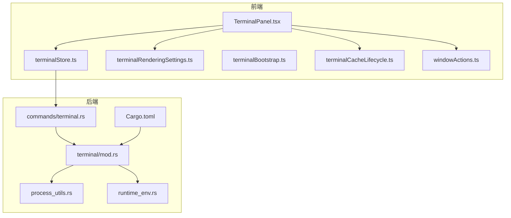
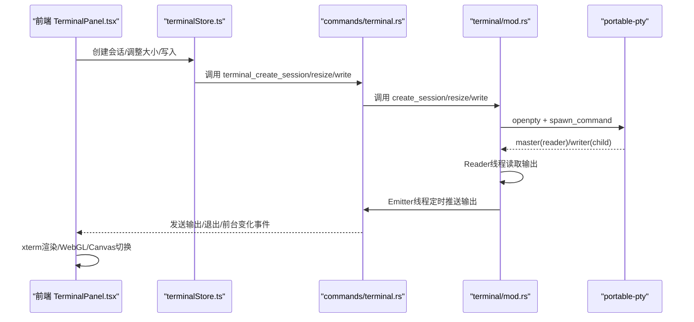
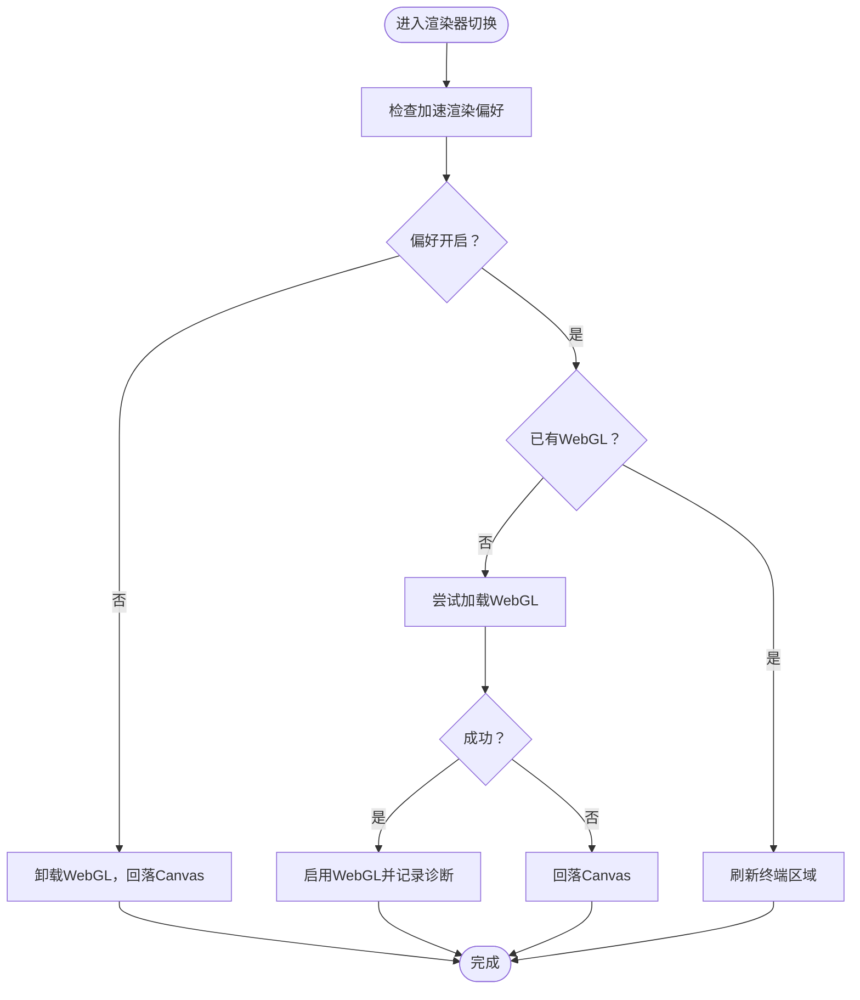
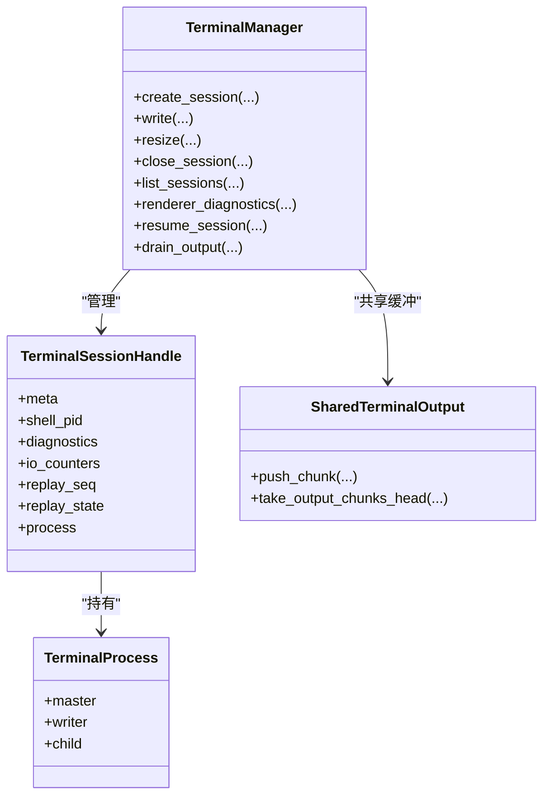
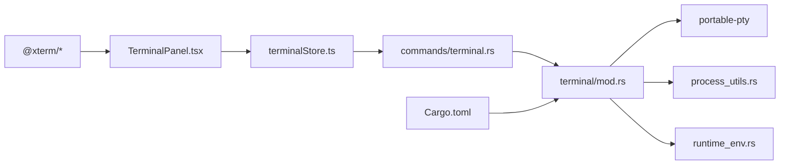

# 跨平台支持

<cite>
**本文引用的文件**
- [src/lib/terminalBootstrap.ts](file://src/lib/terminalBootstrap.ts)
- [src/lib/terminalClipboard.ts](file://src/lib/terminalClipboard.ts)
- [src/lib/terminalFileReferences.ts](file://src/lib/terminalFileReferences.ts)
- [src/lib/terminalRenderingSettings.ts](file://src/lib/terminalRenderingSettings.ts)
- [src/stores/terminalStore.ts](file://src/stores/terminalStore.ts)
- [src/components/terminal/TerminalPanel.tsx](file://src/components/terminal/TerminalPanel.tsx)
- [src/components/terminal/terminalCacheLifecycle.ts](file://src/components/terminal/terminalCacheLifecycle.ts)
- [src-tauri/src/commands/terminal.rs](file://src-tauri/src/commands/terminal.rs)
- [src-tauri/src/terminal/mod.rs](file://src-tauri/src/terminal/mod.rs)
- [src-tauri/src/process_utils.rs](file://src-tauri/src/process_utils.rs)
- [src-tauri/Cargo.toml](file://src-tauri/Cargo.toml)
- [src/lib/windowActions.ts](file://src/lib/windowActions.ts)
- [src-tauri/src/runtime_env.rs](file://src-tauri/src/runtime_env.rs)
</cite>

## 目录
1. [引言](#引言)
2. [项目结构](#项目结构)
3. [核心组件](#核心组件)
4. [架构总览](#架构总览)
5. [详细组件分析](#详细组件分析)
6. [依赖关系分析](#依赖关系分析)
7. [性能考量](#性能考量)
8. [故障排查指南](#故障排查指南)
9. [结论](#结论)
10. [附录](#附录)

## 引言
本文件面向 Panes 终端在 Windows、macOS、Linux 的跨平台支持，系统梳理前端渲染与后端 PTY 实现、平台差异与适配策略、进程管理与辅助工具、平台检测与降级机制、以及安全与权限注意事项。目标是帮助开发者与使用者理解终端在不同系统上的行为差异，并提供可操作的最佳实践。

## 项目结构
终端相关代码主要分布在前端 React 组件与 Tauri 后端两部分：
- 前端负责终端 UI、输入输出队列、渲染器选择与降级、剪贴板快捷键、缓存生命周期与诊断导出等。
- 后端负责 PTY 打开与子进程管理、输出缓冲与速率控制、前台进程检测、命令 IPC、环境变量注入等。

图示来源
- [src/components/terminal/TerminalPanel.tsx](file://src/components/terminal/TerminalPanel.tsx)
- [src/stores/terminalStore.ts](file://src/stores/terminalStore.ts)
- [src/lib/terminalRenderingSettings.ts](file://src/lib/terminalRenderingSettings.ts)
- [src/components/terminal/terminalCacheLifecycle.ts](file://src/components/terminal/terminalCacheLifecycle.ts)
- [src/lib/windowActions.ts](file://src/lib/windowActions.ts)
- [src-tauri/src/commands/terminal.rs](file://src-tauri/src/commands/terminal.rs)
- [src-tauri/src/terminal/mod.rs](file://src-tauri/src/terminal/mod.rs)
- [src-tauri/src/process_utils.rs](file://src-tauri/src/process_utils.rs)
- [src-tauri/src/runtime_env.rs](file://src-tauri/src/runtime_env.rs)
- [src-tauri/Cargo.toml](file://src-tauri/Cargo.toml)

章节来源
- [src/components/terminal/TerminalPanel.tsx](file://src/components/terminal/TerminalPanel.tsx)
- [src/stores/terminalStore.ts](file://src/stores/terminalStore.ts)
- [src-tauri/src/commands/terminal.rs](file://src-tauri/src/commands/terminal.rs)
- [src-tauri/src/terminal/mod.rs](file://src-tauri/src/terminal/mod.rs)

## 核心组件
- 前端渲染与交互
  - 终端面板：负责 xterm 初始化、Fit/WebGL/Image 插件加载、输入输出队列、渲染器降级、诊断收集与导出。
  - 终端状态与布局：会话树、分组、布局模式、启动预设序列化与反序列化。
  - 渲染偏好与事件：加速渲染开关、监听变更事件、版本号用于强制刷新。
  - 缓存生命周期：分离/回收、挂起与恢复、空闲驱逐。
  - 平台检测：Windows/macOS/Linux 桌面判断、自定义窗口框架、终端焦点判定与快捷键处理。
- 后端 PTY 与进程
  - 命令接口：创建/写入/调整大小/关闭/列出/通知/诊断查询等。
  - PTY 管理：打开 native PTY、spawn 子进程、读写器、IO 计数器、重放快照。
  - 输出缓冲与限流：共享缓冲、最小发射间隔、最大发射字节、前台进程检测。
  - 环境注入：跨平台 TERM/颜色/路径/用户目录等环境变量配置。
  - 进程工具：Windows 隐藏窗口标志、PowerShell 终止进程等。

章节来源
- [src/components/terminal/TerminalPanel.tsx](file://src/components/terminal/TerminalPanel.tsx)
- [src/stores/terminalStore.ts](file://src/stores/terminalStore.ts)
- [src/lib/terminalRenderingSettings.ts](file://src/lib/terminalRenderingSettings.ts)
- [src/components/terminal/terminalCacheLifecycle.ts](file://src/components/terminal/terminalCacheLifecycle.ts)
- [src/lib/windowActions.ts](file://src/lib/windowActions.ts)
- [src-tauri/src/commands/terminal.rs](file://src-tauri/src/commands/terminal.rs)
- [src-tauri/src/terminal/mod.rs](file://src-tauri/src/terminal/mod.rs)
- [src-tauri/src/process_utils.rs](file://src-tauri/src/process_utils.rs)
- [src-tauri/src/runtime_env.rs](file://src-tauri/src/runtime_env.rs)

## 架构总览
前端通过 IPC 调用后端命令，后端以 portable-pty 在各平台打开 PTY 并 spawn 子进程，Reader 线程持续从 master 读取输出，Emitter 线程按固定频率合并并发送到前端，前端使用 xterm.js 渲染并根据用户设置启用 WebGL 加速或回退 Canvas。

图示来源
- [src/components/terminal/TerminalPanel.tsx](file://src/components/terminal/TerminalPanel.tsx)
- [src/stores/terminalStore.ts](file://src/stores/terminalStore.ts)
- [src-tauri/src/commands/terminal.rs](file://src-tauri/src/commands/terminal.rs)
- [src-tauri/src/terminal/mod.rs](file://src-tauri/src/terminal/mod.rs)

## 详细组件分析

### 终端启动决策与布局
- 决策逻辑基于监听器就绪、面板打开状态、布局模式、会话数量、工作区 ID、创建中工作区 ID、是否有待定启动预设等条件，决定“无动作”、“应用预设”还是“单会话创建”。
- 该策略确保在合适的时机自动创建初始终端，避免在不必要时占用资源。

章节来源
- [src/lib/terminalBootstrap.ts](file://src/lib/terminalBootstrap.ts)

### 剪贴板快捷键与平台差异
- 定义了终端复制/粘贴的组合键规则，区分不同平台的修饰键语义。
- 前端在处理键盘事件时，依据此规则判断是否拦截或透传快捷键，保证跨平台一致的用户体验。

章节来源
- [src/lib/terminalClipboard.ts](file://src/lib/terminalClipboard.ts)

### 终端缓冲位置与范围计算
- 提供从偏移量到缓冲行列位置的转换，以及将匹配范围映射为行列区间的方法，便于文件链接跳转与高亮定位。

章节来源
- [src/lib/terminalFileReferences.ts](file://src/lib/terminalFileReferences.ts)

### 渲染偏好与事件
- 通过自定义事件广播“加速渲染已更改”，前端据此动态加载/卸载 WebGL 与图像插件，实现按需加速与降级。
- 偏好版本号用于触发 UI 刷新，避免重复渲染。

章节来源
- [src/lib/terminalRenderingSettings.ts](file://src/lib/terminalRenderingSettings.ts)

### 终端面板与渲染器策略
- 前端维护每个会话的 xterm 实例缓存，保留滚动历史；根据用户设置与运行时诊断，选择 WebGL 或 Canvas 渲染，并在上下文丢失或写入卡顿时自动降级。
- 支持图像插件初始化与错误统计，记录初始化尝试、运行时错误次数与最后错误信息。
- 提供前端与后端渲染诊断快照导出，包含输出块/字符计数、丢弃统计、尺寸与时间戳等。

图示来源
- [src/components/terminal/TerminalPanel.tsx](file://src/components/terminal/TerminalPanel.tsx)
- [src/lib/terminalRenderingSettings.ts](file://src/lib/terminalRenderingSettings.ts)

章节来源
- [src/components/terminal/TerminalPanel.tsx](file://src/components/terminal/TerminalPanel.tsx)

### 终端状态与布局（分组、会话树、启动预设）
- 维护会话树（叶子/分割节点）、构建平衡网格、查找/移除叶子、更新比例、会话元数据与工作树配置。
- 支持将当前运行时状态序列化为启动预设，或应用启动预设立即创建多会话分组。
- 提供工作树基目录推断、分支名生成、相对路径拼接等工具函数。

章节来源
- [src/stores/terminalStore.ts](file://src/stores/terminalStore.ts)

### 终端缓存生命周期与空闲驱逐
- 将“分离/挂起/最后访问时间/需要恢复”等状态持久化在缓存条目中，按空闲阈值进行排序与批量驱逐，避免内存泄漏。
- 支持工作区级与面板级分离标记，确保切换时正确恢复输出。

章节来源
- [src/components/terminal/terminalCacheLifecycle.ts](file://src/components/terminal/terminalCacheLifecycle.ts)

### 平台检测与窗口行为
- 通过 navigator.platform 与 Tauri 环境判断桌面平台，识别 Linux/Windows/macOS，以及是否使用自定义窗口框架。
- 提供终端输入焦点判定、允许在终端聚焦时处理的应用快捷键集合，以及窗口关闭/最小化/最大化/全屏等操作。

章节来源
- [src/lib/windowActions.ts](file://src/lib/windowActions.ts)

### 后端 PTY 系统与进程管理
- 使用 portable-pty 在各平台打开 PTY，spawn 默认 shell（Windows 使用 COMSPEC/cmd，非 Windows 使用 SHELL 或探测），设置工作目录与环境变量。
- Reader 线程持续从 master 读取，Emitter 线程按约 60Hz 合并并限流发送，避免前端被大量 IPC 压垮。
- 提供前台进程检测（Windows 使用 PowerShell 查询子进程），并发出前台变化事件。
- 支持输出重放（按序号截断）、IO 计数器、诊断快照、关闭/清理通知等。

图示来源
- [src-tauri/src/terminal/mod.rs](file://src-tauri/src/terminal/mod.rs)

章节来源
- [src-tauri/src/terminal/mod.rs](file://src-tauri/src/terminal/mod.rs)

### 命令接口与 IPC
- 前端通过 IPC 调用后端命令，覆盖创建/写入/调整大小/关闭/列表/通知/诊断/恢复/排空输出等。
- 后端对参数进行校验（如 cwd 必须位于工作区根下），并在失败时返回错误字符串。

章节来源
- [src-tauri/src/commands/terminal.rs](file://src-tauri/src/commands/terminal.rs)

### Windows 特殊处理与进程工具
- Windows 下 spawn 子进程时设置 CREATE_NO_WINDOW 标志，避免弹出控制台窗口。
- 前端 WebGL 初始化在缺少 WebGL2 支持时直接回退 Canvas，并记录上下文丢失次数。
- 后端前台进程检测通过 PowerShell 查询子进程，过滤基础设施进程，提取工具名称。

章节来源
- [src-tauri/src/process_utils.rs](file://src-tauri/src/process_utils.rs)
- [src/components/terminal/TerminalPanel.tsx](file://src/components/terminal/TerminalPanel.tsx)
- [src-tauri/src/terminal/mod.rs](file://src-tauri/src/terminal/mod.rs)

### 环境变量注入与平台差异
- 后端根据平台注入 TERM、COLORTERM、PATH、用户目录等环境变量，Windows 下还处理用户配置目录与默认 HOME。
- 非 Windows 平台会追加 shell 登录参数，Windows 则直接使用 cmd。

章节来源
- [src-tauri/src/runtime_env.rs](file://src-tauri/src/runtime_env.rs)
- [src-tauri/src/terminal/mod.rs](file://src-tauri/src/terminal/mod.rs)

## 依赖关系分析
- 外部依赖
  - portable-pty：跨平台 PTY 打开与子进程管理。
  - xterm.js 及插件：终端渲染、Fit、WebGL、图像、Unicode。
  - Tauri 插件：shell、dialog、fs、notification、process 等。
- 内部耦合
  - 前端 TerminalPanel 与 terminalStore 协作，后者通过 IPC 调用后端命令。
  - 后端 terminal/mod.rs 作为核心调度者，协调 PTY、Reader/Emitter 线程与通知系统。
  - process_utils 与 runtime_env 为平台差异提供统一入口。

图示来源
- [src/components/terminal/TerminalPanel.tsx](file://src/components/terminal/TerminalPanel.tsx)
- [src/stores/terminalStore.ts](file://src/stores/terminalStore.ts)
- [src-tauri/src/commands/terminal.rs](file://src-tauri/src/commands/terminal.rs)
- [src-tauri/src/terminal/mod.rs](file://src-tauri/src/terminal/mod.rs)
- [src-tauri/src/process_utils.rs](file://src-tauri/src/process_utils.rs)
- [src-tauri/src/runtime_env.rs](file://src-tauri/src/runtime_env.rs)
- [src-tauri/Cargo.toml](file://src-tauri/Cargo.toml)

章节来源
- [src-tauri/Cargo.toml](file://src-tauri/Cargo.toml)
- [src-tauri/src/terminal/mod.rs](file://src-tauri/src/terminal/mod.rs)

## 性能考量
- 输出限流与合并
  - Reader 线程持续读取，Emitter 线程以约 60Hz 最小间隔合并输出，单次最大发射字节数限制，避免前端阻塞。
- 渲染器选择
  - 优先 WebGL，失败或上下文丢失则回退 Canvas；当写入回调长时间卡顿时也会触发降级。
- 缓冲与重放
  - 共享输出缓冲限制峰值，超过阈值丢弃头部；支持按序号重放与字节上限截断，兼顾实时性与内存占用。
- 诊断与可观测性
  - 前后端均提供渲染与 IO 诊断快照，便于定位性能瓶颈与异常。

章节来源
- [src-tauri/src/terminal/mod.rs](file://src-tauri/src/terminal/mod.rs)
- [src/components/terminal/TerminalPanel.tsx](file://src/components/terminal/TerminalPanel.tsx)

## 故障排查指南
- 终端无法显示或黑屏
  - 检查是否因 WebGL 不可用而回退 Canvas；查看前端诊断中的 webglUnsupported/webglInitError。
- 输入无响应或延迟严重
  - 关注前端日志中的写入回调卡顿与降级记录；适当降低渲染复杂度或禁用图像插件。
- 输出堆积导致卡顿
  - 查看后端 IO 计数器与前端 pendingOutput 统计；确认最小发射间隔与最大发射字节是否合理。
- 前台进程检测异常（Windows）
  - 确认 PowerShell 可用且未被策略阻止；检查后台脚本执行结果与进程过滤逻辑。
- 权限与路径问题
  - cwd 必须位于工作区根内；Windows 下隐藏控制台窗口需确保进程创建标志正确设置。

章节来源
- [src/components/terminal/TerminalPanel.tsx](file://src/components/terminal/TerminalPanel.tsx)
- [src-tauri/src/commands/terminal.rs](file://src-tauri/src/commands/terminal.rs)
- [src-tauri/src/process_utils.rs](file://src-tauri/src/process_utils.rs)
- [src-tauri/src/terminal/mod.rs](file://src-tauri/src/terminal/mod.rs)

## 结论
Panes 终端通过 portable-pty 实现跨平台 PTY，结合前端 xterm.js 与后端 Reader/Emitter 线程，实现了高性能、可降级的终端体验。平台差异主要体现在默认 shell、进程创建标志、前台进程检测与渲染器支持上。通过环境注入、输出限流、渲染器自动降级与诊断导出，系统在不同平台上保持稳定与可维护性。

## 附录

### 平台差异与适配要点
- Windows
  - 默认 shell：cmd（COMSPEC）；spawn 设置 CREATE_NO_WINDOW，避免控制台闪烁。
  - 前台进程检测：PowerShell 查询子进程并过滤基础设施进程。
- macOS/Linux
  - 默认 shell：SHELL 或探测；登录 shell 参数追加。
  - 渲染器：优先 WebGL，不可用则回退 Canvas。

章节来源
- [src-tauri/src/terminal/mod.rs](file://src-tauri/src/terminal/mod.rs)
- [src-tauri/src/runtime_env.rs](file://src-tauri/src/runtime_env.rs)
- [src-tauri/src/process_utils.rs](file://src-tauri/src/process_utils.rs)
- [src-tauri/src/terminal/mod.rs](file://src-tauri/src/terminal/mod.rs)

### 功能对比与最佳实践
- 功能对比
  - WebGL 加速：Windows/macOS/Linux 均可启用，失败即回退 Canvas。
  - 图像插件：初始化失败不影响整体使用，但会记录错误次数与原因。
  - 前台检测：Windows 通过 PowerShell 实现，其他平台暂不支持。
- 最佳实践
  - 在低端设备或受限环境中禁用加速渲染与图像插件，确保稳定性。
  - 合理设置输出限流参数，避免前端过载。
  - 使用启动预设快速复现复杂布局，减少手动配置成本。

章节来源
- [src/components/terminal/TerminalPanel.tsx](file://src/components/terminal/TerminalPanel.tsx)
- [src/stores/terminalStore.ts](file://src/stores/terminalStore.ts)