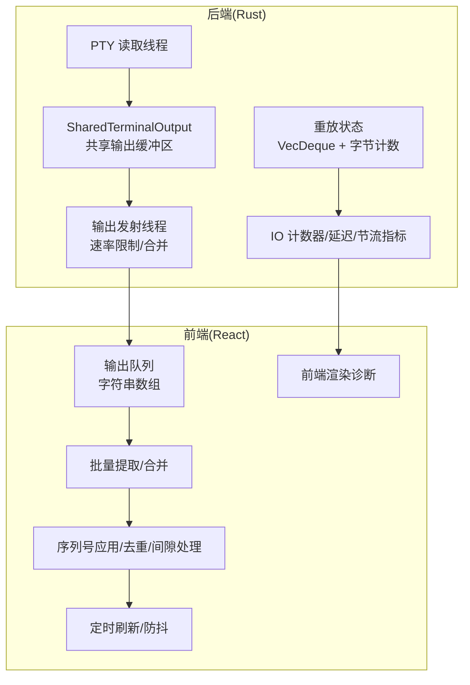
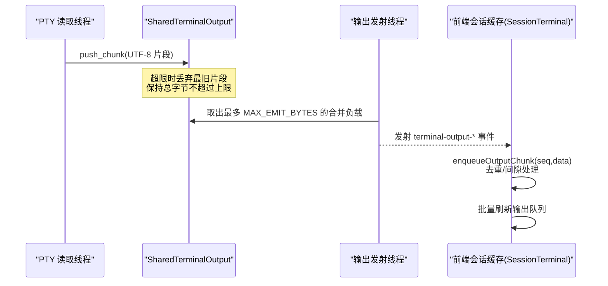
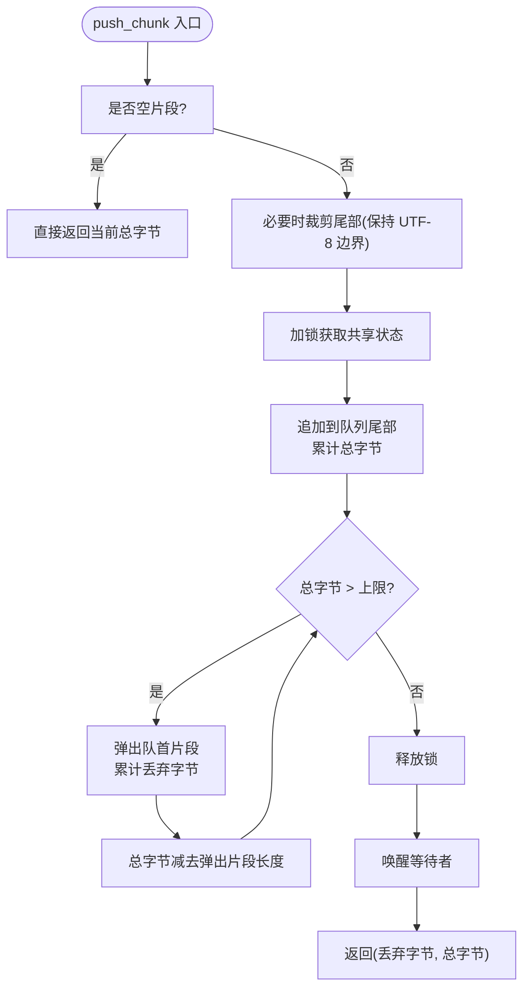
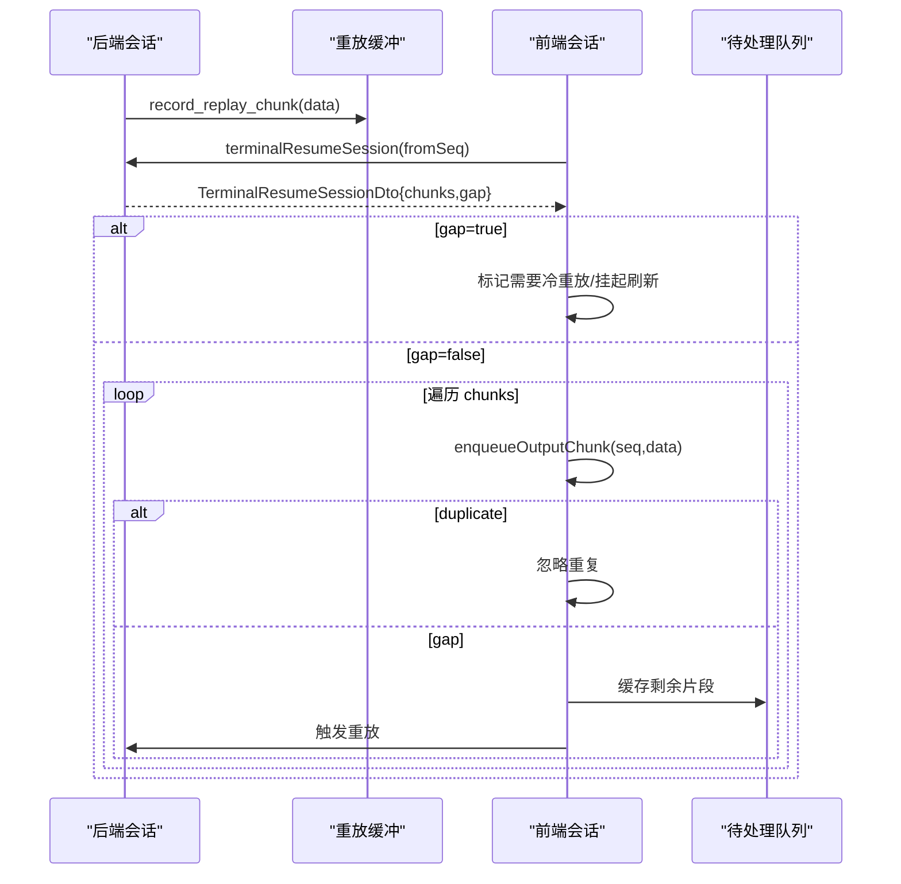
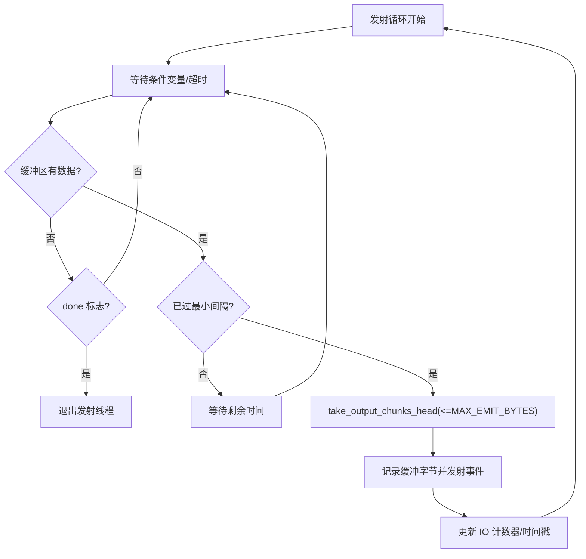
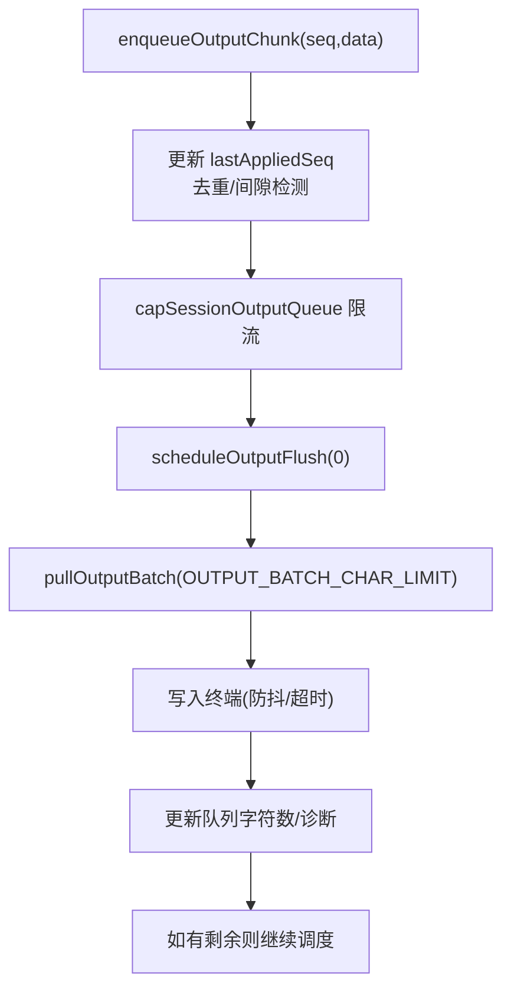
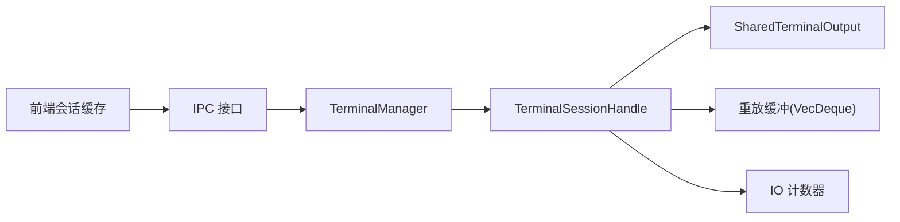

# 输出处理

<cite>
**本文引用的文件**
- [mod.rs](file://src-tauri/src/terminal/mod.rs)
- [TerminalPanel.tsx](file://src/components/terminal/TerminalPanel.tsx)
- [models.rs](file://src-tauri/src/models.rs)
- [terminalStore.ts](file://src/stores/terminalStore.ts)
</cite>

## 目录
1. [简介](#简介)
2. [项目结构](#项目结构)
3. [核心组件](#核心组件)
4. [架构总览](#架构总览)
5. [详细组件分析](#详细组件分析)
6. [依赖关系分析](#依赖关系分析)
7. [性能考量](#性能考量)
8. [故障排除指南](#故障排除指南)
9. [结论](#结论)
10. [附录](#附录)

## 简介
本文件面向 Panes 终端输出处理系统，聚焦以下主题：
- PTY 输出缓冲区管理与内存控制
- 输出流合并与速率限制机制
- SharedTerminalOutput 结构体、输出缓冲区策略与内存管理
- 输出分块、序列号管理与重放机制
- 输出监控、IO 计数器统计与性能指标采集
- 输出调试技巧、性能优化策略与故障排除方法

## 项目结构
终端输出处理由 Rust 后端与前端 React 组件协同完成：
- 后端（Rust）：负责 PTY 读取、UTF-8 分片、输出缓冲区、速率限制、事件发射、重放存储与诊断导出
- 前端（React）：负责输出队列、批量刷新、序列号应用、重放与回补、诊断展示与调试

图表来源
- [mod.rs:622-911](file://src-tauri/src/terminal/mod.rs#L622-L911)
- [TerminalPanel.tsx:1390-1523](file://src/components/terminal/TerminalPanel.tsx#L1390-L1523)

章节来源
- [mod.rs:1-120](file://src-tauri/src/terminal/mod.rs#L1-L120)
- [TerminalPanel.tsx:1-120](file://src/components/terminal/TerminalPanel.tsx#L1-L120)

## 核心组件
- SharedTerminalOutput：后端共享输出缓冲区，采用环形队列保存 UTF-8 片段，并在达到上限时丢弃最旧片段，确保内存可控
- 输出发射线程：按固定最小间隔合并输出，避免 IPC 过载；同时记录节流与峰值字节数
- 前端 SessionTerminal：维护输出队列、批量刷新、序列号应用与重放回补
- IO 计数器与诊断：统计输入/输出次数、字节数、时间戳、延迟与节流参数，支持导出

章节来源
- [mod.rs:120-175](file://src-tauri/src/terminal/mod.rs#L120-L175)
- [mod.rs:622-758](file://src-tauri/src/terminal/mod.rs#L622-L758)
- [TerminalPanel.tsx:171-218](file://src/components/terminal/TerminalPanel.tsx#L171-L218)
- [models.rs:931-957](file://src-tauri/src/models.rs#L931-L957)

## 架构总览
后端 PTY 读取线程持续从 master fd 读取字节，解析为 UTF-8 片段并写入 SharedTerminalOutput 缓冲区；发射线程以约 60Hz 的频率（最小间隔 16ms）从缓冲区取出不超过最大字节数的合并负载，记录重放缓冲与 IO 指标，并通过事件发送到前端。前端接收事件后按序列号顺序应用到输出队列，进行批量刷新与重放回补。

图表来源
- [mod.rs:622-758](file://src-tauri/src/terminal/mod.rs#L622-L758)
- [mod.rs:141-175](file://src-tauri/src/terminal/mod.rs#L141-L175)
- [TerminalPanel.tsx:1525-1574](file://src/components/terminal/TerminalPanel.tsx#L1525-L1574)

## 详细组件分析

### SharedTerminalOutput 与输出缓冲区策略
- 数据结构
  - 共享状态包含：环形队列（VecDeque<String>）与总字节数
  - 使用互斥锁保护并发访问，条件变量用于通知有新数据
- 写入策略
  - 单次写入可能被裁剪至最大缓冲上限
  - 写入后循环丢弃最旧片段，直到总字节不超过上限
  - 返回丢弃字节数与当前总字节数，供 IO 计数器更新
- 读取策略
  - take_output_chunks_head 从队列头部拼接，遇到单个片段超过阈值时先截断再返回
  - 保证每次读取不超过最大字节数，避免单次 IPC 负载过大

图表来源
- [mod.rs:141-175](file://src-tauri/src/terminal/mod.rs#L141-L175)

章节来源
- [mod.rs:120-175](file://src-tauri/src/terminal/mod.rs#L120-L175)

### 输出分块、序列号管理与重放
- 后端
  - 为每个输出片段分配单调递增序列号，记录时间戳与数据
  - 维护重放缓冲（VecDeque + 总字节），丢弃超出数量或字节上限的最旧条目
  - 提供 replay_since/replay_since_limited 接口，按 from_seq 过滤并限制最大字节
- 前端
  - 以 SequencedOutputChunk 形式接收，按 seq 去重与间隙检测
  - 应用成功后更新 lastAppliedSeq；若出现间隙，将后续片段暂存到 pendingOutput 并触发重放
  - 支持 attach 时的冷启动重放与 live-gap 的增量回补

图表来源
- [mod.rs:1070-1135](file://src-tauri/src/terminal/mod.rs#L1070-L1135)
- [TerminalPanel.tsx:1576-1666](file://src/components/terminal/TerminalPanel.tsx#L1576-L1666)

章节来源
- [mod.rs:1070-1135](file://src-tauri/src/terminal/mod.rs#L1070-L1135)
- [TerminalPanel.tsx:1525-1666](file://src/components/terminal/TerminalPanel.tsx#L1525-L1666)

### 速率限制与输出合并
- 最小发射间隔：约 60Hz（16ms）
- 单次最大发射字节数：256KB
- 后端发射线程在未达到最小间隔前阻塞等待，避免过载
- take_output_chunks_head 将多个片段合并为不超过阈值的单一负载，减少 IPC 次数

图表来源
- [mod.rs:649-758](file://src-tauri/src/terminal/mod.rs#L649-L758)

章节来源
- [mod.rs:35-42](file://src-tauri/src/terminal/mod.rs#L35-L42)
- [mod.rs:649-758](file://src-tauri/src/terminal/mod.rs#L649-L758)

### 前端输出队列与批量刷新
- 输出队列：SessionTerminal.outputQueue 保存字符串片段，outputQueueChars 统计字符数
- 批量提取：pullOutputBatch 依据字符上限聚合若干片段，避免单次写入过大
- 刷新调度：scheduleOutputFlush 与 flushOutputQueue 控制刷新时机与防抖，处理 flushWatchdog 超时与重试
- 诊断：rendererDiagnostics 统计输出块数、字符数、丢弃块数与字符数等

图表来源
- [TerminalPanel.tsx:1390-1523](file://src/components/terminal/TerminalPanel.tsx#L1390-L1523)
- [TerminalPanel.tsx:1525-1574](file://src/components/terminal/TerminalPanel.tsx#L1525-L1574)

章节来源
- [TerminalPanel.tsx:1390-1574](file://src/components/terminal/TerminalPanel.tsx#L1390-L1574)

### IO 计数器与性能指标
- 后端 IO 计数器
  - 输入：stdin_writes、stdin_bytes、stdin_ctrl_c、last_stdin_write_duration_ms、last_stdin_write_at
  - 输出：stdout_reads、stdout_bytes、stdout_emits、stdout_emit_bytes、stdout_dropped_bytes、last_stdout_read_at、last_stdout_emit_at
  - 缓冲：output_buffer_bytes、output_buffer_peak_bytes、output_buffer_trimmed_bytes
- 延迟与节流
  - stdin_to_stdout_read_ms、stdout_read_to_emit_ms
  - min_emit_interval_ms、max_emit_bytes、buffer_cap_bytes、buffer_peak_bytes、buffer_trimmed_bytes
- 导出
  - renderer_diagnostics 接口返回完整快照，前端可复制导出

章节来源
- [mod.rs:93-107](file://src-tauri/src/terminal/mod.rs#L93-L107)
- [mod.rs:1038-1056](file://src-tauri/src/terminal/mod.rs#L1038-L1056)
- [models.rs:931-957](file://src-tauri/src/models.rs#L931-L957)

## 依赖关系分析
- 后端模块间关系
  - TerminalManager 管理会话生命周期与工作区映射
  - TerminalSessionHandle 持有 IO 计数器、重放缓冲、进程句柄与诊断状态
  - SharedTerminalOutput 作为跨线程共享缓冲
- 前端与后端交互
  - 前端监听 terminal-output-* 事件，按序列号应用输出
  - 通过 ipc.terminalResumeSession/terminalDrainOutput 获取重放与拉取补充输出
  - 通过 ipc.terminalGetRendererDiagnostics 获取后端诊断

图表来源
- [mod.rs:44-58](file://src-tauri/src/terminal/mod.rs#L44-L58)
- [mod.rs:973-1068](file://src-tauri/src/terminal/mod.rs#L973-L1068)
- [TerminalPanel.tsx:591-627](file://src/components/terminal/TerminalPanel.tsx#L591-L627)

章节来源
- [mod.rs:44-1345](file://src-tauri/src/terminal/mod.rs#L44-L1345)
- [TerminalPanel.tsx:591-627](file://src/components/terminal/TerminalPanel.tsx#L591-L627)

## 性能考量
- 后端
  - 读取线程不睡眠，持续从 PTY 读取，避免阻塞
  - 发射线程以最小间隔合并输出，避免 IPC 过载
  - 缓冲上限与丢弃策略确保内存占用稳定
- 前端
  - 批量刷新与防抖降低渲染压力
  - 重放回补与待处理队列避免丢失输出
  - 诊断与日志辅助定位卡顿与丢弃问题

章节来源
- [mod.rs:633-640](file://src-tauri/src/terminal/mod.rs#L633-L640)
- [TerminalPanel.tsx:246-256](file://src/components/terminal/TerminalPanel.tsx#L246-L256)

## 故障排除指南
- 输出卡顿或冻结
  - 检查后端最小发射间隔与最大发射字节数是否合理
  - 查看 stdout_emits 与 stdout_emit_bytes 是否异常增长
- 输出丢失
  - 关注 stdout_dropped_bytes 与 buffer_trimmed_bytes
  - 若 gap=true，前端会触发冷重放；若 gap 出现在应用过程中，检查 pendingOutput 与重放流程
- 渲染异常
  - 检查前端 rendererDiagnostics 中的 outputDroppedChunkCount/CharCount
  - 若启用加速渲染，关注 WebGL 上下文丢失计数与降级提示
- 调试技巧
  - 开启前端调试开关，观察每秒采样与队列深度
  - 复制后端诊断快照，对比前后端指标差异
  - 使用终端诊断导出功能，收集环境、IO、延迟与节流信息

章节来源
- [mod.rs:1016-1056](file://src-tauri/src/terminal/mod.rs#L1016-L1056)
- [TerminalPanel.tsx:426-449](file://src/components/terminal/TerminalPanel.tsx#L426-L449)
- [TerminalPanel.tsx:4003-4027](file://src/components/terminal/TerminalPanel.tsx#L4003-L4027)

## 结论
Panes 终端输出处理系统通过“后台持续读取 + 前台批量刷新”的双层设计，在高吞吐场景下实现了稳定的输出展示与低 IPC 开销。SharedTerminalOutput 的环形队列与丢弃策略、发射线程的速率限制与合并、以及前端的序列号应用与重放回补，共同构成了可靠且可诊断的输出链路。配合完善的 IO 计数器与诊断导出，开发者可以快速定位性能瓶颈与异常行为。

## 附录
- 关键配置常量（示例）
  - 最小发射间隔：约 16ms
  - 单次最大发射字节数：256KB
  - 输出缓冲上限：2MB
  - 重放缓冲最大片段数：4096
  - 重放缓冲最大字节：4MB
- 相关接口
  - 后端：renderer_diagnostics、resume_session、drain_output
  - 前端：listenTerminalOutput、terminalResumeSession、terminalDrainOutput、terminalGetRendererDiagnostics

章节来源
- [mod.rs:35-42](file://src-tauri/src/terminal/mod.rs#L35-L42)
- [TerminalPanel.tsx:591-627](file://src/components/terminal/TerminalPanel.tsx#L591-L627)