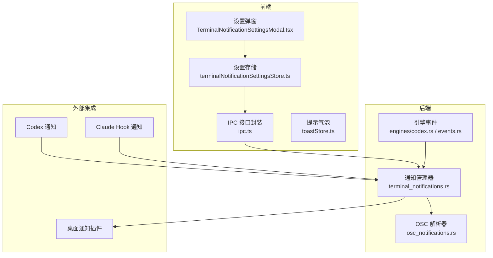
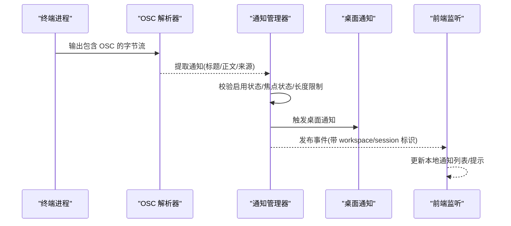
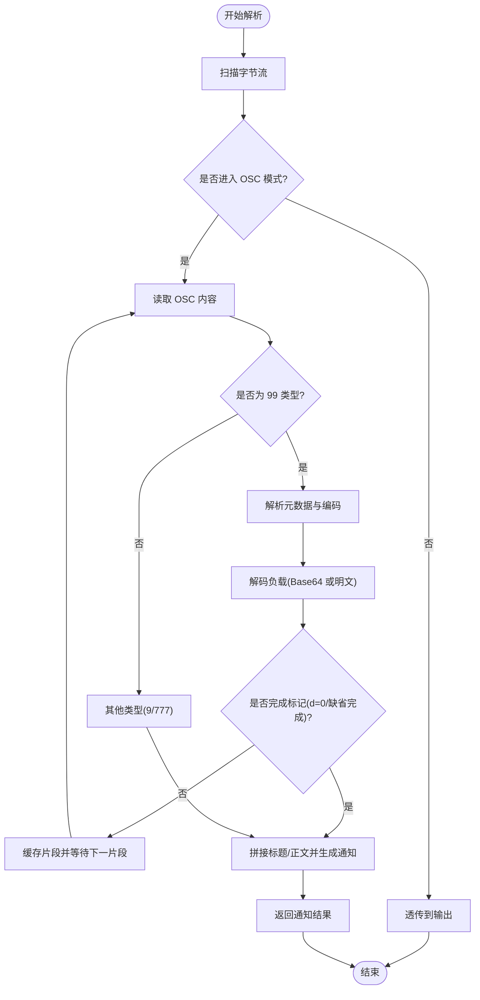
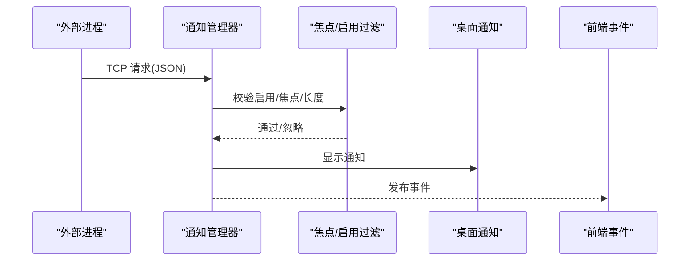
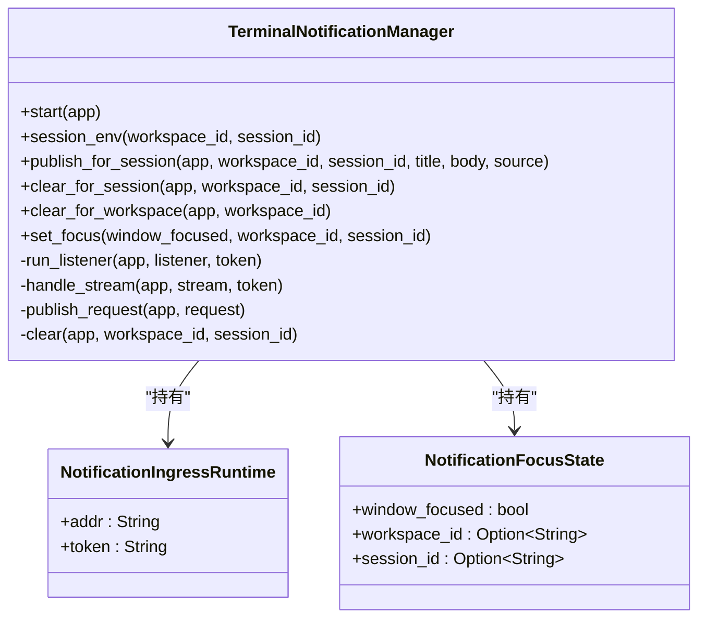
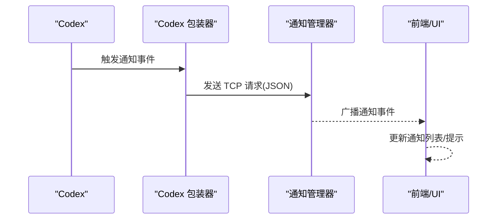
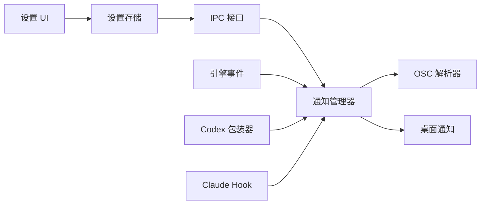

# 通知系统

<cite>
**本文引用的文件**
- [src-tauri/src/terminal/osc_notifications.rs](file://src-tauri/src/terminal/osc_notifications.rs)
- [src-tauri/src/terminal_notifications.rs](file://src-tauri/src/terminal_notifications.rs)
- [src/stores/terminalNotificationSettingsStore.ts](file://src/stores/terminalNotificationSettingsStore.ts)
- [src/components/shared/TerminalNotificationSettingsModal.tsx](file://src/components/shared/TerminalNotificationSettingsModal.tsx)
- [src/lib/ipc.ts](file://src/lib/ipc.ts)
- [src/types.ts](file://src/types.ts)
- [src/stores/toastStore.ts](file://src/stores/toastStore.ts)
- [src-tauri/src/engines/codex.rs](file://src-tauri/src/engines/codex.rs)
- [src-tauri/src/engines/events.rs](file://src-tauri/src/engines/events.rs)
</cite>

## 目录
1. [简介](#简介)
2. [项目结构](#项目结构)
3. [核心组件](#核心组件)
4. [架构总览](#架构总览)
5. [详细组件分析](#详细组件分析)
6. [依赖关系分析](#依赖关系分析)
7. [性能考量](#性能考量)
8. [故障排查指南](#故障排查指南)
9. [结论](#结论)
10. [附录](#附录)

## 简介
本文件系统化阐述 Panes 终端通知系统的设计与实现，覆盖 OSC（Operating System Command）通知协议解析、通知类型分类与处理流程、终端通知管理器、通知环境配置与路由机制，并重点说明 Codex 通知、Claude 通知以及自定义通知支持。同时提供通知配置选项、过滤规则与优先级设置建议，解释通知调试、日志记录与性能影响分析，并讨论系统的扩展性与第三方集成能力。

## 项目结构
通知系统由前端状态与 UI、IPC 接口层、后端通知管理器与协议解析器组成，贯穿 Tauri 原生通道与终端会话环境变量，形成“终端输出 → 协议解析 → 通知路由 → 桌面通知”的完整链路。

图示来源
- [src/components/shared/TerminalNotificationSettingsModal.tsx:1-293](file://src/components/shared/TerminalNotificationSettingsModal.tsx#L1-293)
- [src/stores/terminalNotificationSettingsStore.ts:1-312](file://src/stores/terminalNotificationSettingsStore.ts#L1-312)
- [src/lib/ipc.ts:1-792](file://src/lib/ipc.ts#L1-792)
- [src-tauri/src/terminal_notifications.rs:1-800](file://src-tauri/src/terminal_notifications.rs#L1-800)
- [src-tauri/src/terminal/osc_notifications.rs:1-419](file://src-tauri/src/terminal/osc_notifications.rs#L1-419)
- [src-tauri/src/engines/codex.rs:1-800](file://src-tauri/src/engines/codex.rs#L1-800)
- [src-tauri/src/engines/events.rs:1-262](file://src-tauri/src/engines/events.rs#L1-262)

章节来源
- [src/components/shared/TerminalNotificationSettingsModal.tsx:1-293](file://src/components/shared/TerminalNotificationSettingsModal.tsx#L1-293)
- [src/stores/terminalNotificationSettingsStore.ts:1-312](file://src/stores/terminalNotificationSettingsStore.ts#L1-312)
- [src/lib/ipc.ts:1-792](file://src/lib/ipc.ts#L1-792)
- [src-tauri/src/terminal_notifications.rs:1-800](file://src-tauri/src/terminal_notifications.rs#L1-800)
- [src-tauri/src/terminal/osc_notifications.rs:1-419](file://src-tauri/src/terminal/osc_notifications.rs#L1-419)
- [src-tauri/src/engines/codex.rs:1-800](file://src-tauri/src/engines/codex.rs#L1-800)
- [src-tauri/src/engines/events.rs:1-262](file://src-tauri/src/engines/events.rs#L1-262)

## 核心组件
- 终端通知管理器：负责启动 TCP 入口、接收外部通知请求、进行焦点判断与过滤、发布到前端事件总线、触发桌面通知。
- OSC 通知协议解析器：解析终端输出中的 OSC 序列，识别并提取通知标题/正文，支持 OSC 9/99/777 等多种格式。
- 设置存储与 UI：提供聊天与终端通知开关、声音选择与预览、集成安装等操作入口。
- IPC 接口：桥接前端与后端，暴露获取/设置通知状态、安装集成、播放声音等命令。
- 引擎与事件：Codex/Claude 等引擎通过钩子或协议向 Panes 发送通知，管理器统一路由与展示。

章节来源
- [src-tauri/src/terminal_notifications.rs:70-555](file://src-tauri/src/terminal_notifications.rs#L70-555)
- [src-tauri/src/terminal/osc_notifications.rs:10-277](file://src-tauri/src/terminal/osc_notifications.rs#L10-277)
- [src/stores/terminalNotificationSettingsStore.ts:25-312](file://src/stores/terminalNotificationSettingsStore.ts#L25-312)
- [src/components/shared/TerminalNotificationSettingsModal.tsx:34-293](file://src/components/shared/TerminalNotificationSettingsModal.tsx#L34-293)
- [src/lib/ipc.ts:87-100](file://src/lib/ipc.ts#L87-100)

## 架构总览
通知从终端输出或外部进程进入，经由协议解析与管理器处理，最终在桌面显示并同步到前端状态。

图示来源
- [src-tauri/src/terminal/osc_notifications.rs:45-144](file://src-tauri/src/terminal/osc_notifications.rs#L45-144)
- [src-tauri/src/terminal_notifications.rs:419-500](file://src-tauri/src/terminal_notifications.rs#L419-500)
- [src/lib/ipc.ts:724-742](file://src/lib/ipc.ts#L724-742)

章节来源
- [src-tauri/src/terminal/osc_notifications.rs:1-419](file://src-tauri/src/terminal/osc_notifications.rs#L1-419)
- [src-tauri/src/terminal_notifications.rs:341-500](file://src-tauri/src/terminal_notifications.rs#L341-500)
- [src/lib/ipc.ts:724-742](file://src/lib/ipc.ts#L724-742)

## 详细组件分析

### OSC 通知协议解析
- 支持的 OSC 类型
  - OSC 9：用于进度报告与简单通知；当前实现会忽略进度型 OSC 9（如构建进度），仅保留非进度类通知。
  - OSC 777：用于通用通知，参数包含命令与消息体，解析后生成通知。
  - OSC 99：Kitty 扩展，支持分片传输与元数据（键值对），可按片段拼接标题/正文，完成后一次性生成通知。
- 解析流程
  - 字节流逐字节扫描，识别 ESC 与 OSC 起止标记。
  - 对于 99 类型，解析元数据键值，根据编码（明文或 Base64）解码负载。
  - 将空标题/正文自动补全为默认标题或正文，避免空内容。
- 特殊处理
  - 进度型 OSC 9（以特定前缀标识）被忽略，不产生通知。
  - 分片型 99 通知在完成标记时才产出最终通知，中间片段仅拼接缓存。

图示来源
- [src-tauri/src/terminal/osc_notifications.rs:45-214](file://src-tauri/src/terminal/osc_notifications.rs#L45-214)

章节来源
- [src-tauri/src/terminal/osc_notifications.rs:146-277](file://src-tauri/src/terminal/osc_notifications.rs#L146-277)

### 通知类型分类与处理流程
- 通知来源
  - 外部进程通过 TCP 入口发送通知请求（携带令牌与工作区/会话标识）。
  - 终端输出中嵌入 OSC 通知序列，经解析器提取。
  - 引擎事件（如 Codex/Claude）通过钩子或内置逻辑推送通知。
- 处理策略
  - 启用检查：若终端通知未启用，则清空对应会话的通知并忽略。
  - 焦点过滤：若目标会话处于前台且窗口聚焦，则清空该会话通知，避免重复打扰。
  - 长度限制：标题与正文均有限制，超长将被截断。
  - 桌面通知：成功发布后尝试触发系统桌面通知。
  - 事件广播：向前端发出带工作区/会话标识的事件，便于 UI 层展示与管理。

图示来源
- [src-tauri/src/terminal_notifications.rs:419-500](file://src-tauri/src/terminal_notifications.rs#L419-500)

章节来源
- [src-tauri/src/terminal_notifications.rs:419-555](file://src-tauri/src/terminal_notifications.rs#L419-555)

### 终端通知管理器
- 启动与运行
  - 动态绑定本地回环地址，生成唯一令牌，异步接受连接。
  - 每个请求独立处理，解析 JSON 载荷，校验令牌有效性。
- 会话环境注入
  - 为每个终端会话生成环境变量（地址、令牌、工作区 ID、会话 ID），供子进程使用。
- 清除机制
  - 支持按会话或工作区清除通知，清除后向前端广播清理事件。
- CLI 子命令
  - 提供命令行工具入口，支持直接发送/清除通知，或从 Codex/Claude 钩子转发。

图示来源
- [src-tauri/src/terminal_notifications.rs:70-340](file://src-tauri/src/terminal_notifications.rs#L70-340)

章节来源
- [src-tauri/src/terminal_notifications.rs:219-555](file://src-tauri/src/terminal_notifications.rs#L219-555)

### 通知环境配置与路由机制
- 环境变量注入
  - PANES_NOTIFY_ADDR/PANES_NOTIFY_TOKEN：通知入口地址与令牌。
  - PANES_WORKSPACE_ID/PANES_SESSION_ID：工作区与会话标识。
- 路由规则
  - 依据工作区与会话 ID 将通知路由至对应会话，支持按会话或工作区维度清理。
  - 若窗口未聚焦或目标会话已获得焦点，通知会被忽略或清空，避免重复提醒。
- CLI 与包装器
  - Codex/Claude 包装器自动注入通知配置或钩子，确保外部调用能正确路由到 Panes。

章节来源
- [src-tauri/src/terminal_notifications.rs:26-68](file://src-tauri/src/terminal_notifications.rs#L26-68)
- [src-tauri/src/terminal_notifications.rs:802-826](file://src-tauri/src/terminal_notifications.rs#L802-826)
- [src-tauri/src/terminal_notifications.rs:924-978](file://src-tauri/src/terminal_notifications.rs#L924-978)

### Codex 通知与 Claude 通知支持
- Codex 通知
  - 通过内置配置项将通知路由到 Panes CLI 子命令，仅在“回合完成”等事件时发送。
  - 通知标题固定为 Codex，正文取自最后一条助手消息或输入消息摘要。
- Claude 通知
  - 通过 Claude Hook 在不同事件（通知、停止、失败、会话开始/结束）时推送。
  - 支持错误场景的特殊标题与正文，必要时清空通知。
- 两者均受统一管理器处理，遵循相同的路由、过滤与展示规则。

图示来源
- [src-tauri/src/terminal_notifications.rs:828-859](file://src-tauri/src/terminal_notifications.rs#L828-859)
- [src-tauri/src/terminal_notifications.rs:861-894](file://src-tauri/src/terminal_notifications.rs#L861-894)

章节来源
- [src-tauri/src/terminal_notifications.rs:828-894](file://src-tauri/src/terminal_notifications.rs#L828-894)
- [src-tauri/src/engines/codex.rs:1-800](file://src-tauri/src/engines/codex.rs#L1-800)
- [src-tauri/src/engines/events.rs:113-177](file://src-tauri/src/engines/events.rs#L113-177)

### 自定义通知支持
- 任意外部进程可通过 TCP 将符合格式的通知请求发送至 Panes，请求包含令牌、工作区 ID、会话 ID、标题、正文与来源。
- 管理器对请求进行校验与过滤，然后发布到前端事件并触发桌面通知。
- CLI 子命令提供便捷入口，便于脚本或工具集成。

章节来源
- [src-tauri/src/terminal_notifications.rs:592-643](file://src-tauri/src/terminal_notifications.rs#L592-643)
- [src-tauri/src/terminal_notifications.rs:1509-1548](file://src-tauri/src/terminal_notifications.rs#L1509-1548)

### 通知配置选项、过滤规则与优先级
- 配置选项
  - 聊天通知开关、终端通知开关、通知声音选择与预览、集成安装（Codex/Claude）。
- 过滤规则
  - 未启用终端通知则忽略；前台会话聚焦时忽略或清空通知。
  - OSC 9 进度型通知被忽略；空标题/正文自动补全。
- 优先级
  - 焦点优先：前台会话优先，避免重复打扰。
  - 长度优先：标题/正文超过阈值时截断，保证展示质量。
  - 来源优先：外部来源与内部来源区分，便于后续扩展。

章节来源
- [src/stores/terminalNotificationSettingsStore.ts:142-258](file://src/stores/terminalNotificationSettingsStore.ts#L142-258)
- [src/components/shared/TerminalNotificationSettingsModal.tsx:79-93](file://src/components/shared/TerminalNotificationSettingsModal.tsx#L79-93)
- [src-tauri/src/terminal_notifications.rs:450-463](file://src-tauri/src/terminal_notifications.rs#L450-463)
- [src-tauri/src/terminal/osc_notifications.rs:217-233](file://src-tauri/src/terminal/osc_notifications.rs#L217-233)

### 通知调试、日志记录与性能影响
- 日志
  - 成功发布通知时记录工作区/会话/来源/标题等信息；桌面通知失败时记录警告。
- 性能
  - 解析器采用增量扫描与分片缓存，避免一次性大块内存分配。
  - TCP 入口单次请求处理，超时控制保障稳定性。
  - 前端仅维护最近通知列表，避免内存膨胀。
- 可观测性
  - 前端监听通知事件与清理事件，便于 UI 层调试与用户反馈。

章节来源
- [src-tauri/src/terminal_notifications.rs:486-497](file://src-tauri/src/terminal_notifications.rs#L486-497)
- [src/lib/ipc.ts:724-742](file://src/lib/ipc.ts#L724-742)
- [src/stores/toastStore.ts:1-66](file://src/stores/toastStore.ts#L1-66)

## 依赖关系分析
- 前端依赖
  - 设置存储依赖 IPC；UI 依赖设置存储与提示气泡。
- 后端依赖
  - 通知管理器依赖桌面通知插件、TCP 通信、环境变量与配置。
  - OSC 解析器为纯函数式模块，无外部依赖。
- 引擎集成
  - Codex/Claude 通过包装器或钩子与 Panes 交互，最终统一走通知管理器。

图示来源
- [src/components/shared/TerminalNotificationSettingsModal.tsx:16-49](file://src/components/shared/TerminalNotificationSettingsModal.tsx#L16-49)
- [src/stores/terminalNotificationSettingsStore.ts:105-312](file://src/stores/terminalNotificationSettingsStore.ts#L105-312)
- [src/lib/ipc.ts:87-100](file://src/lib/ipc.ts#L87-100)
- [src-tauri/src/terminal_notifications.rs:219-265](file://src-tauri/src/terminal_notifications.rs#L219-265)
- [src-tauri/src/terminal/osc_notifications.rs:1-419](file://src-tauri/src/terminal/osc_notifications.rs#L1-419)
- [src-tauri/src/engines/codex.rs:1-800](file://src-tauri/src/engines/codex.rs#L1-800)

章节来源
- [src/components/shared/TerminalNotificationSettingsModal.tsx:1-293](file://src/components/shared/TerminalNotificationSettingsModal.tsx#L1-293)
- [src/stores/terminalNotificationSettingsStore.ts:1-312](file://src/stores/terminalNotificationSettingsStore.ts#L1-312)
- [src/lib/ipc.ts:1-792](file://src/lib/ipc.ts#L1-792)
- [src-tauri/src/terminal_notifications.rs:1-800](file://src-tauri/src/terminal_notifications.rs#L1-800)
- [src-tauri/src/terminal/osc_notifications.rs:1-419](file://src-tauri/src/terminal/osc_notifications.rs#L1-419)
- [src-tauri/src/engines/codex.rs:1-800](file://src-tauri/src/engines/codex.rs#L1-800)

## 性能考量
- 解析器
  - 时间复杂度 O(n)，空间复杂度与分片数量相关；对 UTF-8 连续字节保持透传，避免不必要的拷贝。
- 通知管理器
  - TCP 连接采用短生命周期请求/响应模式，超时控制降低资源占用。
  - 前端通知列表限制最大条数，防止内存增长。
- 建议
  - 控制 OSC 负载大小与分片数量，减少多次拼接成本。
  - 合理设置焦点状态，避免频繁切换导致重复清空/发布。

## 故障排查指南
- 无法收到通知
  - 检查终端通知开关与声音设置；确认焦点状态是否导致被忽略。
  - 查看后端日志中“桌面通知失败”的警告。
- OSC 通知未生效
  - 确认输出是否为进度型 OSC 9（会被忽略）；检查 99 分片是否完整。
  - 校验标题/正文是否为空，必要时查看自动补全逻辑。
- 外部进程通知失败
  - 校验 PANES_NOTIFY_ADDR/PANES_NOTIFY_TOKEN 是否正确注入。
  - 检查令牌匹配与请求格式；查看响应错误信息。
- 前端未更新
  - 确认事件监听是否正确绑定工作区 ID；检查通知列表刷新逻辑。

章节来源
- [src-tauri/src/terminal_notifications.rs:486-497](file://src-tauri/src/terminal_notifications.rs#L486-497)
- [src-tauri/src/terminal/osc_notifications.rs:292-314](file://src-tauri/src/terminal/osc_notifications.rs#L292-314)
- [src/lib/ipc.ts:724-742](file://src/lib/ipc.ts#L724-742)

## 结论
Panes 通知系统通过 OSC 协议解析与统一通知管理器，实现了对 Codex、Claude 与自定义来源的通知聚合与路由。系统具备完善的过滤与优先级策略、清晰的前端配置与 UI、以及可观测的日志与性能特性。其模块化设计便于扩展新的通知来源与路由规则，满足多引擎与多场景下的通知需求。

## 附录
- 关键类型与常量
  - 通知设置结构、集成状态结构、通知事件与清理事件等类型定义。
  - OSC 默认标题/来源、最大字符限制、CLI 子命令名称等常量。

章节来源
- [src/types.ts:53-70](file://src/types.ts#L53-70)
- [src-tauri/src/terminal_notifications.rs:26-68](file://src-tauri/src/terminal_notifications.rs#L26-68)
- [src-tauri/src/terminal/osc_notifications.rs:7-8](file://src-tauri/src/terminal/osc_notifications.rs#L7-8)