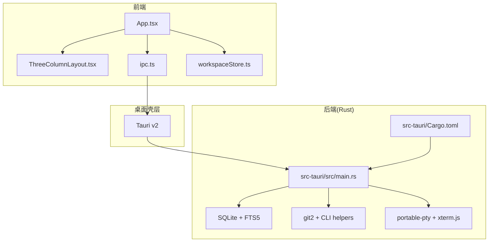
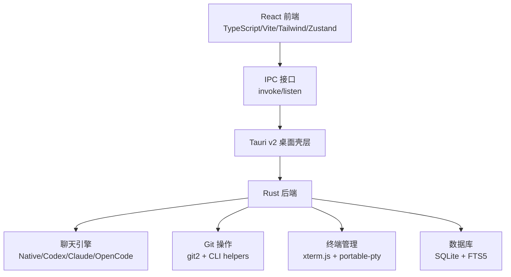
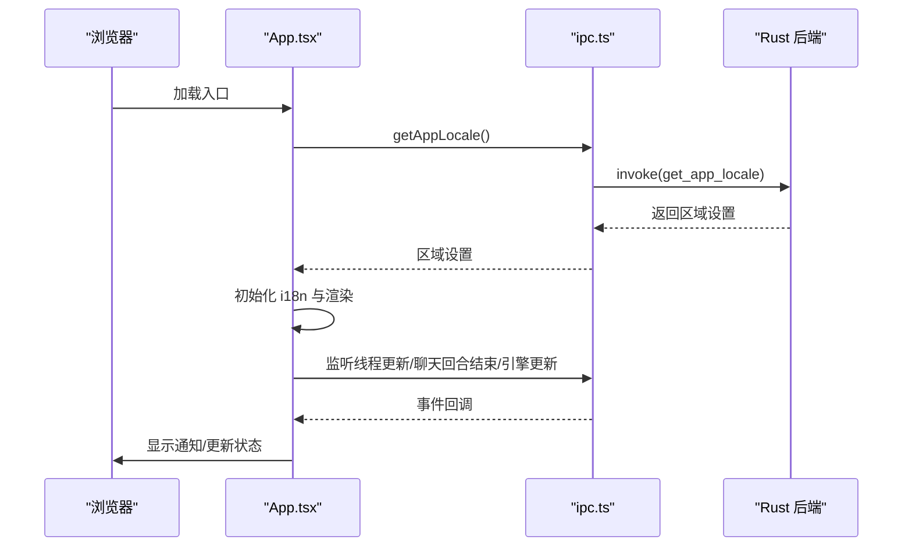
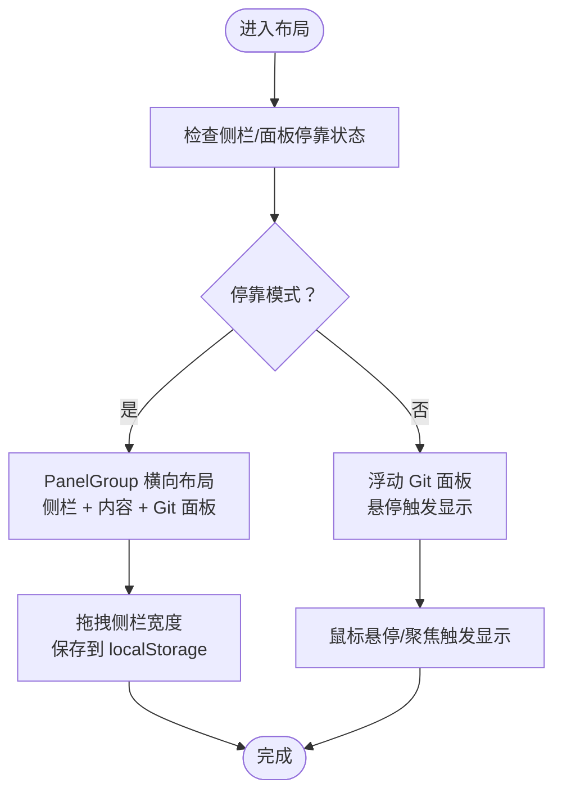
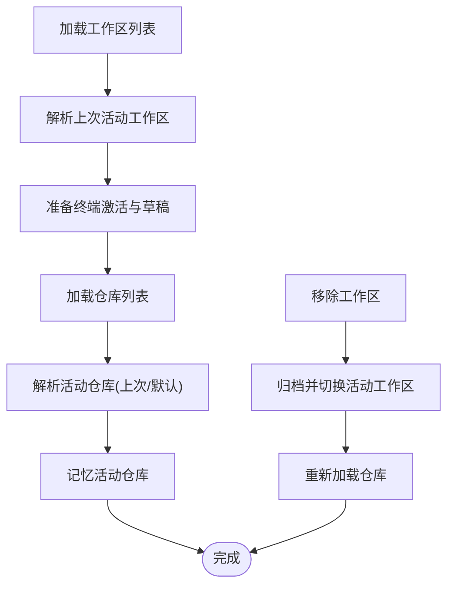
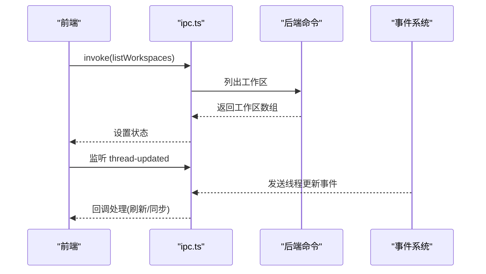
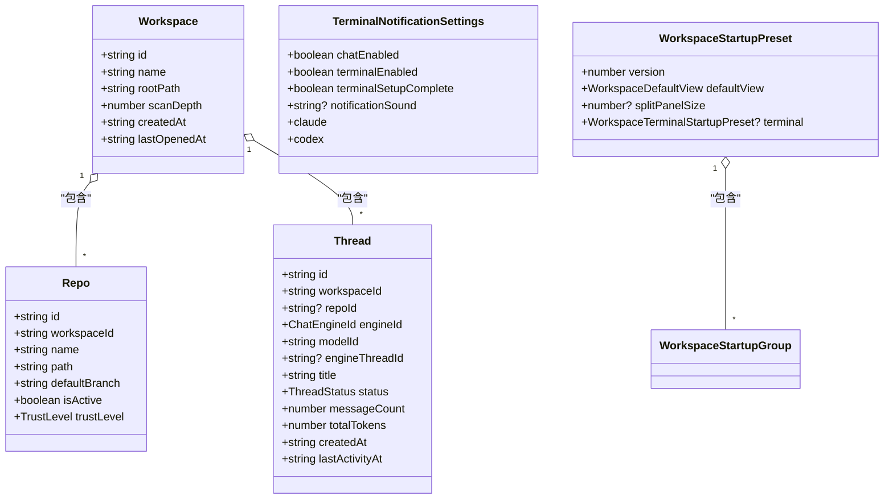
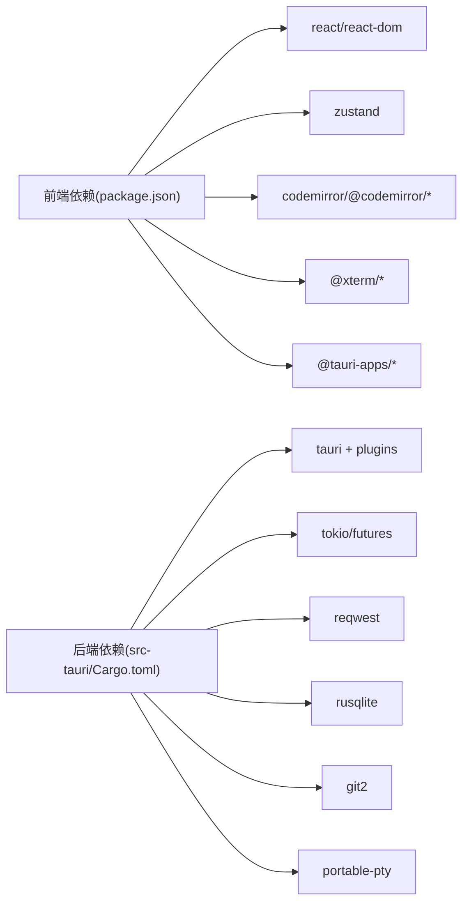

# 项目概述

<cite>
**本文档引用的文件**
- [README.md](file://README.md)
- [package.json](file://package.json)
- [Cargo.toml](file://Cargo.toml)
- [src/main.tsx](file://src/main.tsx)
- [src/App.tsx](file://src/App.tsx)
- [src-tauri/src/main.rs](file://src-tauri/src/main.rs)
- [src-tauri/Cargo.toml](file://src-tauri/Cargo.toml)
- [src/components/layout/ThreeColumnLayout.tsx](file://src/components/layout/ThreeColumnLayout.tsx)
- [src/stores/workspaceStore.ts](file://src/stores/workspaceStore.ts)
- [src/lib/ipc.ts](file://src/lib/ipc.ts)
- [src/types.ts](file://src/types.ts)
- [CONTRIBUTING.md](file://CONTRIBUTING.md)
</cite>

## 目录
1. [引言](#引言)
2. [项目结构](#项目结构)
3. [核心组件](#核心组件)
4. [架构总览](#架构总览)
5. [详细组件分析](#详细组件分析)
6. [依赖关系分析](#依赖关系分析)
7. [性能考量](#性能考量)
8. [故障排除指南](#故障排除指南)
9. [结论](#结论)
10. [附录](#附录)

## 引言
Panes 是一款“本地优先”的桌面级 AI 辅助编码驾驶舱，旨在将聊天代理、Git、终端与轻量文件编辑整合到一个统一的工作空间中。它不是完整的 IDE，但提供了内置多标签编辑器用于快速审阅与修改，同时支持多仓库协作、变更审查、操作审批与审计追踪。项目强调本地优先、可移植与跨平台体验，并通过 Tauri v2 将 React 前端与 Rust 后端无缝结合。

- 核心价值主张
  - 本地优先：数据与运行环境尽可能保留在本地，减少对外部云端的依赖。
  - 一体化工作流：在同一应用内完成“聊天—Git—终端—编辑”的闭环。
  - 多引擎支持：原生 Claude、Codex、Claude 侧车、OpenCode 等多种聊天引擎。
  - 审批与安全：对高风险操作进行审批与沙箱控制，保障开发安全。
  - 可靠性：崩溃恢复、会话持久化、自动更新与通知集成。

- 目标用户与使用场景
  - 目标用户：需要在本地高效进行 AI 协作编程的开发者与工程团队。
  - 典型场景：多仓库并行开发、代码审查与回滚、批量变更、终端命令执行与通知联动、快速文件编辑与预览。

- 平台支持与许可证
  - 平台：macOS、Linux、Windows。
  - 许可证：MIT。

**章节来源**
- [README.md:35-37](file://README.md#L35-L37)
- [README.md:263-266](file://README.md#L263-L266)

## 项目结构
Panes 采用前端（React + TypeScript + Vite）+ 桌面框架（Tauri v2）+ 后端（Rust）的分层架构。前端负责 UI 与交互，后端负责持久化、引擎编排、Git 操作、终端管理与文件系统安全访问。IPC 层桥接前后端，提供类型安全的调用与事件监听。

**图表来源**
- [src/App.tsx:119-577](file://src/App.tsx#L119-L577)
- [src/components/layout/ThreeColumnLayout.tsx:55-381](file://src/components/layout/ThreeColumnLayout.tsx#L55-L381)
- [src/lib/ipc.ts:72-627](file://src/lib/ipc.ts#L72-L627)
- [src-tauri/src/main.rs:1-14](file://src-tauri/src/main.rs#L1-L14)
- [src-tauri/Cargo.toml:15-55](file://src-tauri/Cargo.toml#L15-L55)

**章节来源**
- [README.md:236-256](file://README.md#L236-L256)
- [package.json:1-89](file://package.json#L1-L89)
- [Cargo.toml:1-24](file://Cargo.toml#L1-L24)

## 核心组件
- 应用入口与启动
  - 前端入口初始化国际化、错误边界与根组件渲染。
  - 后端入口处理 CLI 子命令与运行主循环。
- 主布局与视图
  - 三栏布局包含侧边栏、Git 面板与工作区内容，支持停靠/浮动与拖拽调整。
- 工作区与仓库管理
  - 工作区状态管理、仓库扫描与活动仓库切换、信任级别与 Git 选择。
- IPC 与事件系统
  - 统一的 invoke 调用与事件监听，覆盖聊天、Git、终端、设置等模块。
- 类型与配置
  - TypeScript 类型定义涵盖工作区、线程、终端通知、启动预设等。

**章节来源**
- [src/main.tsx:11-32](file://src/main.tsx#L11-L32)
- [src-tauri/src/main.rs:3-13](file://src-tauri/src/main.rs#L3-L13)
- [src/components/layout/ThreeColumnLayout.tsx:55-381](file://src/components/layout/ThreeColumnLayout.tsx#L55-L381)
- [src/stores/workspaceStore.ts:134-429](file://src/stores/workspaceStore.ts#L134-L429)
- [src/lib/ipc.ts:72-627](file://src/lib/ipc.ts#L72-L627)
- [src/types.ts:1-200](file://src/types.ts#L1-L200)

## 架构总览
Panes 的整体架构围绕“本地优先”展开：前端负责用户体验与交互；后端负责数据持久化、引擎编排、Git 与终端能力；IPC 提供前后端通信与事件驱动。应用当前暴露原生、Codex、Claude（侧车）、OpenCode 四类聊天引擎；默认嵌入 Claude Code Rust 引擎，Codex 通过 app-server 通讯，Claude 通过内置侧车运行时桥接。

**图表来源**
- [README.md:238-240](file://README.md#L238-L240)
- [src/lib/ipc.ts:72-627](file://src/lib/ipc.ts#L72-L627)
- [src-tauri/Cargo.toml:15-55](file://src-tauri/Cargo.toml#L15-L55)

**章节来源**
- [README.md:236-256](file://README.md#L236-L256)

## 详细组件分析

### 应用生命周期与窗口行为
- 初始化流程：加载浏览器语言、尝试从后端获取区域设置、初始化 i18n、挂载错误边界与根组件。
- 快捷键与菜单：JS 键盘事件与原生菜单动作去抖冲突处理；支持焦点模式、全屏、新建线程、编辑器切换、命令面板等。
- 通知与运行时：监听聊天回合结束、引擎运行时更新、线程更新事件，按需显示桌面通知与运行时提示。

**图表来源**
- [src/main.tsx:11-32](file://src/main.tsx#L11-L32)
- [src/App.tsx:139-290](file://src/App.tsx#L139-L290)
- [src/lib/ipc.ts:661-686](file://src/lib/ipc.ts#L661-L686)

**章节来源**
- [src/main.tsx:11-32](file://src/main.tsx#L11-L32)
- [src/App.tsx:119-577](file://src/App.tsx#L119-L577)

### 三栏布局与 Git 面板
- 布局策略：侧边栏可停靠或悬空；Git 面板可停靠或浮动；内容区根据焦点模式与窗口状态自适应。
- 交互细节：拖拽调整侧栏宽度、浮动 Git 面板悬停显示、焦点拖动条支持无边框拖拽。
- 本地存储：侧栏宽度与 Git 面板大小持久化到 localStorage。

**图表来源**
- [src/components/layout/ThreeColumnLayout.tsx:55-381](file://src/components/layout/ThreeColumnLayout.tsx#L55-L381)

**章节来源**
- [src/components/layout/ThreeColumnLayout.tsx:55-381](file://src/components/layout/ThreeColumnLayout.tsx#L55-L381)

### 工作区与仓库管理
- 工作区加载：列出工作区、解析上次活动工作区、准备终端与 Git 草稿。
- 仓库扫描：按工作区扫描仓库、解析活动仓库、记忆上次仓库、设置信任级别。
- Git 选择：按工作区启用/禁用仓库、批量设置信任级别。

**图表来源**
- [src/stores/workspaceStore.ts:142-158](file://src/stores/workspaceStore.ts#L142-L158)
- [src/stores/workspaceStore.ts:287-297](file://src/stores/workspaceStore.ts#L287-L297)
- [src/stores/workspaceStore.ts:319-357](file://src/stores/workspaceStore.ts#L319-L357)

**章节来源**
- [src/stores/workspaceStore.ts:134-429](file://src/stores/workspaceStore.ts#L134-L429)

### IPC 与事件系统
- 统一调用：前端通过 invoke 调用后端命令，如工作区、线程、Git、终端、设置等。
- 事件监听：监听线程更新、聊天回合结束、引擎运行时更新、菜单动作、终端输出与通知等。
- 终端写入：新会话创建后等待输出就绪再写入命令，避免竞态。

**图表来源**
- [src/lib/ipc.ts:101-108](file://src/lib/ipc.ts#L101-L108)
- [src/lib/ipc.ts:661-665](file://src/lib/ipc.ts#L661-L665)

**章节来源**
- [src/lib/ipc.ts:72-627](file://src/lib/ipc.ts#L72-L627)

### 类型与配置模型
- 工作区与仓库：包含路径、扫描深度、信任级别、默认分支等。
- 线程与引擎：线程状态、引擎 ID、模型 ID、令牌计数、创建时间等。
- 终端通知：集成 Claude/Codex 的通知配置与状态。
- 启动预设：默认视图、分割面板尺寸、终端组与会话、工作树配置等。

**图表来源**
- [src/types.ts:3-100](file://src/types.ts#L3-L100)
- [src/types.ts:155-200](file://src/types.ts#L155-L200)
- [src/types.ts:63-71](file://src/types.ts#L63-L71)
- [src/types.ts:93-144](file://src/types.ts#L93-L144)

**章节来源**
- [src/types.ts:1-200](file://src/types.ts#L1-L200)

## 依赖关系分析
- 技术栈概览
  - 前端：React 19、TypeScript 5.5、Vite 6、Tailwind CSS 4、Zustand 5、CodeMirror 6、xterm.js、micromark、diff2html 等。
  - 后端：Tauri 2、Tokio、reqwest、rusqlite、git2、portable-pty、notify 等。
  - 构建与脚本：pnpm、Vitest、release-it、构建脚本等。
- 依赖关系图

**图表来源**
- [package.json:27-72](file://package.json#L27-L72)
- [src-tauri/Cargo.toml:15-55](file://src-tauri/Cargo.toml#L15-L55)

**章节来源**
- [package.json:1-89](file://package.json#L1-89)
- [Cargo.toml:1-24](file://Cargo.toml#L1-L24)
- [src-tauri/Cargo.toml:15-55](file://src-tauri/Cargo.toml#L15-L55)

## 性能考量
- 前端性能
  - 使用 Zustand 管理状态，避免不必要的重渲染；长线程消息采用窗口化加载与惰性水合。
  - CodeMirror 编辑器与 diff 渲染优化，配合本地缓存与文件树扫描策略。
- 后端性能
  - SQLite + FTS5 用于全文检索；rusqlite 搭配压缩与事务提升查询效率。
  - Git 操作通过 git2 与 CLI 辅助结合，大仓库采用缓存与截断扫描。
  - 终端使用 portable-pty 与 xterm.js WebGL 加速渲染。
- 运行时优化
  - 保持调试构建可诊断性的同时限制 target/ 输出膨胀；提供清理生成物脚本。

**章节来源**
- [README.md:47-49](file://README.md#L47-L49)
- [README.md:214-215](file://README.md#L214-L215)

## 故障排除指南
- 安装与启动
  - macOS：Homebrew 为主要安装方式，未签名可能触发 Gatekeeper；可通过命令移除隔离属性。
  - Windows/Linux：直接下载安装包或 AppImage，后续通过应用内更新。
- 依赖与前置条件
  - Rust 稳定版、Node.js 20+、pnpm 9+、Tauri v2 前置要求；Codex CLI 可选但推荐用于 Codex 聊天引擎。
- 通知与终端
  - Codex/Claude 通知需在设置中一次性安装钩子；仅在由 Panes 启动的终端会话中生效。
  - 通用 OSC 通知可在 Panes 终端中接收，无需额外配置。
- 开发与贡献
  - 使用 pnpm 安装依赖，开发模式运行 tauri:dev；遵循贡献规范与 PR 流程。

**章节来源**
- [README.md:76-179](file://README.md#L76-L179)
- [README.md:148-169](file://README.md#L148-L169)
- [CONTRIBUTING.md:13-41](file://CONTRIBUTING.md#L13-L41)

## 结论
Panes 通过“本地优先”的设计，将聊天代理、Git、终端与编辑器整合为统一的桌面驾驶舱，既满足初学者的易用性需求，也为有经验的开发者提供强大的可扩展性与可控性。其基于 React + Tauri + Rust 的架构清晰、职责分明，配合完善的 IPC 与事件系统，能够稳定支撑多引擎、多仓库与多终端的复杂工作流。

## 附录
- 平台与版本
  - 平台：macOS | Linux | Windows
  - 版本：前端 React 19、TypeScript 5.5、Vite 6；后端 Tauri 2、Rust 稳定工具链
- 许可证
  - MIT

**章节来源**
- [README.md:27-31](file://README.md#L27-L31)
- [README.md:263-266](file://README.md#L263-L266)